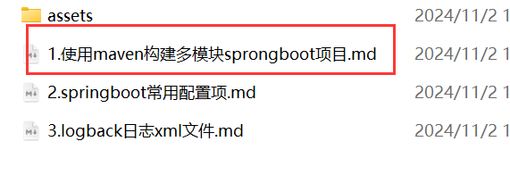

# 1 项目结构

本项目是B站老罗的Easybbs跟敲，采用分模块的方式，将原始maven项目改造为springboot项目，项目创建细节见：

项目的结构分为：

- ling-bbs：根模块，作依赖版本管理。
- ling-bbs-common：通用模块，作依赖管理。
- ling-bbs-admin：后端模块，引入ling-bbs-common，作后端接口管理。
- ling-bbs-web：前端模块，引入ling-bbs-common，作前端接口管理。

按照[springboot-vue-note](https://github.com/lingzed/springboot-vue-note)中第26章，快速搭建项目结构，这里不展示。