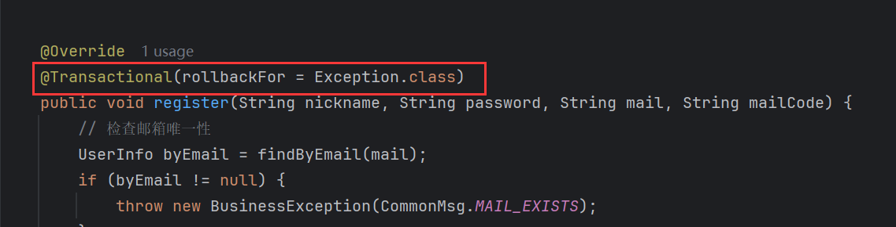
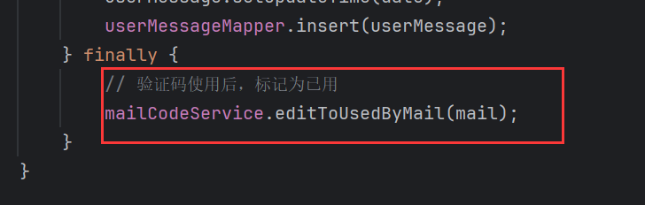

# 1 让邮箱验证码失效的方法

在用户注册和重置密码的场景中，需要用到邮箱验证码，而我们使用完后会将验证码更新为已使用状态：


但是，这里还需要优化一下，因为将邮箱验证码设置为已使用是无论注册或重置密码成功与否都要做出的动作。因此需要将这段代码放到`finally{}`中：

```java
try {
    ...
} finally {
    mailCodeMapper.updateStatusByMail(mail);
}
```

注册或重置密码的方法中涉及到多个写操作，为了保证这些操作正常执行，我将它们都定义在一个事务中：



假如我们像上面这样写，那么`updateStatusByMail()`仍然在这个事务中，因为`updateStatusByMail()`没有加事务。假如发生了异常，导致回滚，本来要失效的验证码，现在依然是未使用状态，这与无论成功与否都要将验证码置为已使用相悖。

所以我们需要将`updateStatusByMail()`抽离为一个方法，并且配置为新事物，不加入到现有的事务中，即使现有的事务回滚，新事物不会受到影响。

邮箱业务层，增加一个接口：

```java
/**
     * 根据邮箱修改状态为已使用
     *
     * @param mail
     */
    void editToUsedByMail(String mail);
```

`Propagation.REQUIRES_NEW`开启新事务：

```java
/**
     * 将这个邮箱验证码数据改为已使用
     *
     * @param mail
     */
    @Transactional(rollbackFor = Exception.class, propagation = Propagation.REQUIRES_NEW)
    @Override
    public void editToUsedByMail(String mail) {
        mailCodeMapper.updateStatusByMail(mail, new Date());
    }
```

