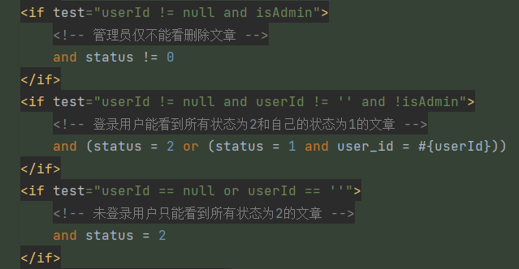

# 1 个人中心

这个模块主要展示个人的一些信息，包括昵称、头像、描述，发文历史，评论历史，点赞历史，积分记录等。

个人中心的所有接口由`UserCenterController`管理。

## 1.1 🌐加载个人信息接口

请求地址：

```http
GET /web/userCenter/{userId}
```

请求参数：

| 参数名 | 参数类型 | 是否必填 | 说明   |
| ------ | -------- | -------- | ------ |
| userId | `string` | `true`   | 用户id |

返回：

```json
{
    "status": "success",
    "code": 200,
    "msg": "请求成功",
    "data": {
        "userId": "9619980088",
        "avatar": "msakm",
        "nickName": "ling",
        "gender": 1,
        "description": "xxxxxxxxxxxxxxxxxx",
        "currentPoints": 58,
        "joinTime": "2024-12-06",
        "lastLoginTime": "2025-03-20",
        "postCount": 1,
        "receiveLikeCount": 3,
        "admin": false
    }
}
```

### 1.1.2 接口实现

这个接口用于请求用户的个人信息，前端展示个人信息，包括以下字段：

- 头像
- 昵称
- 性别
- 描述
- 当前积分
- 加入时间
- 最后登录时间
- 发文数量(已审核)
- 接收点赞数量
- 是否为管理员

我们需要将这些字段查询出来。这个接口是非登录接口，任何人都能通过id访问，前提是id存在。

在个人信息中，大部分字段都可以从`user_info`表中查询出来。只有发文数量和接收点赞数量需要额外统计。我们首先看接受点赞的数量，被点赞的对象是用户发布的文章或评论，因此我们通过文章或评论的作者id = 用户的id来查询计数即可查询出接受点赞的数量。

然后是发布文章的数量，这里只展示已审核的文章的数量，因此我们只需要统计以当前用户为作者发布的已审核文章的数量即可统计发布文章的数量，其SQL如下：

```xml
<!-- 通过 userId 统计已审核数量 -->
<select id="countByUserAndAudit" resultType="java.lang.Long">
    select count(0) total from article where user_id = #{userId} and status = 2
</select>
```

在`UserCenterController`中，我们定义一个加载个人信息的接口`loadUserinfo()`：

```java
/**
     * 加载个人中心个人信息接口
     *
     * @param userId
     * @return
     */
    @GetMapping("/{userId}")
    @AccessControl
    public Result<UserinfoVO> loadUserinfo(@PathVariable @Validation(max = 10) String userId) {
        UserInfo userinfo = checkUserId(userId);

        UserinfoVO userinfoVO = new UserinfoVO();
        BeanUtils.copyProperties(userinfo, userinfoVO);
        userinfoVO.setCurrentPoints(userinfo.getCurrentIntegral());
        LikeRecordQuery likeRecordQuery = new LikeRecordQuery();
        likeRecordQuery.setTargetAuthorId(userId);
        Long receiveLikeTotal = likeRecordService.findTotalByCondition(likeRecordQuery); // 接受点赞的数量
        Long postTotal = articleService.countByUserAndAudit(userId);  // 发文数量, 仅统计已审核文章
        userinfoVO.setPostCount(postTotal);
        userinfoVO.setReceiveLikeCount(receiveLikeTotal);

        return Result.success(userinfoVO);
    }

// 校验userId
    private UserInfo checkUserId(String userId) {
        UserInfo userinfo = userInfoService.findById(userId);
        if (Objects.isNull(userinfo) || Objects.equals(UserStatusEnum.DISABLE.getStatus(), userinfo.getStatus()))
            throw new BusinessException(ResponseCodeEnum.CODE_404);
        return userinfo;
    }
```

首先要检查用户id的有效性，我单独定义一个方法`checkUserId()`用来干这个事，校验通过后，返回`UserInfo`。

然后定义一个视图对象，将`UserInfo`的字段复制到视图对象中，然后统计接受点赞数量和发文数量，调用`LikeRecordService`的条件统计方法，通过`作者 = userId`查询数量。

然后，调用`ArticleService`的`countByUserAndAudit()`方法统计发文数量，接口如下：

```java
/**
     * 通过 userId 计数已审核数量
     *
     * @param userId
     * @return
     */
    Long countByUserAndAudit(String userId);
```

实现：

```java
@Override
    public Long countByUserAndAudit(String userId) {
        return articleMapper.countByUserAndAudit(userId);
    }
```

最后将数量复制到视图对象中，返回视图对象。

## 1.2 🌐加载发文历史的接口

请求地址：

```HTTP
GET /web/userCenter/{userId}/posts
```

请求参数：

| 参数名 | 参数类型 | 是否必填 | 说明   |
| ------ | -------- | -------- | ------ |
| userId | `string` | `true`   | 用户id |

返回：

```json
{
    "status": "success",
    "code": 200,
    "msg": "请求成功",
    "data": [
        {
            "articleId": "uukicbc29eqo",
            "boardId": 3,
            "boardName": "游戏攻略",
            "pBoardId": 1,
            "pBoardName": "游戏",
            "avatar": "msakm",
            "userId": "9619980088",
            "nickName": "ling",
            "userIdAddress": "四川省",
            "title": "巫师3攻略1",
            "cover": null,
            "content": null,
            "mdContent": null,
            "editorType": 0,
            "summary": "巫师3良心攻略",
            "readCount": 13,
            "likeCount": 1,
            "topType": 1,
            "attachmentType": 1,
            "status": 2,
            "createTime": "2025-01-06 16:38:14",
            "commentCount": 25
        }
    ]
}
```

### 1.2.1 接口实现

该接口用于查询指定用户发布的文章列表，同时支持动态权限控制，以适配不同用户角色的访问需求。本接口为**非登录接口**，即用户在未登录状态下也可调用，但仅能访问已审核的文章。

其实就是加载文章列表那一套逻辑，区别是这里只加载访问的用户发布的文章，会根据登录状态动态加载文章：

- 未登录：加载"已审核"的文章
- 已登录(非管理员)：访问其他用户时只能查看"已审核"的文章，访问自己时可以看到"待审核"和"已审核"文章
- 已登录(管理员)：访问"待审核"和"已审核"文章

在`UserCenterController`中添加一个加载发文历史的接口`loadUserPostList()`：

```java
/**
     * 加载个人中心发文列表接口
     *
     * @param userId
     * @return
     */
    @GetMapping("/{userId}/posts")
    @AccessControl
    public Result<List<ArticleVo>> loadUserPostList(HttpSession session,
                                                          @PathVariable @Validation(max = 10) String userId) {
        checkUserId(userId);

        SessionUserinfo userinfo = getUserinfo(session);
        // 作者 && 管理员 能看到待审核文章，其用户 || 未登录 只能看到已审核文章
        boolean showPadding = !Objects.isNull(userinfo)
                && (userinfo.getIsAdmin() || Objects.equals(userId, userinfo.getUserId()));
        List<ArticleVo> articleVos = articleService.findListByUserAndStatus(userId, showPadding);
        return Result.success(articleVos);
    }
```

首先调用`checkUserId()`校验`userId`，避免绕过前端直接请求。然后调用`findListByUserAndStatus()`查询文章列表，这里我另外定义了一个查询的方法，为什么这里不使用之前在文章模块请求文章列表时使用的条件查询方法？

主要在于查询条件，之前的动态控制文章状态的查询条件如下：



在这个条件中控制文章状态是通过`userId`和`isAdmin`参数，在当前的接口中，`userId`是请求传递的参数且为必填项，即便用户没有登录，他在访问这个接口时也会传递`userId`，所以`userId`永远不为`null`，如果按照上面的条件，那么只会出现这两者情况：

```sql
status != 0
-- 或
status = 2 or (status = 1 and user_id = ?)
```

也就是说未登录的情况下可以查询出用户待审核的文章，这显然不符合我们的需求。因此就不能将`userId`作为动态条件的参数，得另外定义一个参数，比如`showPadding`，用来表示是否展示"已审核"文章。SQL如下：

```xml
<!-- 通过 userId 查询已审核文章 -->
<select id="selectByUserAndStatus" resultType="com.ling.entity.po.Article">
    select
    <include refid="commonField"/>
    from article
    <where>
        <if test="userId != null and userId != ''">
            and user_id = #{userId}
        </if>
        <if test="showPadding != null and showPadding">
            and status in (1, 2)
        </if>
        <if test="showPadding != null and !showPadding">
            and status = 2
        </if>
    </where>
    order by create_time desc
</select>
```

然后增加登录状态和用户类型判断是否展示"待审核"文章：

```java
boolean showPadding = !Objects.isNull(userinfo)
                && (userinfo.getIsAdmin() || Objects.equals(userId, userinfo.getUserId()));
```

业务层定义这个查询的方法：

```java
/**
     * 通过 userId 和 status 查询
     *
     * @param userId
     * @param showPadding
     * @return
     */
    List<Article> findListByUserAndStatus(String userId, boolean showPadding);
```

实现，调用SQL查询，封装为视图实体后返回：

```java
@Override
    public List<ArticleVo> findListByUserAndStatus(String userId, boolean showPadding) {
        return articleMapper.selectByUserAndStatus(userId, showPadding).stream()
                .map(e -> {
                    ArticleVo articleVo = new ArticleVo();
                    BeanUtils.copyProperties(e, articleVo);
                    return articleVo;
                }).collect(Collectors.toList());
    }
```

## 1.3 🌐加载点赞历史接口

此接口返回查询用户的点赞评论或文章的历史记录，为非登录接口。

接口详情：

```http
GET /web/userCenter/{userId}/likeRecord
```

请求参数：

| 参数名 | 参数类型 | 是否必填 | 说明   |
| ------ | -------- | -------- | ------ |
| userId | `string` | `true`   | 用户id |

返回：

```json
{
    "status": "success",
    "code": 200,
    "msg": "请求成功",
    "data": [
        {
            "targetId": "39",
            "targetContent": "2级评论14",
            "targetAuthorId": "2550515268",
            "likerId": "9619980088",
            "likeType": 1,
            "likeTime": "2025-02-19 18:17"
        },
        {
            "targetId": "41",
            "targetContent": "鸿星尔克，to be No.1",
            "targetAuthorId": "9619980088",
            "likerId": "9619980088",
            "likeType": 1,
            "likeTime": "2025-02-19 18:15"
        },
        ......
    ]
}
```

### 1.3.1 接口实现

实现方法很简单，就是去查询用户的点赞记录，条件是`liker_id = userId`，不过这里需要做一个联查，因为点赞记录表中只有目标的id，并没有目标内容，而我们需要从文章表和评论表中分别查询出标题和评论，查询的SQL如下：

```xml
<!-- 查询点赞历史 -->
    <select id="selectLikeHistory" resultType="com.ling.entity.vo.LikeRecordVo">
        SELECT lr.like_record_id,
               lr.target_id,
               CASE
                   WHEN lr.like_type = 0 THEN a.title
                   ELSE c.content
                   END AS target_content,
               lr.target_author_id,
               lr.liker_id,
               lr.like_type,
               lr.like_time
        FROM like_record lr
                 LEFT JOIN
             article a ON lr.like_type = 0 AND lr.target_id = a.article_id
                 LEFT JOIN
             comment c ON lr.like_type = 1 AND lr.target_id = c.comment_id
        WHERE lr.liker_id = #{likerId}
        order by like_time desc;
    </select>
```

思路是将点赞记录表、评论表、文章表进行外连接，以点赞表为主，将3张连接的表看作整体，从整体中查询出点赞的字段、文章标题和评论内容。这样查询对比子查询可以最多程度保证索引不会被破坏。

控制器中增加加载点赞记录的接口`loadUserLikeRecords`：

```java
/**
     * 加载个人中心点赞记录列表接口
     *
     * @param userId
     * @return
     */
    @GetMapping("/{userId}/likeRecord")
    @AccessControl
    public Result<List<LikeRecordVo>> loadUserLikeRecords(@PathVariable @Validation(max = 10) String userId) {
        checkUserId(userId);
        List<LikeRecordVo> likeRecordVos = likeRecordService.findLikeHistory(userId);
        return Result.success(likeRecordVos);
    }
```

校验用户id，通过后调用查询点赞历史的方法。

在业务层中增加查询的方法`findLikeHistory()`：

```java
/**
     * 查询点赞历史
     *
     * @param likerId
     * @return
     */
    List<LikeRecordVo> findLikeHistory(String likerId);
```

实现，调用SQL执行：

```java
@Override
    public List<LikeRecordVo> findLikeHistory(String likerId) {
        return likeRecordMapper.selectLikeHistory(likerId);
    }
```

## 1.4 🌐加载用户评论历史接口

此接口返回用户发布的历史评论，为非登录接口。

接口详情：

```http
GET /web/userCenter/{userId}/commentRecord
```

请求参数：

| 参数名 | 参数类型 | 是否必填 | 说明   |
| ------ | -------- | -------- | ------ |
| userId | `string` | `true`   | 用户id |

返回：

```json
{
    "status": "success",
    "code": 200,
    "msg": "请求成功",
    "data": [
        {
            "commentId": 85,
            "pCommentId": 83,
            "articleId": "ababa",
            "imgPath": null,
            "content": "配色我觉得还行",
            "senderAvatar": "msakm",
            "senderId": "9619980088",
            "senderNickname": "ling",
            "senderIpAddress": "四川省",
            "receiverId": "7878970085",
            "receiverNickname": "user_aliyun",
            "likeCount": 0,
            "topType": 0,
            "status": 2,
            "postTime": "2025-02-20 06:09:45",
            "doLike": false,
            "subComment": null
        },
        ......
    ]
}
```

### 1.4.1 接口实现

查询评论表，评论发送人为用户id，我们构建这样的条件，添加接口`loadCommentRecords()`:

```java
/**
     * 加载个人中心发评列表接口
     *
     * @param userId
     * @return
     */
    @GetMapping("/{userId}/commentRecord")
    public Result<List<CommentVo>> loadCommentRecords(@PathVariable @Validation(max = 10) String userId) {
        checkUserId(userId);

        CommentQuery commentQuery = new CommentQuery();
        commentQuery.setSenderId(userId);
        commentQuery.setOrderBy("post_time desc");
        List<CommentVo> commentVos = commentService.findVoListByCondition(commentQuery);

        return Result.success(commentVos);
    }
```

先校验用户id，然后构建查询条件，调用`commentService`的条件查询方法返回查询集。

## 1.5 🌐加载用户积分记录接口

接口地址：

```http
GET /web/userCenter/pointsRecord
```

请求参数：

| 参数名    | 参数类型 | 是否必填 | 说明     |
| --------- | -------- | -------- | -------- |
| page      | `string` | `true`   | 页码     |
| startDate | `date`   | `true`   | 起始时间 |
| endDate   | `date`   | `true`   | 结束时间 |

返回：

```json
{
    "status": "success",
    "code": 200,
    "msg": "请求成功",
    "data": {
        "total": 21,
        "page": 1,
        "pageSize": 10,
        "pageTotal": 3,
        "rows": [
            {
                "operationType": 2,
                "points": -4,
                "createTime": "2025-03-07 00:03:06"
            },
            {
                "operationType": 3,
                "points": 2,
                "createTime": "2025-03-01 01:09:12"
            },
			......
        ]
    }
}
```

此接口为登录接口，返回当前用户的积分记录，返回数据是分页数据，参数传递页码、启始时间和结束时间控制查找范围，每页数据条目默认为10。

### 1.5.1 接口实现

直接调用积分表条件查询的方法即可，控制器中定义方法：

```java
/**
     * 加载用户积分记录接口
     *
     * @param session
     * @param page
     * @param startDate
     * @param endDate
     * @return
     */
    @GetMapping("/pointsRecord")
    @AccessControl(loginRequired = true)
    public Result<PageBean<PointsRecordVo>> loadPointsRecordsHandle(HttpSession session,
                                                                    @Validation(min = 1) Integer page,
                                                                    @DateTimeFormat(pattern = "yyyy-MM-dd") Date startDate,
                                                                    @DateTimeFormat(pattern = "yyyy-MM-dd") Date endDate) {
        page = Objects.isNull(page) ? 1 : page;
        SessionUserinfo sUserinfo = getUserinfo(session);
        UserPointsRecordQuery query = new UserPointsRecordQuery();
        query.setUserId(sUserinfo.getUserId());
        query.setPage(page);
        query.setPageSize(Constant.NUM_10);
        query.setStartDate(startDate);
        query.setEndDate(endDate);
        query.setOrderBy("create_time desc");

        PageBean<PointsRecordVo> resultPage = userPointsRecordService.findVoPageByCondition(query);

        return Result.success(resultPage);
    }
```

构建查询条件，调用条件查询方法，业务层接口：

```java
/**
     * 条件查询
     * 返回VoPage
     *
     * @param userPointsRecodeParam
     * @return
     */
    PageBean<PointsRecordVo> findVoPageByCondition(UserPointsRecordQuery userPointsRecodeParam);
```

实现：

```java
/**
     * 条件计数
     *
     * @param userPointsRecordQueryDto
     * @return
     */
    @Override
    public PageBean<PointsRecordVo> findVoPageByCondition(UserPointsRecordQuery userPointsRecordQueryDto) {
        List<UserPointsRecord> userPointsRecords = userPointsRecordMapper.selectByCondition(userPointsRecordQueryDto);
        Long total = countByCondition(userPointsRecordQueryDto);
        List<PointsRecordVo> rows = userPointsRecords.stream().map(e -> {
            PointsRecordVo pointsRecordVo = new PointsRecordVo();
            BeanUtils.copyProperties(e, pointsRecordVo);
            return pointsRecordVo;
        }).collect(Collectors.toList());
        Integer page = userPointsRecordQueryDto.getPage();
        Integer pageSize = userPointsRecordQueryDto.getPageSize();
        return PageBean.of(total, page, pageSize, rows);
    }
```

## 1.6 🌐更新用户信息接口

**接口描述**

该接口用于更新用户的基本信息，包括昵称、头像、性别及个性化描述。更新成功后，系统将返回最新的用户信息。

**接口地址**

```http
PUT /web/userCenter/{userId}
```

**请求参数**

| 参数名      | 参数类型 | 是否必填 | 说明                  |
| ----------- | -------- | -------- | --------------------- |
| userId      | `string` | `true`   | 用户id                |
| nickname    | `string` | `true`   | 昵称                  |
| avatar      | `string` | `false`  | 头像                  |
| gender      | `int`    | `true`   | 0: 女, 1: 男, 2: 保密 |
| description | `string` | `false`  | 描述                  |

**返回实例**

```json
{
    "status": "success",
    "code": 200,
    "msg": "请求成功",
    "data": {
        "gender": 1,
        "nickname": "ling",
        "description": "xxxxx",
        "avatar": "xxxxx",
        "userId": "9619980088"
    }
}
```

### 1.6.1 接口实现

在更新用户信息时，头像字段的特殊性需要额外处理。由于部分业务表（如文章、评论、消息等）存在头像冗余存储，因此在用户表更新头像后，这些表也需同步更新，以确保数据一致性。目前涉及的表包括：

- `article`（文章表）
- `comment`（评论表）
- `user_message`（消息表）

在头像更新逻辑中，需考虑以下特殊情况：

1. **头像变更**：若用户更新了头像，则需同步修改上述业务表中的冗余头像字段。
2. **头像保持不变**：若用户提交的头像与当前头像相同，则无需进行数据库更新，避免不必要的写操作，降低数据库负载。
3. **头像清空**：若用户希望移除头像（即传入 `null`），则系统应允许其头像字段置空，而非保持原值。

所以我们在更新完用户表的数据后，也要将这三张表的头像更新，另外有一种情况需要注意，就是更新前后头像是一样的，这种情况下，我们就不用再去更新头像了，同样这3张表也不用再更新，这样做可以减少更新频率，降低数据库压力。

更新用户信息的SQL，我不打算用采用`edit()`，原因在于头像字段的条件：

```xml
<if test="avatar != null and avatar != ''">avatar = #{avatar},</if>
```

当`avatar`为`null`时不会更新头像。但假如用户本来有头像，他又不想使用头像了，他会传递`null`过来，这就会导致头像不更新，本来用户想将头像去掉，但是头像未更新还是原来的头像。

为解决 `null` 影响 SQL 生成的问题，更新 SQL 需去除条件判断，确保 `null` 也能正确更新。优化后的 SQL 如下：

```xml
<!-- 更新用户信息 -->
    <update id="updateUserinfo">
        update user_info
        set <if test="keepAvatar != null and !keepAvatar">avatar = #{avatar},</if>
            nick_name   = #{nickName},
            gender      = #{gender},
            description = #{description}
        where user_id = #{userId}
    </update>
```

这里新增了 `keepAvatar` 变量，作为头像更新的控制标志：

- `true`：保持头像不变
- `false`：更新头像

控制层增加接口：

```java
/**
     * 更新用户信息接口
     *
     * @param session
     * @param userId
     * @param nickname
     * @param avatar
     * @param gender
     * @param description
     * @return
     */
    @PutMapping("/{userId}")
    @AccessControl(loginRequired = true)
    public Result<Map<String, Object>> resetUserinfoHandle(HttpSession session,
                                                           @PathVariable @Validation(max = 10) String userId,
                                                           @Validation String nickname,
                                                           String avatar,
                                                           @Validation(max = 2) Integer gender,
                                                           @Validation(required = false, max = 100) String description) {
         // 校验用户 ID
        UserInfo userinfo = checkUserId(userId);
        SessionUserinfo sUserinfo = getUserinfo(session);
        
        // 确保当前用户只能修改自己的信息
        if (!Objects.equals(sUserinfo.getUserId(), userId))
            throw new BusinessException(CommonMsg.UNAUTHORIZED_ACCESS);
        
        // 处理头像更新逻辑
        UserInfo ui = new UserInfo();
        ui.setUserId(userId);
        ui.setNickName(nickname);
        String resAvatar = userinfo.getAvatar();
        boolean keepAvatar = Objects.equals(resAvatar, avatar);
        ui.setAvatar(keepAvatar ? null : avatar);
        ui.setGender(gender);
        ui.setDescription(description);
        ui.setAdmin(sUserinfo.getIsAdmin());
	
        userInfoService.processResetUserinfo(ui, keepAvatar);   // 更新用户信息

        // 更新会话信息
        if (!keepAvatar) sUserinfo.setAvatar(avatar);
        sUserinfo.setNickName(ui.getNickName());
		
        // 返回更新后的用户信息
        Map<String, Object> result = new HashMap<>();
        result.put("userId", userId);
        result.put("nickname", nickname);
        result.put("avatar", keepAvatar ? resAvatar : avatar);
        result.put("gender", gender);
        result.put("description", description);
        return Result.success(result);
    }
```

在业务层，提供 `editUserinfo()` 方法用于执行数据库更新，并通过 `processResetUserinfo()` 处理用户信息和冗余头像的同步更新。

```java
/**
     * 处理用户信息更新
     *
     * @param userInfo
     * @param keepAvatar
     * @return
     */
    void processResetUserinfo(UserInfo userInfo, boolean keepAvatar);

    /**
     * 更新用户信息
     *
     * @param userInfo
     * @param keepAvatar
     */
    void editUserinfo(UserInfo userInfo, boolean keepAvatar);
```

实现：

```java
@Override
    @Transactional(rollbackFor = Exception.class)
    public void processResetUserinfo(UserInfo userInfo, boolean keepAvatar) {
        // 更新用户基本信息
        editUserinfo(userInfo, keepAvatar);
        
        // 仅在头像发生变更时，更新业务表的头像字段
        if (!keepAvatar) {
            articleMapper.updateAvatar(userInfo.getAvatar(), userInfo.getUserId());
            commentMapper.updateAvatar(userInfo.getAvatar(), userInfo.getUserId());
            userMessageMapper.updateAvatar(userInfo.getAvatar(), userInfo.getUserId());
        }
    }

    @Override
    public void editUserinfo(UserInfo userInfo, boolean keepAvatar) {
        userInfoMapper.updateUserinfo(userInfo, keepAvatar);
    }
```

另外，这3张表更新头像的方法也要重新定义，因为之前的更新方法是通过表主键来更新，而此处头像需要根据`user_id`来更新，SQL如下：

```xml
<!-- 更新头像 -->
<update id="updateAvatar">
    update article set avatar = #{avatar} where user_id = #{userId}
</update>

<!-- 更新头像 -->
<update id="updateAvatar">
    update comment set sender_avatar = #{senderAvatar} where sender_id = #{senderId}
</update>

<!-- 更新头像 -->
<update id="updateAvatar">
    update user_message set sender_avatar = #{senderAvatar} where send_user_id = #{sendUserId}
</update>
```

## 1.7 🌐发送邮箱验证码接口

**接口描述**

本接口用于向用户的绑定邮箱发送验证码，该验证码可用于用户修改密码或执行其他安全操作。由于本接口仅允许已登录用户调用，因此无需额外传递邮箱地址，而是**直接从当前会话中获取绑定邮箱**。

**请求地址**

```http
GET /web/userCenter/sendMail
```

**请求参数**

`null`

**返回实例**

```json
{
    "status": "success",
    "code": 200,
    "msg": "请求成功",
    "data": null
}
```

### 1.7.1 接口实现

在 `UserController` 控制器中定义 `sendMail()` 方法，调用 **邮件验证码发送服务**：

```java
/**
     * 发送邮箱验证码接口
     *
     * @param session
     * @return
     */
    @GetMapping("/sendMail")
    @AccessControl(loginRequired = true)
    public Result<Void> sendMail(HttpSession session) {
        SessionUserinfo userinfo = getUserinfo(session);
        String mail = userinfo.getMail();
        mailCodeService.sendMailCode(mail);
        return Result.success();
    }
```

## 1.8 🌐重置密码接口

**接口描述**

本接口用于**重置用户密码**，供登录后的用户进行访问。

**请求地址**

```http
PUT /web/userCenter/resetPwd
```

**请求参数**

| 参数名   | 参数类型 | 是否必填 | 说明       |
| -------- | -------- | -------- | ---------- |
| mailCode | `string` | `true`   | 邮箱验证码 |
| password | `string` | `true`   | 密码       |

**返回实例**

```json
{
    "status": "success",
    "code": 200,
    "msg": "请求成功",
    "data": null
}
```

### 1.8.1 接口实现

在 `UserController` 控制器中定义 `resetPassword()` 方法，调用 **用户服务** 执行密码重置逻辑：

```java
/**
     * 重置密码接口
     *
     * @param session
     * @param mailCode
     * @param password
     * @return
     */
    @PutMapping("/resetPwd")
    @AccessControl(loginRequired = true)
    public Result<Void> resetPassword(HttpSession session,
                                      @Validation String mailCode,
                                      @Validation(regex = RegexEnum.PWD_MEDIUM) String password) {
        SessionUserinfo userinfo = getUserinfo(session);
        userInfoService.resetPwd(userinfo.getMail(), password, mailCode);
        return Result.success();
    }
```


