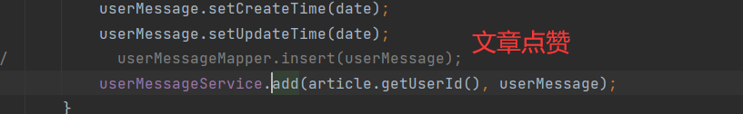
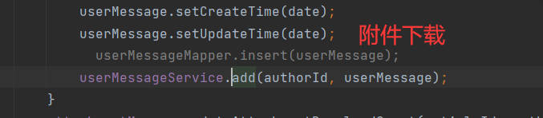
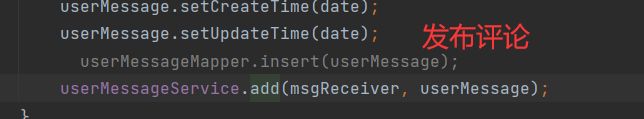

# 1 消息功能模块说明

本模块负责处理系统消息的推送与管理，功能包括：

- **未读消息查询**：提供接口，支持客户端获取当前未读消息的数量，以便及时提醒用户处理。
- **消息列表加载**：支持分页加载消息列表，方便用户查看历史消息，提升使用体验。
- **消息详情查询**：允许用户查看具体消息内容，确保信息的完整性和可读性。
- **实时消息推送**：采用 **WebSocket** 技术，实现消息的 **主动推送**，确保重要通知能够 **即时到达** 客户端，提高系统的交互性与响应效率。

该模块的消息接口由 **`MessageController`** 负责管理。


# 2 🌐加载未读消息数量接口

**接口描述**

该接口用于 **统计当前用户的未读消息数量**。

**请求地址**

```http
GET /web/message/count
```

**请求参数**

`null`

**返回实例**

```json
{
    "status": "success",
    "code": 200,
    "msg": "请求成功",
    "data": {
        "msgCount": xxx
    }
}
```

### 2.1 接口实现

该接口的核心逻辑是 **查询当前用户的未读消息数量** 并返回相应结果。在控制器中定义方法`loadMessageCount()`:

```java
/**
     * 统计未读消息数量的接口
     *
     * @param session
     * @return
     */
    @GetMapping("/count")
    @AccessControl(loginRequired = true)
    public Result<Map<String, Long>> loadMessageCount(HttpSession session) {
         // 获取当前登录用户信息
        SessionUserinfo userinfo = getUserinfo(session);

        // 构造查询条件：接收人为当前用户，消息状态为未读
        UserMessageQuery query = new UserMessageQuery();
        query.setReceivedUserId(userinfo.getUserId());
        query.setStatus(MessageStatusEnum.NO_READ.getStatus());

        // 统计符合条件的未读消息数量
        Long total = userMessageService.countByCondition(query);

        // 组装返回数据
        HashMap<String, Long> res = new HashMap<>();
        res.put("msgCount", total);

        return Result.success(res);
    }
```


# 3 🌐加载消息列表接口

**接口描述**

本接口用于 **查询当前用户的消息列表**，支持分页加载，并可通过 **多种筛选条件** 精确查询。

**请求地址**

```http
GET /web/message
```

**请求参数**

| 参数名      | 参数类型 | 是否必填 | 说明                                                         |
| ----------- | -------- | -------- | ------------------------------------------------------------ |
| page        | `int`    | `true`   | 页码                                                         |
| pageSize    | `int`    | `true`   | 每页条目                                                     |
| messageType | `int`    | `false`  | 0: 系统消息, 1: 评论, 2: 文章点赞,<br /> 3: 评论点赞, 4: 附件下载 |
| status      | `int`    | `false`  | 0: 未读, 1: 已读                                             |
| startDate   | `date`   | `false`  | 起始时间                                                     |
| endDate     | `date`   | `false`  | 结束时间                                                     |

**返回实例**

```json
{
    "status": "success",
    "code": 200,
    "msg": "请求成功",
    "data": {
        "total": 37,
        "page": 1,
        "pageSize": 10,
        "pageTotal": 4,
        "rows": [
            {
                "messageId": 169,
                "articleId": "uukicbc29eqo",
                "articleTitle": "巫师3攻略1",
                "commentId": 87,
                "senderAvatar": "avatar/2025-03/31f311b3a680488eafce05a41d54e575.jpg",
                "sendUserId": "1835487851",
                "sendNickName": "su7 Ultra",
                "messageType": 1,
                "messageContent": "评论了您的文章%s",
                "status": 0,
                "createTime": "2025-03-26 20:00:32"
            },
            {
                "messageId": 168,
                "articleId": null,
                "articleTitle": null,
                "commentId": 41,
                "senderAvatar": "avatar/2025-03/31f311b3a680488eafce05a41d54e575.jpg",
                "sendUserId": "1835487851",
                "sendNickName": "su7 Ultra",
                "messageType": 3,
                "messageContent": "点赞了您的评论%s",
                "status": 0,
                "createTime": "2025-03-26 19:57:51"
            },
            ......
        ]
    }
}
```

## 3.1 接口实现

在 `MessageController` 控制器中定义 `loadMessageList()` 方法，构建查询条件后调用业务层查询消息列表数据：

```java
/**
     * 加载消息列表接口
     *
     * @param session
     * @param page
     * @param pageSize
     * @param status
     * @return
     */
    @GetMapping
    @AccessControl(loginRequired = true)
    public Result<PageBean<MessageListVo>> loadMessageList(HttpSession session,
                                                           @Validation(min = 1) Integer page,
                                                           @Validation Integer pageSize,
                                                           @Validation(required = false, max = 4) Integer messageType,
                                                           @Validation(max = 1, required = false) Integer status,
                                                           @DateTimeFormat(pattern = "yyyy-MM-dd")
                                                           @Validation(required = false) Date startDate,
                                                           @DateTimeFormat(pattern = "yyyy-MM-dd")
                                                           @Validation(required = false) Date endDate) {
        // 获取当前登录用户信息
        SessionUserinfo userinfo = getUserinfo(session);

        // 构建查询条件
        UserMessageQuery query = new UserMessageQuery();
        query.setReceivedUserId(userinfo.getUserId());
        query.setPage(page);
        query.setPageSize(pageSize);
        query.setMessageType(messageType);
        query.setStatus(status);
        query.setStartDate(startDate);
        query.setEndDate(endDate);

        // 按创建时间倒序排序
        query.setOrderBy("create_time desc");

        // 查询消息列表
        PageBean<MessageListVo> voPageByCondition = userMessageService.findVoPageByCondition(query);

        return Result.success(voPageByCondition);
    }
```


# 4 🌐加载消息详情接口

**接口描述**

该接口用于获取指定消息的详细信息。用户在访问某条消息时，系统将自动更新其状态为 **“已读”**。如果消息类型涉及 **评论**，接口还会返回评论的具体内容。

**请求地址**

```http
GET /web/message/{message-id}
```

**请求参数**

| 参数名     | 参数类型 | 是否必填 | 说明   |
| ---------- | -------- | -------- | ------ |
| message-id | `int`    | `true`   | 消息id |

**返回实例**

```json
{
    "status": "success",
    "code": 200,
    "msg": "请求成功",
    "data": {
        "messageId": 169,
        "articleId": "uukicbc29eqo",
        "articleTitle": "巫师3攻略1",
        "commentId": 87,
        "commentContent": "作者写的不错，快处第二章👍",
        "senderAvatar": "avatar/2025-03/31f311b3a680488eafce05a41d54e575.jpg",
        "sendUserId": "1835487851",
        "sendNickName": "su7 Ultra",
        "messageType": 1,
        "messageContent": "评论了您的文章%s",
        "createTime": "2025-03-26 20:00:32"
    }
}
```

## 4.1 接口实现

在 **控制器** 中定义 `loadMessageDetail()` 方法，该方法负责接收用户请求并调用业务层接口获取消息详情：

```java
/**
     * 加载消息详情接口
     *
     * @param session
     * @param messageId
     * @return
     */
    @GetMapping("/{message-id}")
    @AccessControl(loginRequired = true)
    public Result<MessageDetailVo> loadMessageDetail(HttpSession session,
                                                     @PathVariable("message-id") @Validation Integer messageId) {
        // 获取当前登录用户信息
        SessionUserinfo userinfo = getUserinfo(session);
        // 调用业务层方法查询消息详情
        MessageDetailVo messageDetailVo = userMessageService.loadMessageDetail(messageId, userinfo.getUserId());
        return Result.success(messageDetailVo);
    }
```

在 **业务层** 新增 `loadMessageDetail()` 方法，负责根据 `messageId` 查询消息详情：

```java
/**
     * 查询消息详情
     *
     * @param messageId
     * @param userId
     * @return
     */
    MessageDetailVo loadMessageDetail(Integer messageId, String userId);
```

实现：

```java
@Override
    public MessageDetailVo loadMessageDetail(Integer messageId, String userId) {
        UserMessage message = findById(messageId);
        // 校验id有效性
        if (Objects.isNull(message))
            throw new BusinessException(ResponseCodeEnum.CODE_404);
        if (!Objects.equals(message.getReceivedUserId(), userId))
            throw new BusinessException(CommonMsg.UNAUTHORIZED_ACCESS);
		
        // 封装消息详情对象
        MessageDetailVo messageDetailVo = new MessageDetailVo();
        BeanUtils.copyProperties(message, messageDetailVo);
        
        // 若消息类型涉及评论，则查询评论内容
        if (Objects.equals(MessageTypeEnum.COMMENT.getType(), message.getMessageType())
                || Objects.equals(MessageTypeEnum.COMMENT_LIKE.getType(), message.getMessageType())) {
            Comment comment = commentMapper.selectById(message.getCommentId());
            messageDetailVo.setCommentContent(comment.getContent());
        }

        // 若未读，则更新为已读
        if (Objects.equals(message.getStatus(), MessageStatusEnum.NO_READ.getStatus())) {
            UserMessage userMessage = new UserMessage();
            userMessage.setMessageId(message.getMessageId());
            userMessage.setStatus(MessageStatusEnum.READ.getStatus());
            edit(userMessage);
            
            // 通知前端重新加载未读消息
            try {
                String jsonString = OBJECT_MAPPER.writeValueAsString(WSMessage.ofServer(WSMessageTypeEnum.LOAD_UNREAD));
                webSocketServer.sendMessageToUser(userId, jsonString);
            } catch (IOException e) {
                throw new BusinessException(CommonMsg.WS_MESSAGE_SEND_FAIL, e);
            }
        }

        return messageDetailVo;
    }
```


# 5 🌐删除消息接口

**接口描述**

该接口用于 **删除指定消息**，系统会验证 **消息归属权**，避免越权删除操作。

**请求地址**

```http
DELETE /web/message/{message-id}
```

**请求参数**

| 参数名     | 参数类型 | 是否必填 | 说明   |
| ---------- | -------- | -------- | ------ |
| message-id | `int`    | `true`   | 消息id |

**返回实例**

```json
{
    "status": "success",
    "code": 200,
    "msg": "请求成功",
    "data": null
}
```

## 5.1 接口实现

在 **控制器** 中定义 `delMessage()` 方法，该方法负责接收用户请求，并调用业务层接口进行消息删除：

```java
/**
     * 删除消息接口
     *
     * @param session
     * @param messageIds
     * @return
     */
    @DeleteMapping("/{message-ids}")
    @AccessControl(loginRequired = true)
    public Result<Void> delMessage(HttpSession session, @PathVariable("message-ids") List<Integer> messageIds) {
        // 获取当前登录用户信息
        SessionUserinfo userinfo = getUserinfo(session);
        // 调用业务层方法删除消息
        userMessageService.delete(userinfo.getUserId(), messageIds);
        return Result.success();
    }
```

在 **业务层** 定义 `delete()` 方法，负责执行 **删除操作**，并进行 **消息归属校验**：：

```java
/**
     * 删除
     *
     * @param userId
     * @param list
     */
    void delete(String userId, List<Integer> list);
```

实现：

```java
@Override
    public void delete(String userId, List<Integer> list) {
        // 查询该用户是否拥有这些消息
        Long total = userMessageMapper.countByReceiverAndIds(userId, list);

        // 若查询结果为 0，说明消息不属于当前用户，抛出异常
        if (Objects.equals(total, (long) Constant.NUM_0)) {
            throw new BusinessException(ResponseCodeEnum.CODE_404, "消息不存在或无权限删除");
        }

        // 执行删除操作
        delete(list);
    }
```

为了 **校验消息归属权**，我们需要定义一个 **查询消息归属的 SQL 语句**，确保 **用户只能删除自己的消息**：

```xml
<!-- 计数 通过 接收人 && id集 -->
<select id="countByReceiverAndIds" resultType="java.lang.Long">
    select count(0) total from user_message where received_user_id = #{userId} and message_id in
    <foreach collection="list" item="id" open="(" close=")" separator=",">
        #{id}
    </foreach>
</select>
```

若计数为0，则消息不属于当前用户。


# 6 消息推送

## 6.1 创建WebSocket服务

为了实现消息的 **实时推送**，后端采用 WebSocket 技术，在特定时机主动推送消息至前端。前端接收后，可据此 **重新请求最新数据**，确保信息的实时性。

实现步骤如下：

1、创建WebSocket服务，继承`TextWebSocketHandler`，重写以下方法：

- `afterConnectionEstablished()`，在socket建立连接时执行。
- `handleTextMessage()`，接收前端发送的消息时执行。
- `afterConnectionClosed()`，socket连接关闭时执行。

声明`WebSocketServer`：

```java
@Component
public class WebSocketServer extends TextWebSocketHandler {
    private Logger log = LoggerFactory.getLogger(WebSocketServer.class);
    private static final Map<String, WebSocketSession> userSessionMap = new ConcurrentHashMap<>();

    /**
     * socket连接时执行
     *
     * @param session
     * @throws Exception
     */
    @Override
    public void afterConnectionEstablished(WebSocketSession session) {
        String userId = (String) session.getAttributes().get("userId");
        // 连接时存储用户的会话
        userSessionMap.put(userId, session);
    }

    /**
     * 接收发送方(如前端)的消息
     *
     * @param session
     * @param message
     */
    @Override
    protected void handleTextMessage(WebSocketSession session, TextMessage message) {
        log.info("接收到消息: {}", message);
    }

    /**
     * socket关闭时执行
     *
     * @param session
     * @param status
     * @throws Exception
     */
    @Override
    public void afterConnectionClosed(WebSocketSession session, CloseStatus status) {
        String userId = (String) session.getAttributes().get("userId");
        if (!Objects.isNull(userId)) {
            userSessionMap.remove(userId);
        }
    }
    
    /**
     * 发送消息
     *
     * @param userId
     * @param message
     */
    public void sendMessageToUser(String userId, String message) throws IOException {
        WebSocketSession userSession = userSessionMap.get(userId);  // 拿到userId对应会话
        if (userSession != null && userSession.isOpen()) {
            userSession.sendMessage(new TextMessage(message));
        }
    }
}
```

WebSocket 连接建立后，系统会生成 `WebSocketSession`，该会话对象是 **后端与前端通信的核心载体**。为实现 **定向推送**，需维护一个 `userSessionMap`，用于存储 **用户 ID 与 WebSocket 会话的映射关系**，确保后端能够根据用户 ID 直接向特定用户推送消息。

在 `afterConnectionEstablished()` 方法中，WebSocket 连接建立后，会将用户 ID 存入 `WebSocketSession` 的 `attributes`，并加入 `userSessionMap` 进行管理。连接关闭时，需从 `userSessionMap` 中移除对应的会话，避免资源泄露。

然后再定义一个发送消息的方法`sendMessageToUser()`，接收用户id和消息，通过id从`userSessionMap`中找到对应的会话，再通过会话发送消息。

2、定义握手拦截器

由于 WebSocket **协议独立于 HTTP**，连接建立后，前端无法在 WebSocket 请求中携带 URL 参数。因此，在 **WebSocket 握手阶段**，需通过 **拦截器** 提取请求参数，并存储至 `WebSocketSession` 的 `attributes`，供后续使用。就比如上述从`attributes`中获取用户id一样。

声明`UserIdHandshakeInterceptor`实现`HandshakeInterceptor`，实现以下方法：

- `beforeHandshake()`，握手前的处理，返回布尔值，`true`表示允许握手，`false`表示拒绝。
- `afterHandshake()`，握手后的处理，一般无需操作。

我们需要在`beforeHandshake()`中获取到请求参数：

```java
@Component
public class UserIdHandshakeInterceptor implements HandshakeInterceptor {
    private Logger log = LoggerFactory.getLogger(UserIdHandshakeInterceptor.class);

    @Resource
    private UserInfoService userInfoService;

    /**
     * 握手前的处理(关键)
     *
     * @param request
     * @param response
     * @param wsHandler
     * @param attributes
     * @return
     */
    @Override
    public boolean beforeHandshake(ServerHttpRequest request, ServerHttpResponse response, WebSocketHandler wsHandler,
                                   Map<String, Object> attributes) {
        if (request instanceof ServletServerHttpRequest) {
            ServletServerHttpRequest servletRequest = (ServletServerHttpRequest) request;

            // 可以选择将id作为参数传递，但这样不安全
            String userId = servletRequest.getServletRequest().getParameter("userId");
            checkUser(userId);
            attributes.put("userId", userId); // 存入WebSocketSession属性
        }
        return true; // 返回true表示允许握手
    }

    /**
     * 握手后的处理（一般无需操作）
     *
     * @param request
     * @param response
     * @param wsHandler
     * @param exception
     */
    @Override
    public void afterHandshake(ServerHttpRequest request, ServerHttpResponse response, WebSocketHandler wsHandler, Exception exception) {

    }

    private UserInfo checkUser(String userId) {
        UserInfo userInfo = userInfoService.findById(userId);
        if (Objects.isNull(userInfo))
            throw new BusinessException(CommonMsg.WS_CONNECTION_FAIL);
        return userInfo;
    }
}
```

直接在 URL 传递 `userId` 存在 **被篡改** 的风险，建议采用 **JWT、对称加密、非对称加密** 进行身份验证。这里我选择明文传递，对id做校验。

**为什么不从HttpSession中获取用户id，反而将id作为参数传递落下安全隐患？**

因为WebSocket是独立协议，**不会自动携带Cookie**，而JSEESIONID通常存储在Cookie中，导致服务器在握手时无法通过JSEESIONID找到对应的`HttpSession`。即获取的`HttpSession`为`null`无法从中获取用户id。

3、注册握手拦截器和WebSocket服务

WebSocket 及其拦截器需进行注册，使其能够接受连接请求。

声明`WebSocketConfig`实现`WebSocketConfigurer`，实现方法`registerWebSocketHandlers()`：

```java
@Configuration
@EnableWebSocket
public class WebSocketConfig implements WebSocketConfigurer {
    @Resource
    private WebSocketServer webSocketServer;
    @Resource
    private UserIdHandshakeInterceptor userIdHandshakeInterceptor;

    @Override
    public void registerWebSocketHandlers(WebSocketHandlerRegistry registry) {
        registry.addHandler(webSocketServer, "/ws") // 监听/ws
                .addInterceptors(userIdHandshakeInterceptor)    // 添加拦截器
                .setAllowedOrigins("*");    // 允许所有URL跨域
    }
}
```

注册 WebSocket 服务器，监听 `ws://` 请求，并启用握手拦截器，实现 WebSocket 认证与鉴权，最后配置跨域。

4、前端请求建立连接

下面是一个演示，前端采用【WebSocket】对象建立ws连接：

```js
let socket = null;

const socketInit = () => {
    socket = new WebSocket("ws://localhost:8091/web/ws?userId=xxx");	// 连接到/ws，传递参数userId
	
    // 连接建立时执行
    socket.onopen = () => {
        console.log("WebSocket 连接成功");
        // TODO
    };
	
    // 接收后端发送的消息
    socket.onmessage = (event) => {
        console.log(event);
        // TODO
    };
	
    // 连接关闭时执行
    socket.onclose = () => {
        console.log("WebSocket 连接关闭");
    };
};

socketInit();
```


## 6.2 推送消息

当向消息表中插入消息时，即可 **触发 WebSocket 推送**，通知前端更新。在 `UserMessageService` 业务逻辑中，扩展 `add()` 方法，确保 **消息存入数据库后，立即推送 WebSocket 通知**：

```java
@Override
    public void add(String userId, UserMessage userMessage) {
        add(userMessage);
        try {
            // 通知前端重新加载未读消息
            String jsonString = OBJECT_MAPPER.writeValueAsString(WSMessage.ofServer(WSMessageTypeEnum.LOAD_UNREAD));
            webSocketServer.sendMessageToUser(userId, jsonString);
        } catch (IOException e) {
            throw new BusinessException(CommonMsg.WS_MESSAGE_SEND_FAIL, e);
        }
    }
```

WebSocket 消息采用 `WSMessage` 统一格式封装：

```java
/**
 * Web Socket 消息
 */
public class WSMessage {
    private String sender;
    private Integer type;
    private String content;
    @JsonFormat(pattern = "yyyy-MM-dd HH:mm:ss", timezone = "GMT+8")
    private Date date;

    public WSMessage(String sender, Integer type, String content, Date date) {
        this.sender = sender;
        this.type = type;
        this.content = content;
        this.date = date;
    }

    public WSMessage() {
    }

    public static WSMessage of(String sender, Integer type, String content, Date date) {
        return new WSMessage(sender, type, content, date);
    }

    public static WSMessage ofServer(Integer type, String content) {
        return new WSMessage(Constant.SERVER_SENDER, type, content, new Date());
    }

    public static WSMessage ofServer(WSMessageTypeEnum wsMessageTypeEnum) {
        return new WSMessage(Constant.SERVER_SENDER, wsMessageTypeEnum.getType(), wsMessageTypeEnum.getDesc(), new Date());
    }

    // getter && setter
}
```

分别在文章点赞、附件下载、评论点赞、评论发布需要插入消息的场景下替换掉原来的添加方法：








