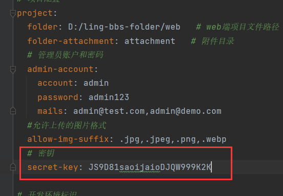

# 一、🌐更新缓存中系统设置的接口

## 1.1 接口描述

此接口用于更新缓存中的系统设置，为admin端使用，因为设置是在admin端更新，而web端和admin端又是不同的服务，因此提供这样的接口在admin端更新后同步更新web端。

## 1.2 请求地址

```http
PUT /web/inner/refresh-cache
```

## 1.3 请求参数

| 参数名    | 参数类型 | 是否必填 | 说明   |
| --------- | -------- | -------- | ------ |
| timestamp | `int`    | `true`   | 时间戳 |
| secretKey | `string` | `true`   | 密钥   |

## 1.4 返回实例

```json
{
    "status": "success",
    "code": 200,
    "msg": "请求成功",
    "data": null
}
```

## 1.5 接口实现

该接口为内部服务接口，并非由浏览器直接访问，而是由后端服务之间相互调用。由于该接口不依赖用户登录状态，因此属于一个透明接口，任何知道请求地址的人均可访问。为了保证接口的安全性，我们需要进行访问身份验证。

为防止恶意访问，需要通过校验访问方的身份来保障接口的安全。具体做法如下：

1、首先，我们定义一个密钥，它是一个唯一的随机字符串（以下图示）。该密钥仅限于服务双方（即web端和admin端）使用，并且不得共享给其他任何人。



2、当请求方（即管理端）发送请求时，需要携带请求的时间戳和签名。时间戳是请求发起时的毫秒值，而签名是根据时间戳和密钥经过加密算法生成的。加密采用 **HMAC-SHA256** 算法，确保相同的内容生成相同的签名。

3、当接收到请求后，服务端会使用相同的加密算法，将密钥和时间戳生成一个新的签名，并与请求中传递的签名进行比对。如果一致，说明请求合法，服务器接受该请求；否则，拒绝该请求。

4、为了防止第三方使用已过时的时间戳和签名发起请求，我们对时间戳进行了有效性校验。具体实现方式是，当请求的时间戳与当前时间差异超过30秒时，认为该请求的时间戳已失效。

整个过程中，时间戳或者签名有任何一个被篡改，那么最终生成的签名都会不一致。

在 `InnerAPIController` 控制器中，定义了接口处理方法 `refreshSysCache()`，用于实现上述逻辑。代码如下：

```java
package com.ling.controller.inner;

import com.ling.annotation.AccessControl;
import com.ling.annotation.Validation;
import com.ling.config.web.WebpageConfig;
import com.ling.constant.Constant;
import com.ling.entity.vo.Result;
import com.ling.enums.ResponseCodeEnum;
import com.ling.exception.BusinessException;
import com.ling.service.SysSettingService;
import com.ling.utils.StrUtil;
import org.apache.commons.codec.digest.HmacUtils;
import org.slf4j.Logger;
import org.slf4j.LoggerFactory;
import org.springframework.web.bind.annotation.*;

import javax.annotation.Resource;
import java.util.Objects;

@RestController
@RequestMapping("/inner-api")
public class InnerAPIController {
    private Logger log = LoggerFactory.getLogger(InnerAPIController.class);
    @Resource
    private SysSettingService sysSettingService;
    @Resource
    private WebpageConfig webpageConfig;

    @PutMapping("/refresh-cache")
    @AccessControl
    public Result<Void> refreshSysCache(@Validation Long timestamp, @Validation String sign) {
        // 校验时间戳，避免使用旧值
        if (Math.abs(System.currentTimeMillis() - timestamp) >= Constant.MILLIS_1 * 30) {
            log.error("时间戳失效");
            throw new BusinessException(ResponseCodeEnum.CODE_600);
        }

        // 校验签名
        String secretKey = webpageConfig.getSecretKey();
        String mySign = StrUtil.generateHmacSha256Hex(secretKey, String.valueOf(timestamp));
        if (!Objects.equals(mySign, sign)) {
            log.error("签名错误，校验失败");
            throw new BusinessException(ResponseCodeEnum.CODE_600);
        }

        sysSettingService.refreshCache();
        return Result.success();
    }
}
```

其实这里对时间戳的校验还不算严谨，毕竟只要不超过30秒，我仍然可以使用旧的时间戳。最安全的做法是时间戳用过一次后立刻失效，不过要实现这个技术有点复杂，这里就简单的采用时间限制。

签名是通过 **HMAC-SHA256** 算法计算得出的，它将密钥和时间戳结合加密后生成一个字符串。如果计算出的签名与请求中提供的签名一致，则说明请求合法。

> 此方法依赖 **Apache Commons Codec** 库来进行 SHA256 加密。

```java
/**
     * HMAC-SHA256 算法
     * 生成16进制随机字符串
     * 若密钥和数据一致，则生成的结果一致
     *
     * @param secretKey
     * @param data
     * @return
     */
    public static String generateHmacSha256Hex(String secretKey, String data) {
        // 1. 初始化 Mac 实例
        Mac mac = HmacUtils.getInitializedMac(HmacAlgorithms.HMAC_SHA_256, secretKey.getBytes(StandardCharsets.UTF_8));

        // 2. 更新数据并生成摘要
        byte[] digestBytes = mac.doFinal(data.getBytes(StandardCharsets.UTF_8));

        // 3. 转换为十六进制字符串
        return Hex.encodeHexString(digestBytes);
    }
```
