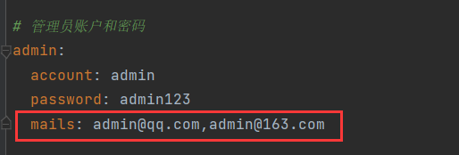

# 1 登录之前的准备

## 1.1 查询IP信息的第三方接口

登录我们需要用到用户的IP，这是一个查询IP信息的接口：

```http
https://whois.pconline.com.cn/ipJson.jsp?json=true&ip=IP地址
```

请求方法：

`GET`

请求参数：

| 参数名 | 必填项 | 说明   |
| ------ | ------ | ------ |
| ip     | `true` | IP地址 |

返回值：

```json
{
  "ip": "171.219.187.76",
  "pro": "四川省",
  "proCode": "510000",
  "city": "成都市",
  "cityCode": "510100",
  "region": "",
  "regionCode": "0",
  "addr": "四川省成都市 电信",
  "regionNames": "",
  "err": ""
}
```

其中，省份`pro`是我们需要的值。

这个请求在我们的场景中由服务器发送，因此需要借用OkHttp工具类向此接口发送用户的IP，获取用户的省份信息。而用户的IP则可以从`HttpServletRequest`中获取，获取的方法如下：

## 1.2  从HttpServletRequest中获取IP

IP工具类如下：

```java
package com.ling.utils;

import javax.servlet.http.HttpServletRequest;

/**
 * IP工具类
 */
public class IPUtil {
    /**
     * 获取客户端IP地址
     *
     * @param request
     * @return
     */
    public static String getIP(HttpServletRequest request) {
        String ip = request.getHeader("x-forwarded-for");
        if (ip != null && !ip.isEmpty() && !ip.equalsIgnoreCase("unknown")) {
            // 多次反向代理后会有多个ip值，第一个ip才是真实ip
            if (ip.contains(",")) {
                ip = ip.split(",")[0];
            }
        }
        if (ip == null || ip.isEmpty() || ip.equalsIgnoreCase("unknown"))
            ip = request.getHeader("Proxy-Client-IP");  // nginx反向代理
        if (ip == null || ip.isEmpty() || ip.equalsIgnoreCase("unknown"))
            ip = request.getHeader("WL-Proxy-Client-IP");   // 阿里云反向代理
        if (ip == null || ip.isEmpty() || ip.equalsIgnoreCase("unknown"))
            ip = request.getHeader("HTTP_CLIENT_IP");   // 西云数据
        if (ip == null || ip.isEmpty() || ip.equalsIgnoreCase("unknown"))
            ip = request.getHeader("HTTP_X_FORWARDED_FOR"); // 普通代理
        if (ip == null || ip.isEmpty() || ip.equalsIgnoreCase("unknown"))
            ip = request.getHeader("X-Real-IP");    // 云服务器
        if (ip == null || ip.isEmpty() || ip.equalsIgnoreCase("unknown"))
            ip = request.getRemoteAddr();   // 如果没有获取到，就直接取IP
        return ip;
    }
}
```

调用`getIP()`获取。

## 1.3 查询IP信息方法

```java
public String getProvince(String IP) {
    try {
        String url = "https://whois.pconline.com.cn/ipJson.jsp?json=true&ip=" + IP;
        String res = OkHttpUtil.getRequest(url);
        Map resMap = JSON.parseObject(res, Map.class);
        String province = (String) resMap.get("pro");
        return province;
    } catch (Exception e) {
        log.error(CommonMsg.FETCH_FAIL, e);
        return Constant.UNKNOWN;	// 若获取不到IP属地，返回未知
    }
}
```

响应为JSON字符串时，通常解析为对应的实体对象，如果没有实体，则解析为`Map`。

## 1.4 UserInfoSessionDto

`UserInfoSessionDto`对象是用于保存用户会话信息的传输实体。用户登录成功后，我们通常将用户的会话信息存储在`session`中，而这些信息可以通过`UserInfoSessionDto`对象来承载和表示。

> JWT也可以用于维护用户会话，但与传统的`session`不同的是，服务器只负责生成和校验JWT，而存储工作由浏览器完成。当然，在实际应用中，我们也可以结合使用两者，根据需求选择最佳方案。

`UserInfoSessionDto`定义如下：

```java
package com.ling.entity.dto;

/**
 * 用户会话信息传输实体
 */
public class UserInfoSessionDto {
    private String userId;  //  用户id
    private String nikeName; // 昵称
    private String province; // 省份
    private String isAdmin; // 是否管理员

    public String getUserId() {
        return userId;
    }

    public void setUserId(String userId) {
        this.userId = userId;
    }

    public String getNikeName() {
        return nikeName;
    }

    public void setNikeName(String nikeName) {
        this.nikeName = nikeName;
    }

    public String getProvince() {
        return province;
    }

    public void setProvince(String province) {
        this.province = province;
    }

    public String getIsAdmin() {
        return isAdmin;
    }

    public void setIsAdmin(String isAdmin) {
        this.isAdmin = isAdmin;
    }
}
```


# 2 登录接口

## 2.1 接口详细

请求地址：

```http
/web/account/login
```

请求方法：

`GET`

请求参数：

| 参数名    | 必填项 | 说明       |
| --------- | ------ | ---------- |
| mail      | `true` | 邮箱/账号  |
| password  | `true` | 密码       |
| checkCode | `true` | 图片验证码 |

响应：

```json
{
    "status": "success",
    "code":	200,
    "msg": "请求成功",
    "data": null
}
```

是否响应`UserInfoSessionDto`，视情况而定。

## 2.2 接口实现

登录操作主要包含查询和更新两部分：

1. **查询**：用于校验用户账户的合法性。
2. **更新**：用于维护用户的登录信息，包括以下字段：
   - `last_login_time`：记录用户最后一次登录的时间。
   - `last_login_ip`：记录用户最后一次登录时的IP地址。
   - `last_login_ip_address`：记录IP地址所属的地理位置。

在登录校验成功后，需要获取用户IP的归属地，并更新上述三个字段。同时，将用户的会话状态保存为 `UserInfoSessionDto`，以便后续使用。

下面是实现：

控制层：

> 注意⚠：
>
> 验证码的校验应该放到控制层，而不应该放到业务层。

```java
/**
     * 登录
     *
     * @param request
     * @param session
     * @param mail      邮箱
     * @param password  密码
     * @param checkCode 图片验证码
     * @return
     */
@GetMapping("/login")
@AccessControl
public Result login(HttpServletRequest request,
                                        HttpSession session,
                                        @Validation(max = 150, regex = RegexConstant.REGEX_EMAIL) String mail,
                                        @Validation(min = 8, max = 32) String password,
                                        @Validation String checkCode) {
    try {
        log.info("邮箱: {}, 密码: {}, 图片验证码: {}", mail, password, checkCode);
        String sCheckCode = (String) session.getAttribute(Constant.CHECK_CODE);
        if (StrUtil.isEmpty(sCheckCode))
            throw new BusinessException(CommonMsg.CHECK_CODE_EXPIRED);
        if (!Objects.equals(checkCode, sCheckCode))
            throw new BusinessException(CommonMsg.CHECK_CODE_ERROR);
        String ip = IPUtil.getIP(request);
        UserInfoSessionDto userInfoSessionDto = userInfoService.login(ip, mail, password, checkCode, sCheckCode);
        session.setAttribute(Constant.USERINFO_SESSION_KEY, userInfoSessionDto);
        // return Result.success(userInfoSessionDto);
        return Result.success();
    } finally {
        session.removeAttribute(Constant.CHECK_CODE);
    }
}
```

说一个细节，密码校验仅作长度限制，因为登录一般不会对密码进行校验，而且登录传输的密码肯定是密文，对密文进行正则校验没有意义。

业务层接口，添加一个`login()`：

```java
/**
     * 登录
     *
     * @param IP         IP
     * @param mail       邮箱
     * @param password   密码
     * @return
     */
    UserInfoSessionDto login(String IP, String mail, String password);
```

业务层实现，更新用户信息直接调用已有的方法`update()`：

```java
@Override
    public UserInfoSessionDto login(String IP, String mail, String password) {
        try {
            UserInfo userInfo = userInfoMapper.selectByEmail(mail);
            if (userInfo == null || !userInfo.getPassword().equals(password))
                throw new BusinessException(CommonMsg.USERNAME_OR_PASSWORD_ERROR);
            if (Objects.equals(userInfo.getStatus(), UserStatusEnum.DISABLE.getStatus()))
                throw new BusinessException(CommonMsg.USER_DISABLED);

            String province = getProvince(IP);
            userInfo.setLastLoginTime(new Date());
            userInfo.setLastLoginIp(IP);
            userInfo.setLastLoginIpAddress(province);
            userInfoMapper.update(userInfo);

            UserInfoSessionDto userInfoSessionDto = new UserInfoSessionDto();
            userInfoSessionDto.setUserId(userInfo.getUserId());
            userInfoSessionDto.setNickName(userInfo.getNickName());
            userInfoSessionDto.setProvince(province);
            boolean isAdmin = ArrayUtils.contains(webConfig.getAdminMails().split(","), userInfo.getEmail());
            userInfoSessionDto.setIsAdmin(isAdmin);
            return userInfoSessionDto;
        } catch (BusinessException e) {
            log.error(CommonMsg.LOGIN_FAIL, e);
            throw new BusinessException(CommonMsg.LOGIN_FAIL, e);
        }
    }

    /**
     * 获取IP归属地
     *
     * @param IP
     * @return
     */
    public String getProvince(String IP) {
        try {
            String url = "https://whois.pconline.com.cn/ipJson.jsp?json=true&ip=" + IP;
            String res = OkHttpUtil.getRequest(url);
            Map<String, Object> resMap = JSON.parseObject(res, Map.class);
            String province = (String) resMap.get("pro");
            return province;
        } catch (Exception e) {
            log.error(CommonMsg.FETCH_FAIL, e);
            return Constant.UNKNOWN;
        }
    }
```

`isAdmin`标识用户是否为管理员，通过邮箱来判断。管理员邮箱定义在配置文件中，多个邮箱用,分割：



注入后拿到邮箱集解析为数组，判断用户的邮箱是否在数组中，不在则不是管理员。


# 3 获取用户会话信息接口

## 3.1 接口详细

请求地址：

```http
/web/account/getUserInfo
```

请求方法：

`GET`

请求参数：无

响应：

```json
{
    "status": "success",
    "code":	200,
    "msg": "请求成功",
    "data": {
        userId: "xxx",
        nikeName: "xxx",
        province: "xxx",
        isAdmin: false
    }
}
```

就是响应`UserInfoSessionDto`。

## 3.2 接口实现

```java
/**
     * 获取用户信息
     *
     * @param session
     * @return
     */
    @GetMapping("/getUserInfo")
    @AccessControl
    @RequestLogRecode
    public Result<UserInfoSessionDto> getUserInfo(@ExcludeParamLog HttpSession session) {
        UserInfoSessionDto userInfo = (UserInfoSessionDto) session.getAttribute(Constant.USERINFO_SESSION_KEY);
        return Result.success(userInfo);
    }
```


# 4 登出接口

## 4.1 接口详细

请求地址：

```http
/web/account/logout
```

请求方法：

`GET`

请求参数：无

响应：

```json
{
    "status": "success",
    "code":	200,
    "msg": "请求成功",
    "data": null
}
```

将会话对象删除。

## 4.2 接口实现

```java
/**
     * 登出
     *
     * @param session
     * @return
     */
    @GetMapping("/logout")
    @AccessControl
    @RequestLogRecode
    public Result logout(@ExcludeParamLog HttpSession session) {
        session.invalidate();
        return Result.success();
    }
```

用`invalidate()`来删除`Session`，没有使用`removeAttribute(key)`删除对应的信息。因为`Session`类使于`Map`以键值对形式存储值，而`removeAttribute()`一次只能删除一个键值对，`invalidate()`是把整个`Session`给删除，其内部会调用`removeAttribute()`逐一删除`Session`的键值对。

```java
session.removeAttribute(Constant.USERINFO_SESSION_KEY);
```

这只是删除`USERINFO_SESSION_KEY`对应的信息，当前会话的其他信息并没删除。而彻底销毁`Session`就用`invalidate()`。

在登出(完全销毁登录状态)或清空会话信息(购物车、登录信息)的场景下使用。


# 5 获取是否开启评论的状态

## 5.1 接口详细

请求地址：

```http
/web/account/getOpenComment
```

请求方法：

`GET`

请求参数：无

响应：

```json
{
    "status": "success",
    "code": 200,
    "msg": "请求成功",
    "data": {
        "openComment": true
    }
}
```

将开启状态返回，是一个布尔值。这个状态在系统启动时已存入系统设置中。

## 5.2 接口实现

```java
/**
     * 获取评论开关状态
     *
     * @return
     */
    @GetMapping("/getOpenComment")
    @AccessControl
    @RequestLogRecode
    public Result<HashMap<String, Object>> getSysSetting4Comment() {
        SysSettingContainer sysSettingContainer = SysCacheUtil.getSysSettingContainer();
        HashMap<String, Object> res = new HashMap<>();
        res.put("openComment", sysSettingContainer.getSysSetting4Comment().isOpenComment());
        return Result.success(res);
    }
```


# 6 重置密码接口

## 6.1 接口详情
