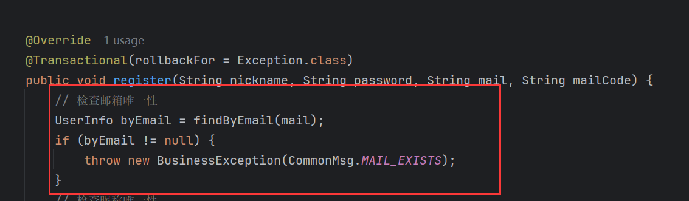

# 1 更新发送邮箱的方法

这是旧版的方法：

```java
@Override
    @Transactional(rollbackFor = Exception.class)
    public void sendMailCode(String mail) {
        UserInfo userInfo = userInfoMapper.selectByEmail(mail);
        // 判断邮箱是否已存在
        if (userInfo != null) {
            throw new BusinessException(CommonMsg.MAIL_EXISTS);
        }
        // 先将这个mail的status改为失效
        mailCodeMapper.updateStatusByMail(mail);

        // 生成随机code
        String mCode = StrUtil.getRandomStr(Constant.NUM_5);
        send(mail, mCode);

        // 再将这个邮箱验证码数据插入mail_code表
        MailCode mailCode = new MailCode();
        mailCode.setMail(mail);
        mailCode.setCode(mCode);
        Date date = new Date();
        mailCode.setCreateTime(date);
        mailCode.setUpdateTime(date);
        mailCode.setStatus(MailCodeStatusEnum.NOT_USE.getStatus());

        mailCodeMapper.insert(mailCode);
    }
```

这个方法中在发送前对邮箱进行了是否存在的校验，这是为了注册时保证邮箱的唯一性，但是这个校验其实在注册的接口中实现最好，而且在注册的接口中已经实现了：



这里再次校验就显得冗余了。

如果保留这个校验，此处的逻辑是邮箱存在则报错，但是后面的重置密码接口也需要用到发送邮箱的功能，而这里的场景中邮箱不存在才应该报错，这两个功能冲突了。

最好是将其作为一个接口抽离出去，我们可以让用户输入完邮箱后，马上请求接口及时响应邮箱是否存在，对于注册，若邮箱存在则报错，对于重置密码，若邮箱不存在则报错，用户可以马上得到反馈并改正。


# 2 检查邮箱是否存在的接口

## 2.1 接口详细

请求地址：

```http
/web/account/checkMailExists
```

请求方法：

`GET`

请求参数：

| 参数名 | 必填项 | 说明                                           |
| ------ | ------ | ---------------------------------------------- |
| type   | `true` | 值为1、2，其中1：注册的检查、2：重置密码的检查 |

响应：

```java
// 邮箱已存在
{
    "status": "error",
    "code": 700,
    "msg": "邮箱已存在",
    "data": null
}
// 邮箱不存在
{
    "status": "error",
    "code": 700,
    "msg": "邮箱不存在",
    "data": null
}
// 检查通过
{
    "status": "success",
    "code": 200,
    "msg": "请求成功",
    "data": null
}
```

## 2.2 接口实现

在用户业务层增加接口：

```java
 /**
     * 检查邮箱是否存在
     *
     * @param mail
     * @param env
     */
    void checkMailExists(String mail, Integer env);
```

```java
@Override
    public void checkMailExists(String mail, Integer env) {
        UserInfo userInfo = findByEmail(mail);
        if (Objects.equals(env, MailExistsCheckEnum.REGEISTER_CHECK.getEnv()) && userInfo != null) {
            throw new BusinessException(CommonMsg.MAIL_EXISTS);
        }
        if (Objects.equals(env, MailExistsCheckEnum.RESET_PWD_CHECK.getEnv()) && userInfo == null) {
            throw new BusinessException(CommonMsg.MAIL_NOT_EXISTS);
        }
    }
```

控制器：

```java
@GetMapping("/mailCheckExists")
    @AccessControl
    @RequestLogRecode
    public Result mailCheckExists(@Validation(max = 150, regex = RegexConstant.REGEX_EMAIL) String mail,
                                  @Validation(max = 2, min = 1) Integer env) {
        userInfoService.checkMailExists(mail, env);
        return Result.success();
    }
```

邮箱不同场景检查是否存在枚举：

```java
package com.ling.enums;

/**
 * 枚举类，用于检查邮件是否存在
 */
public enum MailExistsCheckEnum {
    REGEISTER_CHECK(1, "注册场景检查"),
    RESET_PWD_CHECK(2, "重置密码场景检查");

    private Integer env;
    private String desc;

    MailExistsCheckEnum(Integer env, String desc) {
        this.env = env;
        this.desc = desc;
    }

    public Integer getEnv() {
        return env;
    }

    public String getDesc() {
        return desc;
    }
}
```
