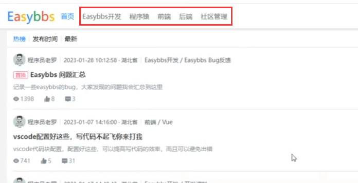
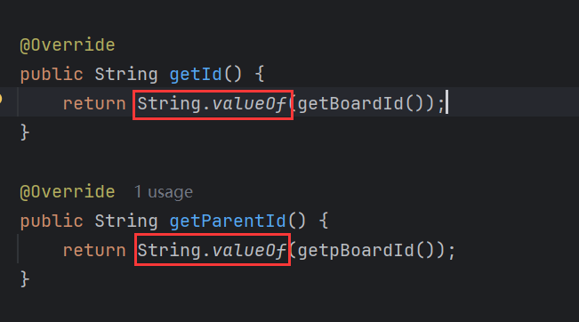
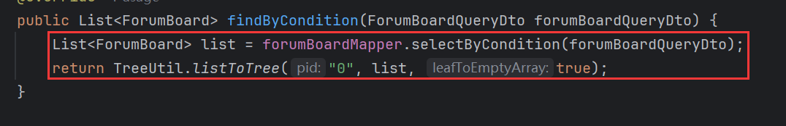
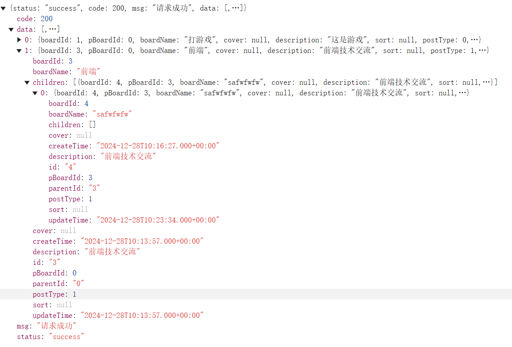

# 1 板块

**板块**是论坛内容的一种分类方式，用于组织和管理主题帖子。不同的领域可以设置为一个板块，例如汽车板块、游戏板块等。板块下可以进一步划分为不同的主题或子分类（具体分类视板块内容的复杂程度而定）。以**游戏板块**为例，可以包含以下主题分类：

- **游戏资讯**：发布最新公告、新闻、更新内容等。
- **游戏攻略**：分享游戏玩法技巧、任务流程、装备搭配等实用信息。
- **玩家交流**：讨论游戏趣事、晒成就、吐槽版本等。

板块和主题的设置目的是为用户提供有条理的内容组织结构，使他们能够快速找到感兴趣的内容并参与讨论。总之，通过科学的分类设计，论坛可以提升信息管理效率和用户的参与体验。

本项目前端中的板块样式：



类似导航栏。

## 1.1 板块表

板块表结构如下：

```sql
create table forum_board
(
    board_id    int auto_increment comment '板块id',
    p_board_id  int               null comment '父级板块id',
    board_name  varchar(50)       null comment '板块名称',
    cover       varchar(50)       null comment '板块封面',
    description varchar(150)      null comment '板块描述',
    sort        int               null comment '排序',
    post_type   tinyint default 1 null comment '0: 只允许管理员发帖, 1: 允许任何人发帖',
    constraint forum_board_pk
        primary key (board_id)
)
    comment '论坛板块表';
```

板块存在层级，因此有父级id，根板块的pid为0，响应给前端的数据是树形结构。

## 1.2 创建CRUD

快速CRUD参考[springboot-vue-note](https://github.com/lingzed/springboot-vue-note)第26章。

有一些细节需要注意，板块返回给前端的是一个树形结构的数据，后端使用【TreeUtil】工具类转换为有层次的【List】，使用【TreeUtil】需要实体实现【TreeNode】接口，在转换时，用到的【pid】是字符串，因此需要实现【getId()】和【getParentId()】时，需要返回字符串id：



有层次的【List】一般不需要分页，因为分页可能导致父节点的某些子节点显示不全，直接转换为层次【List】返回即可：



响应的数据：

