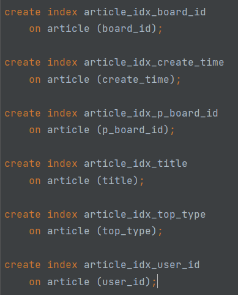
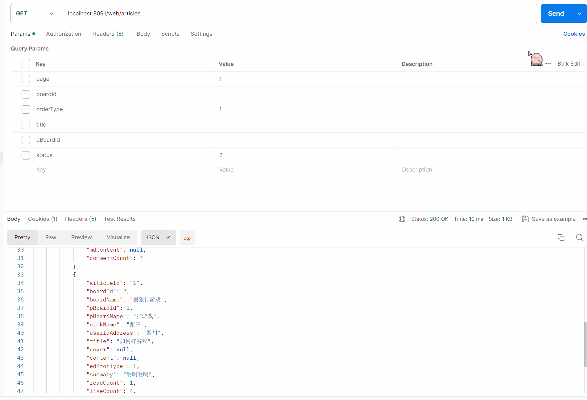
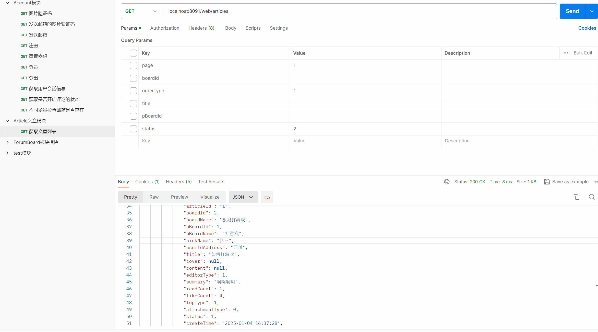
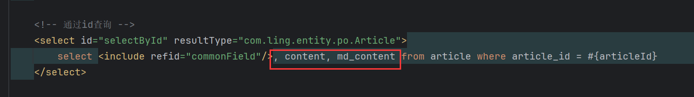

# 1 文章表

表结构如下：

```sql
create table article
(
    article_id      varchar(15)       not null comment '文章id'
        primary key,
    board_id        int               not null comment '板块id',
    board_name      varchar(50)       not null comment '板块名称',
    p_board_id      int               null comment '父级板块id',
    p_board_name    varchar(50)       null comment '父级板块名称',
    user_id         varchar(15)       not null comment '用户id',
    nick_name       varchar(20)       not null comment '昵称',
    user_id_address varchar(100)      not null comment '最后登录ip地址',
    title           varchar(150)      not null comment '文章标题',
    cover           varchar(100)      null comment '文章封面',
    content         text              null comment '内容',
    md_content      text              null comment 'markdown格式的内容',
    editor_type     tinyint           null comment '文章编辑器类型, 0: 富文本编辑器, 1: markdown编辑器',
    summary         varchar(200)      null comment '摘要',
    read_count      int     default 0 not null comment '浏览量',
    like_count      int     default 0 not null comment '点赞量',
    comment_count   int     default 0 not null comment '评论数量',
    top_type        tinyint default 0 not null comment '0: 未置顶, 1: 已置顶',
    attachment_type tinyint default 0 not null comment '0: 没有附件, 1: 有附件',
    status          tinyint default 1 not null comment '0: 已删除, 1: 待审核, 2: 已审核',
    create_time     datetime          not null comment '创建/发布时间',
    update_time     datetime          not null comment '编辑时间'
)
    comment '文章表';

create index article_idx_board_id
    on article (board_id);

create index article_idx_create_time
    on article (create_time);

create index article_idx_p_board_id
    on article (p_board_id);

create index article_idx_title
    on article (title);

create index article_idx_top_type
    on article (top_type);

create index article_idx_user_id
    on article (user_id);
```

这张表中冗余了【user_info】表和【forum_board】表的一些字段，是为了减少联查，保证查询速度。也因此，在更新【user_info】或者【forum_board】时，【article】表也要对应更新。

表中【content】和【md_content】字段是用来存储文章内容的，第一个存储HTML格式的内容，另一个存储markdown格式的内容。

字段的其他细节，下面结合功能实现说明。


# 2 文章查询

## 2.1 文章查询DTO

主要通过以下几个字段查询：

```java
package com.ling.entity.dto;

import java.util.Date;

/**
 * 文章查询DTO
 */
public class ArticleQueryDto extends BaseQueryDto {
    private String title;
    private Integer boardId;
    private Integer pBoardId;
    private Integer status;
    private String orderBy;
    private String userId;

    public Date getCreateTime() {
        return createTime;
    }

    public void setCreateTime(Date createTime) {
        this.createTime = createTime;
    }

    private Integer topType;
    private Date createTime;

    public Integer getTopType() {
        return topType;
    }

    public void setTopType(Integer topType) {
        this.topType = topType;
    }

    public String getUserId() {
        return userId;
    }

    public void setUserId(String userId) {
        this.userId = userId;
    }

    public String getTitle() {
        return title;
    }

    public void setTitle(String title) {
        this.title = title;
    }

    public Integer getBoardId() {
        return boardId;
    }

    public void setBoardId(Integer boardId) {
        this.boardId = boardId;
    }

    public Integer getpBoardId() {
        return pBoardId;
    }

    public void setpBoardId(Integer pBoardId) {
        this.pBoardId = pBoardId;
    }

    public Integer getStatus() {
        return status;
    }

    public void setStatus(Integer status) {
        this.status = status;
    }

    public String getOrderBy() {
        return orderBy;
    }

    public void setOrderBy(String orderBy) {
        this.orderBy = orderBy;
    }
}
```

【status】字段看情况，是否通过【status】查询文章看需求。另外表中创建了这些字段的索引，增加查询速度：



## 2.2 ArticleVo

展示给前端的VO，有些字段不需要展示给用户：

```java
package com.ling.entity.vo;

import com.fasterxml.jackson.annotation.JsonFormat;

import java.util.Date;

public class ArticleVo {
    private String articleId; //文章id
    private Integer boardId; //板块id
    private String boardName; //板块名称
    private Integer pBoardId; //父板块id
    private String pBoardName; //父板块名称
    private String userId; //用户id
    private String nickName; //用户昵称
    private String userIdAddress; //用户地址
    private String title; //标题
    private String cover; //封面图
    private String content; //内容
    private String mdContent; //markdown内容
    private Integer editorType; //编辑器类型, 0: 富文本编辑器, 1: markdown编辑器
    private String summary; //摘要
    private Integer readCount; //阅读数
    private Integer likeCount; //点赞数
    private Integer CommentCount; //评论数
    private Integer topType; //置顶类型, 0: 未置顶, 1: 已置顶
    private Integer attachmentType; //附件类型, 0: 没有附件, 1: 有附件
    private Integer status; //状态, 0: 已删除, 1: 待审核, 2: 已审核
    @JsonFormat(pattern = "yyyy-MM-dd HH:mm:ss", timezone = "GMT+8")
    private Date createTime; //创建时间

    public String getUserId() {
        return userId;
    }

    public void setUserId(String userId) {
        this.userId = userId;
    }

    public String getArticleId() {
        return articleId;
    }

    public void setArticleId(String articleId) {
        this.articleId = articleId;
    }

    public Integer getBoardId() {
        return boardId;
    }

    public void setBoardId(Integer boardId) {
        this.boardId = boardId;
    }

    public String getBoardName() {
        return boardName;
    }

    public void setBoardName(String boardName) {
        this.boardName = boardName;
    }

    public Integer getpBoardId() {
        return pBoardId;
    }

    public void setpBoardId(Integer pBoardId) {
        this.pBoardId = pBoardId;
    }

    public String getpBoardName() {
        return pBoardName;
    }

    public void setpBoardName(String pBoardName) {
        this.pBoardName = pBoardName;
    }

    public String getNickName() {
        return nickName;
    }

    public void setNickName(String nickName) {
        this.nickName = nickName;
    }

    public String getUserIdAddress() {
        return userIdAddress;
    }

    public void setUserIdAddress(String userIdAddress) {
        this.userIdAddress = userIdAddress;
    }

    public String getTitle() {
        return title;
    }

    public void setTitle(String title) {
        this.title = title;
    }

    public String getCover() {
        return cover;
    }

    public void setCover(String cover) {
        this.cover = cover;
    }

    public String getContent() {
        return content;
    }

    public void setContent(String content) {
        this.content = content;
    }

    public String getMdContent() {
        return mdContent;
    }

    public void setMdContent(String mdContent) {
        this.mdContent = mdContent;
    }

    public Integer getEditorType() {
        return editorType;
    }

    public void setEditorType(Integer editorType) {
        this.editorType = editorType;
    }

    public String getSummary() {
        return summary;
    }

    public void setSummary(String summary) {
        this.summary = summary;
    }

    public Integer getReadCount() {
        return readCount;
    }

    public void setReadCount(Integer readCount) {
        this.readCount = readCount;
    }

    public Integer getLikeCount() {
        return likeCount;
    }

    public void setLikeCount(Integer likeCount) {
        this.likeCount = likeCount;
    }

    public Integer getCommentCount() {
        return CommentCount;
    }

    public void setCommentCount(Integer commentCount) {
        CommentCount = commentCount;
    }

    public Integer getTopType() {
        return topType;
    }

    public void setTopType(Integer topType) {
        this.topType = topType;
    }

    public Integer getAttachmentType() {
        return attachmentType;
    }

    public void setAttachmentType(Integer attachmentType) {
        this.attachmentType = attachmentType;
    }

    public Integer getStatus() {
        return status;
    }

    public void setStatus(Integer status) {
        this.status = status;
    }

    public Date getCreateTime() {
        return createTime;
    }

    public void setCreateTime(Date createTime) {
        this.createTime = createTime;
    }
}
```

## 2.3 排序查询的实现思路

前端页面中有3个排序选项：

- 热榜
- 发布时间
- 最新

如下图：


文章列表支持这三种排序方式，根据规则调整文章排列顺序（如热度、发布时间等）。排序通过`order by` 语句实现，在 `ArticleQueryDto` 中，字段`orderBy` 表示查询排序规则。`orderBy` 是字符串类型，用于传递 SQL 的`order by` 语句。排序的具体规则如下：

**1. 热榜**

热榜根据置顶、评论数、点赞数、浏览数倒序排列，SQL 如下：

```sql
order by top_type desc, comment_count desc, like_count desc, read_count desc
```

**2. 发布时间**

按照文章发布时间正序排列：

```sql
order by create_time
```

**3. 最新**

按照文章发布时间倒序排列：

```sql
order by create_time desc
```

前端通过参数传递排序类型，后端根据参数动态生成对应的`order by` 语句，构建 SQL，实现文章列表的动态排序，例如：

```xml
<select>
    <if test="orderBy != null and orderBy != ''">
        order by ${orderBy}
    </if>
</select>
```

我们可以维护一个枚举，来表示这3种排序规则：

```java
package com.ling.enums;

/**
 * 文章排序枚举类
 */
public enum ArticleOrderEnum {
    HOT(0, "top_type desc, comment_count desc, like_count desc, read_count desc", "热榜"),
    POST_TIME(1, "create_time", "发布时间"),
    NEW(2, "create_time desc", "最新");

    private Integer orderType;
    private String orderBySql;
    private String desc;

    ArticleOrderEnum(Integer orderType, String orderBySql, String desc) {
        this.orderType = orderType;
        this.orderBySql = orderBySql;
        this.desc = desc;
    }

    public static ArticleOrderEnum getArticleOrderEnum(Integer orderType) {
        for (ArticleOrderEnum value : ArticleOrderEnum.values()) {
            if (orderType.equals(value.getOrderType())) {
                return value;
            }
        }
        return null;
    }

    public Integer getOrderType() {
        return orderType;
    }

    public String getOrderBySql() {
        return orderBySql;
    }

    public String getDesc() {
        return desc;
    }
}
```

根据前端传递的排序类型参数例如【orderType】，获取对应的排序sql，然后存入查询Dto中进行传递，伪代码如下：

```java
{
    ArticleQueryDto articleQueryDto = new ArticleQueryDto();
    // orderType=0 | 1 | 2, 通过orderType拿到对应枚举
	ArticleOrderEnum articleOrder = ArticleOrderEnum.getArticleOrderEnum(orderType);
    // 获取枚举对应的order by sql语句，然后封装到QueryDto中
    articleQueryDto.setOrderBy(articleOrder.getOrderBySql());
    articleService.findByCondition(articleQueryDto);
}
```

## 2.4 文章状态查询

文章一共有3种状态，用字段【status】表示，其中：

- 0：已删除
- 1：待审核
- 2：已审核

用户的登录状态会对文章列表产生影响，结合【status】字段：

1. 当用户登录时，可以看到自己发布的待审核文章，以及所有已审核文章。
2. 当未登录时，用户只能看到所有已审核的文章。

在动态构建sql时，需要通过userId是否未【null】来判断是否登录，从而产生不同的条件，当userId不为【null】即用户登录，条件如下：

```xml
<if test="userId != null">
    <!-- 登录用户能看到所有状态为2和自己的状态为1的文章 -->
    and (status = 2 or status = 1 and user_id = #{userId})
</if>
```

当【userId】为【null】时，条件应为：

```xml
<if test="userId == null">
    <!-- 未登录用户只能看到所有状态为2的文章 -->
    and status = 2
</if>
```

> 在sql中条件的优先级最高的是【()】，其次是【not】，然后是【and】、【or】，相同优先级按从左往右的顺序比较。

我们这里将前面的其他条件假设为a，那么就是在满足a的文章中选出状态为2，和当前用户的状态为1的文章。如果不加【()】提升优先级，直接写成这样：

```sql
a and status = 2 or status = 1 and user_id = ?
```

那么效果就是在满足a的文章中选出状态为2的文章加上当前用户的状态为1的文章，【status = 1 and user_id = ?】选择出来的数据没有经过条件a的筛选。因此需要将【status = 2 or status = 1 and user_id =  ？】看作一个整体再在满足a的文章中进行筛选，所以加【()】:

```sql
a and (status = 2 or status = 1 and user_id = ?)
```

等效写法：

```sql
-- 因为and优先于or计算，所以加不加()不影响顺序
(status = 2 or status = 1 and user_id = ?) = (status = 2 or (status = 1 and user_id = ?))
```

下面是演示：

当前已登录，能看到状态2和自己的状态1的文章的文章：



未登录时，只能看到状态2的文章：



## 2.5 查询集不反回文章内容

文章的内容是HTML文本或者markdown文本，存储在text字段中。由于内容数据量通常非常庞大，如果在查询文章列表时直接将这些内容全部查询出来，会带来以下问题：

- **查询效率低**：大量无关数据的查询增加了数据库和服务器的负担。

- **网络传输慢**：数据量过大导致传输时间变长，影响用户体验。

文章列表仅展示基础信息，如标题、浏览量、点赞量、作者等，详细内容只有在用户点击具体文章时才需要加载。因此：

1. **查询文章列表时**：只查询必要的字段（如标题、作者等），**不查询 `text` 字段**。
2. **查看具体文章时**：单独查询所需文章的 `text` 内容，此时仅查询 **一个文章的内容**，避免了不必要的性能消耗。

通用的查询字段里没有【content】和【md_content】字段：


具体查询时，才会查这两个字段：



查询出来的【Article】实体需要转换未【ArticleVo】返回。

## 2.6 查询文章接口

地址：

```apl
http://localhost:8091/web/articles
```

请求方式：

【GET】

请求参数：

| 参数名    | 类型       | 必填项    | 说明                                             |
| --------- | ---------- | --------- | ------------------------------------------------ |
| title     | 【string】 | 【false】 | 文章标题                                         |
| boardId   | 【int】    | 【false】 | 板块id                                           |
| pBoardId  | 【int】    | 【false】 | 父板块id                                         |
| orderType | 【int】    | 【false】 | 排序类型，0：热榜，1：发布时间，2：最近，默认为0 |
| page      | 【int】    | 【false】 | 页码，默认为1                                    |
| status    | 【int】    | 【false】 | 文章状态，0：已删除，1：待审核，2：已审核        |

响应：

```json
{
    "status": "success",
    "code": 200,
    "msg": "请求成功",
    "data": {
        "total": 1,
        "page": 1,
        "pageSize": 10,
        "pageTotal": 1,
        "rows": [
            {
                "articleId": "11",
                "boardId": 3,
                "boardName": "游戏攻略",
                "pBoardId": 1,
                "pBoardName": "游戏",
                "userId": "9619980088",
                "nickName": "ling",
                "userIdAddress": "四川",
                "title": "巫师3攻略1",
                "cover": null,
                "content": null,
                "mdContent": null,
                "editorType": null,
                "summary": "巫师3良心攻略",
                "readCount": 0,
                "likeCount": 0,
                "topType": 0,
                "attachmentType": 0,
                "status": 2,
                "createTime": "2025-01-06 16:38:14",
                "commentCount": 0
            }
        ]
    }
}
```

## 2.7 接口实现

查询的sql：

```xml
	<!-- 通用字段 -->
    <sql id="commonField">
        article_id
        , board_id
        , board_name
        , p_board_id
        , p_board_name
        , user_id
        , nick_name
        , user_id_address
        , title
        , cover
        , editor_type
        , summary
        , read_count
        , like_count
        , comment_count
        , top_type
        , attachment_type
        , status
        , create_time
        , update_time
    </sql>

    <!-- 查询条件 -->
    <sql id="queryCondition">
        <where>
            <if test="title != null and title != ''">
                title like concat('%', #{title}, '%')
            </if>
            <if test="boardId != null">
                and board_id = #{boardId}
            </if>
            <if test="pBoardId != null">
                and p_board_id = #{pBoardId}
            </if>
            <if test="userId != null">
                <!-- 登录用户能看到所有状态为2和自己的状态为1的文章 -->
                and (status = 2 or (status = 1 and user_id = #{userId}))
            </if>
            <if test="userId == null">
                <!-- 未登录用户只能看到所有状态为2的文章 -->
                and status = 2
            </if>
            <if test="status != null">
                and status = #{status}
            </if>
            <if test="topType != null">
                and top_type = #{topType}
            </if>
            <if test="createTime != null">
                and create_time = #{createTime}
            </if>
        </where>
    </sql>

    <!-- 条件分页查询，返回po -->
    <select id="selectByCondition" resultType="com.ling.entity.po.Article">
        select <include refid="commonField"/> from article
        <include refid="queryCondition"/>
        <if test='orderBy != null and orderBy != ""'>
            order by ${orderBy}
        </if>
        <if test="index != null and size != null">
            limit #{index}, #{size}
        </if>
    </select>

	<!-- 条件查询总数量 -->
    <select id="selectCountByCondition" resultType="java.lang.Long">
        select count(0) total from article <include refid="queryCondition"/>
    </select>
```

业务层：

```java
/**
 * 条件查询Vo
 *
 * @param articleQueryDto
 * @return
 */
@Override
public PageBean<ArticleVo> findVoByCondition(ArticleQueryDto articleQueryDto) {
    List<Article> list = articleMapper.selectByCondition(articleQueryDto);
    List<ArticleVo> articleVos = list.stream().map(e -> {
        ArticleVo vo = new ArticleVo();
        BeanUtils.copyProperties(e, vo);
        return vo;
    }).collect(Collectors.toList());
    Long total = findTotalByCondition(articleQueryDto);
    return PageBean.of(total, articleQueryDto.getPage(), articleQueryDto.getPageSize(), articleVos);
}
```

控制器：

```java
@GetMapping
@AccessControl
public Result loadArticles(HttpSession session, String title,
                           @Validation(required = false) Integer boardId,
                           @Validation(required = false) Integer pBoardId,
                           @RequestParam(defaultValue = "0") @Validation(max = 2, required = false) Integer orderType,
                           @Validation(required = false, max = 2) Integer status,
                           @RequestParam(defaultValue = "1") @Validation(min = 1, required = false) Integer page) {
    ArticleQueryDto articleQueryDto = new ArticleQueryDto();
    articleQueryDto.setTitle(title);
    articleQueryDto.setBoardId(Objects.equals(boardId, 0) ? null : boardId); // 板块id为0时，表示查询所有专栏的文章
    articleQueryDto.setpBoardId(pBoardId);
    // 根据前端传来的orderType，获取对应的排序规则
    ArticleOrderEnum articleOrderEnum = ArticleOrderEnum.getArticleOrderEnum(orderType);
    articleQueryDto.setOrderBy(articleOrderEnum.getOrderBySql());
    UserInfoSessionDto userinfo = (UserInfoSessionDto) session.getAttribute(Constant.USERINFO_SESSION_KEY);
    articleQueryDto.setUserId(userinfo == null ? null : userinfo.getUserId());
    articleQueryDto.setStatus(status);// 查询文章的场景中，状态单独作为条件基本没用上，但是我还是留着
    articleQueryDto.setPage(page);
    articleQueryDto.setPageSize(Constant.NUM_10);
    PageBean<ArticleVo> voByCondition = articleService.findVoByCondition(articleQueryDto);
    return Result.success(voByCondition);
}
```

查询Dto就是用来携带查询sql的条件，巧妙的构建Dto字段与sql条件字段的对应关系，动态改变查询Dto的字段，查询条件的字段也会动态改变，这是查询Dto的一种能力。


# 3 查询文章详情

查询文章详情，不能直接调用【findById()】，因为这个方法仅通过id查询。当用户点开文章查看时是需要给文章增加浏览量的。因此我们需要重新定义一个方法，至少实现两个功能：

- 返回文章详情内容。
- 增加文章浏览量。

一般增加浏览量的需求有这么几个：

1. 无论是否登录，只要访问接口，就增加浏览量。
2. 无论是否登录，只有在第一次访问接口时才增加浏览量。
3. 只有在登录时，访问接口才增加浏览量。
4. 只有在登录时，且为第一次访问接口，才增加浏览量。

具体选哪个看情况，这里我选择实现第3种需求。

## 3.1 a = a + value线程安全问题

```sql
update table set a = a + value where condition;
```

【a = a + value】本身不是一个线程安全的操作，它包含读取、更新、写回三个步骤，因此存在线程安全问题。但是【a = a + value】与【update】结合起来却是线程安全的，因为使用 `update` 语句更新数据时，数据库会在执行该操作时会采取措施如：加行锁，确保在同一时间内只有一个事务能够成功更新数据。所以增加浏览量的操作不需要加锁：

```sql
update article set read_count = read_count + 1 where article_id = ?
```

## 3.2 文章不同状态的查询情况

1. 未登录用户不能访问呢已删除、待审核文章。
2. 管理员不能访问已删除文章。
3. 已登录用户不能访问已删除、待审核但作者不是自己的文章。

逻辑判断比较多，可以定义一些变量来存储这些判断，让逻辑更加清晰：

```java
boolean isLogin;	// 是否登录
boolean isDeleted;	// 是否删除
boolean isPending;	// 是否待审核
boolean isAudited;	// 是否已审核
boolean isAuthor;	// 是否是作者
```

对于不能访问的文章，我们抛出404错误。

不管有没有登录，删除的文章都不能访问：

```java
if(isDeleted)
    throw new BusinessException(ResponseCodeEnum.CODE_404);
```

若访问未删除的文章，那么未登录的用户不能访问待审核的文章：

```java
if(isDeleted)
    throw new BusinessException(ResponseCodeEnum.CODE_404);

if (!isLogin && isPending)
            throw new BusinessException(ResponseCodeEnum.CODE_404);
```

若访问未删除的文章，且用户已登录，那么如果他不是管理员，就不能访问作者不是自己的待审核文章：

```java
if(isDeleted)
    throw new BusinessException(ResponseCodeEnum.CODE_404);

if (!isLogin && isPending)
            throw new BusinessException(ResponseCodeEnum.CODE_404);

if (isLogin && !userinfo.getIsAdmin() && isPending && !isAuthor)
            throw new BusinessException(ResponseCodeEnum.CODE_404);
```

以上就是完整的逻辑判断。

## 3.3 查询文章详情接口

地址：

```apl
http://localhost:8091/web/articles/{articlesId}
```

请求方式：

【GET】

请求参数：

| 参数名    | 类型       | 必填项   | 说明   |
| --------- | ---------- | -------- | ------ |
| articleId | 【string】 | 【true】 | 文章id |

响应：

```json
{
    "status": "success",
    "code": 200,
    "msg": "请求成功",
    "data": {
        "articleId": "2saisdo",
        "boardId": 2,
        "boardName": "游戏咨询",
        "pBoardId": 1,
        "pBoardName": "游戏",
        "userId": "6256788016",
        "nickName": "张三",
        "userIdAddress": "四川省",
        "title": "任天堂预计2025推出switch2",
        "cover": null,
        "content": "",
        "mdContent": "这是md文本",
        "editorType": 1,
        "summary": "老任终于要出手了",
        "readCount": 5,
        "likeCount": 0,
        "topType": 0,
        "attachmentType": 0,
        "status": 2,
        "createTime": "2025-01-04 16:37:28",
        "commentCount": 0
    }
}
```

## 3.4 接口实现

控制器：

```java
@GetMapping("/{articleId}")
@AccessControl
public Result<ArticleVo> getArticleDetails(HttpSession session, @PathVariable @Validation String articleId) {
    UserInfoSessionDto userInfo = (UserInfoSessionDto) session.getAttribute(Constant.USERINFO_SESSION_KEY);
    ArticleVo articleVo = articleService.articleDetails(userInfo, articleId);
    return Result.success(articleVo);
}
```

业务实现：

- 阅读量一定得是登录且已审核的文章才增加。
- 如果【ArticleVo】是【null】，说明文章id无效，有用户瞎输入的情况，因此直接返回404。

```java
@Override
public ArticleVo articleDetails(UserInfoSessionDto userinfo, String articleId) {
    ArticleVo articleVo = findById(articleId);
    if (Objects.isNull(articleVo))
        throw new BusinessException(ResponseCodeEnum.CODE_404);
    // 不能访问已删除文章
    boolean isDeleted = articleVo.getStatus().equals(ArticleStatusEnum.DELETED.getStatus());
    if (isDeleted)
        throw new BusinessException(ResponseCodeEnum.CODE_404);

    boolean isLogin = Objects.nonNull(userinfo);
    boolean isPending = articleVo.getStatus().equals(ArticleStatusEnum.PENDING.getStatus());
    // 未登录不能访问待审核文章
    if (!isLogin && isPending)
        throw new BusinessException(ResponseCodeEnum.CODE_404);

    boolean isAuthor = isLogin && articleVo.getUserId().equals(userinfo.getUserId());
    // 非管理员登录，不能访问待审核文章，除非是作者本人
    if (isLogin && !userinfo.getIsAdmin() && isPending && !isAuthor)
        throw new BusinessException(ResponseCodeEnum.CODE_404);

    boolean isAudited = articleVo.getStatus().equals(ArticleStatusEnum.AUDITED.getStatus());
    // 登录用户访问已审核文章才增加阅读量
    if (isLogin && isAudited) articleMapper.incrementReadCount(articleId);
    return articleVo;
}
```

更新阅读量的sql：

```xml
<!-- 更新阅读量 -->
<update id="incrementReadCount">
    update article set read_count = read_count + 1 where article_id = #{articleId}
</update>
```

