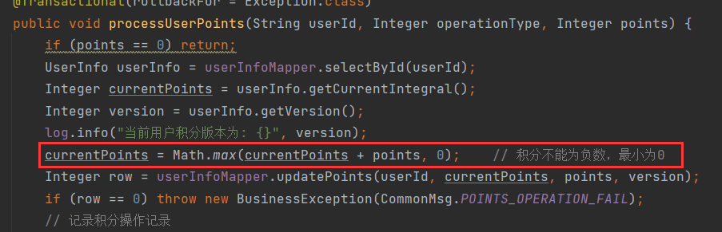

# 1 查询文章详情

查询文章详情，不能直接调用`findById()`，因为该方法仅通过文章ID进行查询。无法处理浏览量的更新。为了在用户查看文章时增加浏览量，我们需要重新定义一个方法，该方法需要实现至少两个功能：

- 返回文章的详细信息。
- 增加文章的浏览量。

通常，增加浏览量的需求有以下几种常见的实现方式：

1. **无论是否登录，只要访问接口，就增加浏览量**：每次用户访问接口时，都会增加浏览量，无需考虑用户是否登录。
2. **无论是否登录，只有第一次访问接口时才增加浏览量**：只有在用户首次访问时增加浏览量，之后的访问不再增加。
3. **只有在登录时，访问接口才增加浏览量**：只有登录用户访问时才会增加浏览量，未登录用户访问时不会触发浏览量更新。
4. **只有在登录时，且为第一次访问接口时，才增加浏览量**：登录用户首次访问时增加浏览量，之后访问不再增加浏览量。

根据具体需求的不同，可以选择适合的方案。在本项目中，我们选择实现第三种需求：**只有在用户登录时，访问接口才增加浏览量**。

---

## 1.1 a = a + value线程安全问题

```sql
update table set a = a + value where condition;
```

`a = a + value`本身不是一个线程安全的操作，它包含读取、更新、写回三个步骤，因此存在线程安全问题。但是`a = a + value`与`update`结合起来却是线程安全的，因为使用 `update` 语句更新数据时，数据库会在执行该操作时会采取措施如：加行锁，确保在同一时间内只有一个事务能够成功更新数据。所以增加浏览量的操作不需要加锁：

```sql
update article set read_count = read_count + 1 where article_id = ?
```

---

### 1.1.1 积分操作的线程安全细节

在更新用户积分的场景中（见[9.积分表以及对应CRUD.md](9.积分表以及对应CRUD.md)），我采用了乐观锁机制来实现线程安全。积分更新是基于原有积分的变更操作，那么是否可以通过`UPDATE`的行锁来替代乐观锁呢？

**理论上可以，但在这个场景中并不适用。**

使用`UPDATE`加行锁，更新积分的 SQL 是这样的：

```sql
update user_info set current_points = current_points + ? where user_id = ?
```

这种方式的确能够保证更新操作的线程安全，但无法避免积分出现负值的情况。例如，在扣减积分时，如果扣减的积分超过了当前积分，就会导致积分变为负数，而这是我们需要避免的。

为了防止积分为负，我们可以在`WHERE`子句中增加限制条件：

```sql
update user_info set current_points = current_points + ? where user_id = ? and current_points + ? >= 0
```

通过`current_points + ? >= 0`的条件，当扣减操作导致积分小于 0 时，更新操作将不会执行。这种方式能在一定程度上解决问题：既保证了积分不为负数，也维持了线程安全。

然而，这种方法仍然存在局限性。例如，当进行扣减操作时，如果扣减后积分应为负数，我们的业务需求是将积分强制置为 0。这一点在代码中有所体现，通过比较更新后的积分与 0 的大小来实现：



但上述 SQL 无法满足这一需求，因为当积分变更后小于 0 时，SQL 根本不会执行更新操作。因此，`UPDATE`加行锁并不完全适用于该场景。

**为满足业务需求，我们需要采用两步操作：先查询当前积分，再进行更新操作。**
具体步骤为：

1. 查询当前积分值；
2. 将查询结果与变更量计算后执行更新。

虽然`UPDATE`加行锁能保证单次更新操作的线程安全，但无法保证查询和更新这两步操作的整体线程安全。举个例子：

- 当前积分为 2，线程 A 和线程 B 分别尝试更新积分，A 增加 2，B 增加 3。
- A 先读取到积分值为 2，并在执行更新操作前，B 也读取到同样的值 2。
- 当 A 执行更新操作时，加了行锁，B 被阻塞等待。A 将积分更新为 4 后，B 获得行锁并执行更新，但 B 使用的是旧值 2，最终将积分更新为 5，覆盖了 A 的结果。
- 最终结果是积分为 5，而不是期望的 7。

**这说明，即便更新操作本身是线程安全的，但查询和更新的组合操作并非线程安全。**所以我才会使用乐观锁来实现。

> 通常情况下能一句`update`实现的更新操作是线程安全的，如果能保证经过`where`条件过滤后只有一条数据，即只更新这一条数据那么一定是线程安全的。

---

## 1.2 文章不同状态的查询情况

1. 未登录用户不能访问已删除、待审核文章。
2. 管理员不能访问已删除文章。
3. 已登录用户不能访问已删除、待审核但作者不是自己的文章。

逻辑判断比较多，可以定义一些变量来存储这些判断，让逻辑更加清晰：

```java
boolean isLogin;	// 是否登录
boolean isDeleted;	// 是否删除
boolean isPending;	// 是否待审核
boolean isAudited;	// 是否已审核
boolean isAuthor;	// 是否是作者
```

对于不能访问的文章，我们抛出404错误。

不管有没有登录，删除的文章都不能访问：

```java
if(isDeleted)
    throw new BusinessException(ResponseCodeEnum.CODE_404);
```

若访问未删除的文章，那么未登录的用户不能访问待审核的文章：

```java
if(isDeleted)
    throw new BusinessException(ResponseCodeEnum.CODE_404);

if (!isLogin && isPending)
            throw new BusinessException(ResponseCodeEnum.CODE_404);
```

若访问未删除的文章，且用户已登录，那么如果他不是管理员，就不能访问作者不是自己的待审核文章：

```java
if(isDeleted)
    throw new BusinessException(ResponseCodeEnum.CODE_404);

if (!isLogin && isPending)
            throw new BusinessException(ResponseCodeEnum.CODE_404);

if (isLogin && !userinfo.getIsAdmin() && isPending && !isAuthor)
            throw new BusinessException(ResponseCodeEnum.CODE_404);
```

以上就是完整的逻辑判断。

### 1.2.1 状态矩阵

不同用户访问文章与文章的状态有关，我们可以以此来建立一个**登录情况**与**文章状态**的关系表：

行代表不同的登录情况，列代表不同的文章状态。如果当前登录情况需要对当前状态进行限制，或其他操作，那么就✔，就像这样：

| 登录情况/文章状态 | 已删除 | 待审核 | 已审核 |
| ----------------- | ------ | ------ | ------ |
| 管理员            | ✔      |        |        |
| 一般用户          | ✔      | ✔      |        |
| 未登录            | ✔      | ✔      |        |

查询已删除的文章时，管理员、一般用户、未登录用户都需要进行限制。因此3中情况都✔。

查询待审核文章时，只有一般用户、未登录用户需要进行限制。因此一般用户、未登录都✔。

查询已审核文章时，所有登录情况都不需要做限制。

最终这张表中✔的就是需要做出限制的情况。表中一共有5中情况，其中已删除的3中情况可以合并为1种，因此总共有3种情况，反应到代码中就是这3中条件限制：

```java
if(isDeleted)
    throw new BusinessException(ResponseCodeEnum.CODE_404);

if (!isLogin && isPending)
            throw new BusinessException(ResponseCodeEnum.CODE_404);

if (isLogin && !userinfo.getIsAdmin() && isPending && !isAuthor)
            throw new BusinessException(ResponseCodeEnum.CODE_404);
```

当逻辑复杂或者状态和条件的组合较多时，你不能轻易的整理出逻辑判断，那么使用**状态矩阵**是一种非常有效的方法。状态矩阵可以清晰地理清复杂逻辑，尤其是在以下场景中非常有用：

1.  条件复杂，容易遗漏时。
2.  需要合并或优化逻辑时。
3.  需要增加新状态或条件时。

---

## 1.3 文章详情vo和附件vo

`ArticleVo`只是文章列表的vo，文章详情还需要另外定义vo，其实就是在`ArticleVo`外面套一层，因为附件也有一个vo，查看文章详情同时就可以查看到附件，相当于文章详情vo = `ArticleVo` + 附件vo。

`ArticleVo` 是用于展示文章列表的视图对象，而文章详情则需要定义一个单独的VO。文章详情VO实际上是将 `ArticleVo` 包含在内，并同时包含附件信息。简而言之，文章详情VO = `ArticleVo` + 附件VO。

**附件vo**：

```java
package com.ling.entity.vo;

/**
 * 附件信息VO
 */
public class AttachmentVo {
    private String fileId;  // 文件ID
    private String filename; // 文件名
    private Long filesize; // 文件大小
    private Integer filetype; // 文件类型
    private Integer downloadCount; // 下载次数
    private Integer downloadPoints; // 下载所需积分

    public String getFileId() {
        return fileId;
    }

    public void setFileId(String fileId) {
        this.fileId = fileId;
    }

    public String getFilename() {
        return filename;
    }

    public void setFilename(String filename) {
        this.filename = filename;
    }

    public Long getFilesize() {
        return filesize;
    }

    public void setFilesize(Long filesize) {
        this.filesize = filesize;
    }

    public Integer getFiletype() {
        return filetype;
    }

    public void setFiletype(Integer filetype) {
        this.filetype = filetype;
    }

    public Integer getDownloadCount() {
        return downloadCount;
    }

    public void setDownloadCount(Integer downloadCount) {
        this.downloadCount = downloadCount;
    }

    public Integer getDownloadPoints() {
        return downloadPoints;
    }

    public void setDownloadPoints(Integer downloadPoints) {
        this.downloadPoints = downloadPoints;
    }
}
```

**文章详情vo**：

`ArticleDetailVo` 是用于展示文章详细信息的视图对象。它包含以下几个重要字段：

- `article`：包含文章的基本信息，类型为 `ArticleVo`。
- `attachments`：包含与文章相关的附件列表，类型为 `List<AttachmentVo>`，每篇文章可以有多个附件。
- `haveLike`：表示当前用户是否已经对该文章进行了点赞。

```java
package com.ling.entity.vo;

import java.util.List;

/**
 * 文章详情VO
 */
public class ArticleDetailVo {
    private ArticleVo article;  // 文章信息
    private List<AttachmentVo> attachments; // 附件信息
    private boolean haveLike; // 是否点赞

    public ArticleVo getArticle() {
        return article;
    }

    public void setArticle(ArticleVo article) {
        this.article = article;
    }

    public List<AttachmentVo> getAttachments() {
        return attachments;
    }

    public void setAttachments(List<AttachmentVo> attachments) {
        this.attachments = attachments;
    }

    public boolean isHaveLike() {
        return haveLike;
    }

    public void setHaveLike(boolean haveLike) {
        this.haveLike = haveLike;
    }
}
```

---

## 1.4 附件表

```sql
create table attachment
(
    file_id         varchar(15)   not null comment '文件id'
        primary key,
    article_id      varchar(15)   not null comment '文章id',
    user_id         varchar(15)   not null comment '用户id',
    file_size       bigint        not null comment '文件大小',
    filename        varchar(200)  not null comment '文件名',
    download_count  int default 0 null comment '下载次数',
    filepath        varchar(100)  not null comment '文件路径',
    filetype        tinyint       not null comment '文件类型',
    download_points int           not null comment '下载所需积分'
)
    comment '附件表';

create index attachment_article_id_index
    on attachment (article_id)
    comment '文章id索引';

create index attachment_user_id_index
    on attachment (user_id)
    comment '用户id索引';
```

快速完成附件表CRUD。

---

### 1.4.1 查询文章附件

查询文章详情需要查询文章的附件，首先定义一个查看文章附件的接口，通过文章id和作者查询，sql如下：

```xml
<!-- 通过文章id和作者查询 -->
<select id="selectByArticleIdAndUserId" resultType="com.ling.entity.po.Attachment">
    select <include refid="commonField"/> from attachment
    where article_id = #{articleId} and user_id = #{userId}
</select>
```

这个接口返回的是一个集合，原因上面说过一个文章可能有多个附件。

实现这个接口：

```java
@Override
public List<AttachmentVo> findByArticleIdAndUserId(String articleId, String userId) {
    List<Attachment> attachments = attachmentMapper.selectByArticleIdAndUserId(articleId, userId);
    List<AttachmentVo> attachmentVos = attachments.stream().map(e -> {
        AttachmentVo attachmentVo = new AttachmentVo();
        BeanUtils.copyProperties(e, attachmentVo);
        return attachmentVo;
    }).collect(Collectors.toList());
    return attachmentVos;
}
```

---

## 1.5 点赞表

记录用户给文章点赞的情况，或者给评论点赞的情况。每个人，每篇文章或评论只能点赞一次：

```sql
create table like_recode
(
    like_recode_id   int auto_increment comment '记录id'
        primary key,
    target_id        varchar(15) not null comment '目标id, 文章或评论',
    target_author_id varchar(15) not null comment '目标作者id',
    liker_id         varchar(15) not null comment '点赞人id',
    like_type        tinyint     not null comment '点赞类型, 0: 文章点赞, 1: 评论点赞',
    like_time        datetime    not null comment '点赞时间',
    constraint like_recode_pk2
        unique (target_id, liker_id, like_type)
)
    comment '点赞记录表';

create index like_recode_liker_id_like_type_target_id_index
    on like_recode (liker_id, like_type, target_id);
```

`target_id`同时记录文章id和评论id，用`like_type`来区分文章和评论。

点过赞后，重复点赞不会增加点赞次数，相应的点赞记录表中也只会存在一条数据。可以通过前端控制，不让请求发送到后端。

---

### 1.5.1 组合索引

假设字段a、b、c建立组合索引，这3个字段是否走索引根据**最左前缀原则**来判断，具体规则如下：

- 使用a、b、c为条件查询时，走索引。
- 使用a、b为条件查询时，走索引。
- 使用a为条件查询时，走索引。
- 使用b、c为条件查询时，不走索引。
- 使用a、c为条件查询时，a的部分走索引，c的部分不走索引。

最左前缀指的是建立组合索引最左边的字段，也就是第一个字段。这里是a，联合索引是按照索引字段从左到右排序的，所以索引可以用于匹配从左到右的字段顺序。

> ⚠注意：
>
> 这个匹配是连续的。

所以使用从a开始的，连续的字段为条件的查询是走索引的。像b、c就是跳过了a开始，违反了最左前缀，因此不走索引。像a、c虽然从a开始，但是不连续，因此只有a的部分走索引，c的部分不走索引。

总结：

- 从最左字段开始，连续的字段走索引。
- 不是从最左字段开始，不走索引。
- index(a, b, c, d)，使用a, b, d，那么仅a, b走索引。

---

### 1.5.2 查询点赞记录

通过目标id、点作者以及点赞类型查询，根据查询结果判断当前登录人有没有给文章或者评论点赞。

查询sql：

```xml
<!-- 通过目标id、点赞人、点赞类型查询 -->
<select id="selectByTargetIdAndLikerIdAndLikeType" resultType="com.ling.entity.po.LikeRecode">
    select <include refid="commonField"/> from like_recode
    where target_id = #{targetId} and
    liker_id = #{likerId} and
    like_type = #{likeType}
</select>
```

---

## 1.6 🌐查询文章详情接口

地址：

```
http://localhost:8091/web/articles/{articlesId}
```

请求方式：

`GET`

请求参数：

| 参数名    | 类型     | 必填项 | 说明   |
| --------- | -------- | ------ | ------ |
| articleId | `string` | `true` | 文章id |

响应：

```json
{
    "status": "success",
    "code": 200,
    "msg": "请求成功",
    "data": {
        "article": {
            "articleId": "uukicbc29eqo",
            "boardId": 3,
            "boardName": "游戏攻略",
            "pBoardId": 1,
            "pBoardName": "游戏",
            "userId": "9619980088",
            "nickName": "ling",
            "userIdAddress": "四川省",
            "title": "巫师3攻略1",
            "cover": null,
            "content": "这是html内容",
            "mdContent": null,
            "editorType": null,
            "summary": "巫师3良心攻略",
            "readCount": 12,
            "likeCount": 1,
            "topType": 1,
            "attachmentType": 1,
            "status": 2,
            "createTime": "2025-01-06 16:38:14",
            "commentCount": 0
        },
        "attachments": [
            {
                "fileId": "wdpqowjdpq",
                "filename": "巫师3攻略.pdf",
                "filesize": null,
                "filetype": 1,
                "downloadCount": 0,
                "downloadPoints": 3
            }
        ],
        "haveLike": false
    }
}
```

---

## 1.7 接口实现

- 查询文章返回`null`，可能存在用户输入错误文章id的情况，抛出404异常。
- 按照上面分析的文章状态对不同登录情况进行限制，不满足抛出404异常。
- 能访问的文章就需要增加文章的浏览量，但是一定是登录用户访问已审核的文章才能增加。
- 文章可能有附件，因此要查询附件表。
- 用户可能给文章点赞，要进行判断。
- 接口返回`ArticleDetailVo`。

控制器：

```java
/**
     * 活期文章详情
     *
     * @param session
     * @param articleId
     * @return
     */
    @GetMapping("/{articleId}")
    @AccessControl
    public Result<ArticleDetailVo> getArticleDetails(HttpSession session, @PathVariable @Validation String articleId) {
        UserInfoSessionDto userInfo = (UserInfoSessionDto) session.getAttribute(Constant.USERINFO_SESSION_KEY);
        ArticleDetailVo articleDetailVo = articleService.articleDetail(userInfo, articleId);
        return Result.success(articleDetailVo);
    }
```

接口实现：

```java
/**
     * 文章详情
     *
     * @param userinfo
     * @param articleId
     * @return
     */
    @Override
    @Transactional(rollbackFor = Exception.class)
    public ArticleDetailVo articleDetail(UserInfoSessionDto userinfo, String articleId) {
        ArticleVo articleVo = findById(articleId);
        if (Objects.isNull(articleVo))
            throw new BusinessException(ResponseCodeEnum.CODE_404);
        // 不能访问已删除文章
        boolean isDeleted = articleVo.getStatus().equals(ArticleStatusEnum.DELETED.getStatus());
        if (isDeleted)
            throw new BusinessException(ResponseCodeEnum.CODE_404);

        boolean isLogin = Objects.nonNull(userinfo);
        boolean isPending = articleVo.getStatus().equals(ArticleStatusEnum.PENDING.getStatus());
        // 未登录不能访问待审核文章
        if (!isLogin && isPending)
            throw new BusinessException(ResponseCodeEnum.CODE_404);

        boolean isAuthor = isLogin && articleVo.getUserId().equals(userinfo.getUserId());
        // 非管理员登录，不能访问待审核文章，除非是作者本人
        if (isLogin && !userinfo.getIsAdmin() && isPending && !isAuthor)
            throw new BusinessException(ResponseCodeEnum.CODE_404);

        boolean isAudited = articleVo.getStatus().equals(ArticleStatusEnum.AUDITED.getStatus());
        // 登录用户访问已审核文章才增加阅读量
        if (isLogin && isAudited) articleMapper.incrementReadCount(articleId);

        ArticleDetailVo articleDetailVo = new ArticleDetailVo();
        articleDetailVo.setArticle(articleVo);

        if (Objects.equals(articleVo.getAttachmentType(), AttachmentTypeEnum.HAVE_ATTACHMENT.getType())) {
            List<AttachmentVo> attachmentVos = attachmentService.findVoByArticleIdAndUserId(articleVo.getArticleId(), articleVo.getUserId());
            articleDetailVo.setAttachments(attachmentVos);
        }
        // 登录用户才判断有没有对文章点赞
        if (isLogin) {
            LikeRecode likeRecode = likeRecodeService.findByTargetIdAndLikerIdAndLikeType(articleVo.getArticleId(), userinfo.getUserId(), 0);
            articleDetailVo.setHaveLike(likeRecode != null);
        }
        return articleDetailVo;
    }
```

更新阅读量的sql：

```xml
<!-- 更新阅读量 -->
<update id="incrementReadCount">
    update article set read_count = read_count + 1 where article_id = #{articleId}
</update>
```
