# 1 附件下载

首先来看附件表，该表用于存储附件的相关信息。其中一个关键字段`filepath`表示附件在服务器上的存储路径：

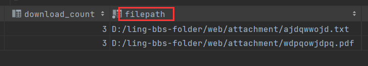

下载的核心就是通过`filepath`字段标识的路径读取文件内容，并将其响应给客户端。

在此基础上，下载附件的业务逻辑还涉及以下需求：

- **积分机制**：普通用户下载附件需要消耗其账户中的积分，同时附件的作者将相应增加积分收益。
- **作者特权**：附件的作者可直接下载自己的附件，无需积分消耗。
- **权限控制**：下载附件的接口需校验用户的登录状态，确保仅登录用户可进行操作。
- **重复下载优化**：如果用户已经下载过某附件，再次下载时无需消耗积分。
- **行为记录**：下载附件的操作会生成一条消息通知发送给附件的作者。但需要注意，作者本人下载自己的附件不会触发消息记录。

---

## 1.1 下载记录表

为实现"重复下载不消耗积分"的功能，我们需要专门设计一张的表，用于记录用户的下载行为。

具体来说，当用户首次下载附件时，将其下载记录存储到该表中。随后，每次用户尝试下载相同附件时，可以通过查询该表判断该用户是否已有相关记录。如果记录已存在，用户不是首次下载，从而免除积分消耗。

表结构如下：

```sql
create table attachment_download_recode
(
    download_recode_id int auto_increment comment '下载记录id'
        primary key,
    article_id         varchar(15) not null comment '文章id',
    downloader_id      varchar(15) not null comment '下载人id',
    download_time      datetime    not null comment '下载时间',
    constraint attachment_download_recode_pk
        unique (article_id, downloader_id)
)
    comment '附件下载记录表';
```

因为附件与文字绑定在一起，并且一篇文章可能包含多个附件，因此下载记录表中我并没有记录文件id，而是记录文章id。

---

## 1.2 🌐下载附件接口

地址：

```
http://localhost:8091/web/articles/attachment
```

请求方式：

`GET`

请求参数：

| 参数名     | 类型     | 必填项 | 说明         |
| ---------- | -------- | ------ | ------------ |
| articleId  | `string` | `true` | 文章id       |
| title      | `string` | `true` | 文章标题     |
| authorId   | `string` | `true` | 作者id       |
| needPoints | `int`    | `true` | 下载所需积分 |

响应：

```
数据流
```

---

## 1.3 接口实现

业务层主要负责用户积分的更新、积分记录、下载记录、消息记录等相关操作，最终返回附件列表。实际的文件下载操作由控制器层完成。

积分操作的方法，已在注册接口中详细说明，见[9.积分表以及对应CRUD.md](9.积分表以及对应CRUD.md)。当时考虑到其他接口可能也需要执行积分相关操作因此专门抽离出一个处理积分的方法：`processUserPoints()`，这里直接调用。该方法的主要职责包括两个方面：更新用户的积分以及记录用户的积分更新情况。

鉴于下载操作涉及下载人和作者双方的积分更新，因此`processUserPoints()`需要调用两次。

在执行积分更新前，首先需要查询下载记录表。如果记录不存在，说明这是用户的首次下载，此时会进行积分更新操作；若记录已存在，则直接返回附件列表，跳过积分更新步骤，进行文件下载。

以下是业务接口：

```java
/**
     * 处理文章附件下载中积分情况记录&消息记录
     *
     * @param userinfo
     * @param articleId
     * @param title
     * @param authorId
     * @param needPoints
     * @return
     */
    List<Attachment> processAttachmentDownload(UserInfoSessionDto userinfo, String articleId, String title, String authorId, Integer needPoints);
```

具体实现：

```java
/**
     * 文章附件下载
     *
     * @param session
     * @param response
     * @param articleId
     * @param title
     * @param authorId
     * @param needPoints
     */
    @GetMapping("/attachment")
    @AccessControl(loginRequired = true)
    @Transactional(rollbackFor = Exception.class)
    public void attachmentDownload(HttpSession session, HttpServletResponse response,
                                   @Validation(max = 15) String articleId, @Validation String title,
                                   @Validation(max = 15) String authorId, @Validation Integer needPoints) {
        UserInfoSessionDto userInfo = (UserInfoSessionDto) session.getAttribute(Constant.USERINFO_SESSION_KEY);
        List<Attachment> attachments = articleService.processAttachmentDownload(userInfo, articleId, title, authorId, needPoints);
        try {
            if (attachments.size() > 1) {
                downloadAsZip(response, attachments);           // 压缩下载
            } else {
                downloadAsOne(response, attachments.get(0));    // 单文件下载
            }
        } catch (BusinessException e) {
            throw e;
        } catch (Exception e) {
            throw new BusinessException(CommonMsg.FILE_DOWNLOAD_FAIL, e);
        }
    }

    /**
     * 单文件直接下载
     *
     * @param response
     * @param attachment
     * @throws IOException
     */
    private void downloadAsOne(HttpServletResponse response, Attachment attachment) throws IOException {
        response.setContentType(MIMETypeEnum.getContentType(attachment.getFiletype()));
        response.setHeader("Content-Disposition", "attachment; filename=" + attachment.getFilename());
        response.setContentLengthLong(attachment.getFileSize());
        try (OutputStream os = response.getOutputStream();
             InputStream is = new FileInputStream(toServerPath(attachment.getFilepath()))) {
            byte[] buffer = new byte[8192];
            int len;
            while ((len = is.read(buffer)) != -1) {
                os.write(buffer, 0, len);
            }
        } catch (IOException e) {
            throw e;
        }
    }

    /**
     * 多文件压缩下载
     *
     * @param response
     * @param attachments
     * @throws IOException
     */
    private void downloadAsZip(HttpServletResponse response, List<Attachment> attachments) throws IOException {
        response.setContentType(MIMETypeEnum.ZIP.getContentType());
        String filename = URLEncoder.encode(String.format(Constant.ZIP_FILENAME, StrUtil.formatDate("_yyyyMMdd_hhmmss")));
        response.setHeader("Content-Disposition", "attachment; filename=" + filename);
        response.setHeader("Cache-Control", "no-cache, no-store, must-revalidate");
        try (OutputStream os = response.getOutputStream();
             ZipOutputStream zos = new ZipOutputStream(os)) {
            for (Attachment attachment : attachments) {
                File file = new File(toServerPath(attachment.getFilepath()));
                ZipEntry zipEntry = new ZipEntry(attachment.getFilename());
                zos.putNextEntry(zipEntry);
                try (InputStream is = new FileInputStream(file)) {
                    byte[] buffer = new byte[8192];
                    int len;
                    while ((len = is.read(buffer)) != -1) {
                        zos.write(buffer, 0, len);
                    }
                    zos.closeEntry();
                }
            }
            zos.flush();
        } catch (IOException e) {
            throw e;
        }
    }

    /**
     * 拼接为服务器绝对路径
     *
     * @param res
     * @return
     */
    private String toServerPath(String res) {
        return new StringBuffer()
                .append(webConfig.getProjectFolder())
                .append(File.separator)
                .append(webConfig.getProjectFolderAttachment())
                .append(res).toString();
    }
```

控制器层：

```java
/**
     * 文章附件下载
     *
     * @param session
     * @param response
     * @param articleId
     * @param title
     * @param authorId
     * @param needPoints
     */
    @GetMapping("/attachment")
    @AccessControl(loginRequired = true)
    @Transactional(rollbackFor = Exception.class)
    public void attachmentDownload(HttpSession session, HttpServletResponse response,
                                   @Validation(max = 15) String articleId, @Validation String title,
                                   @Validation(max = 15) String authorId, @Validation Integer needPoints) {
        UserInfoSessionDto userInfo = (UserInfoSessionDto) session.getAttribute(Constant.USERINFO_SESSION_KEY);
        List<Attachment> attachments = articleService.processAttachmentDownload(userInfo, articleId, title, authorId, needPoints);
        try {
            if (attachments.size() > 1) {
                downloadAsZip(response, attachments);           // 压缩下载
            } else {
                downloadAsOne(response, attachments.get(0));    // 单文件下载
            }
        } catch (BusinessException e) {
            throw e;
        } catch (Exception e) {
            throw new BusinessException(CommonMsg.FILE_DOWNLOAD_FAIL, e);
        }
    }

    /**
     * 单文件直接下载
     *
     * @param response
     * @param attachment
     * @throws IOException
     */
    private void downloadAsOne(HttpServletResponse response, Attachment attachment) throws IOException {
        response.setContentType(MIMETypeEnum.getContentType(attachment.getFiletype()));
        response.setHeader("Content-Disposition", "attachment; filename=" + attachment.getFilename());
        response.setContentLengthLong(attachment.getFileSize());
        try (OutputStream os = response.getOutputStream();
             InputStream is = new FileInputStream(attachment.getFilepath())) {
            byte[] buffer = new byte[8192];
            int len;
            while ((len = is.read(buffer)) != -1) {
                os.write(buffer, 0, len);
            }
        } catch (IOException e) {
            throw e;
        }
    }

    /**
     * 多文件压缩下载
     *
     * @param response
     * @param attachments
     * @throws IOException
     */
    private void downloadAsZip(HttpServletResponse response, List<Attachment> attachments) throws IOException {
        response.setContentType(MIMETypeEnum.ZIP.getContentType());
        response.setHeader("Content-Disposition", "attachment; filename=attachment.zip");
        response.setHeader("Cache-Control", "no-cache, no-store, must-revalidate");
        try (OutputStream os = response.getOutputStream();
             ZipOutputStream zos = new ZipOutputStream(os)) {
            for (Attachment attachment : attachments) {
                File file = new File(attachment.getFilepath());
                ZipEntry zipEntry = new ZipEntry(attachment.getFilename());
                zos.putNextEntry(zipEntry);
                try (InputStream is = new FileInputStream(file)) {
                    byte[] buffer = new byte[8192];
                    int len;
                    while ((len = is.read(buffer)) != -1) {
                        zos.write(buffer, 0, len);
                    }
                    zos.closeEntry();
                }
            }
            zos.flush();
        } catch (IOException e) {
            throw e;
        }
    }
```

## 1.4 压缩下载

这里着重提一下压缩下载，我们都知道HTTP 请求和响应遵循"一次请求，一次响应"的原则。当一个文章包含多个附件时，如果每个附件都单独响应，就会导致一次请求发起多个响应。然而，浏览器只会遵循"一次请求，一次响应"的原则，这意味着只有第一个文件会被下载，后续的附件无法完成下载。

为了实现一次性下载多个附件，我们需要将这些附件打包成一个压缩文件，并通过该压缩文件进行响应。

在实现压缩下载时，主要涉及到两个类：`ZipOutputStream`和`ZipEntry`。以下是实现的基本步骤：

1、通常情况下，我们使用普通的输出流来写出文件内容，但在进行压缩写入时，需要使用压缩输出流。因此，我们首先将输出流包装为压缩输出流：

```java
new ZipOutputStream(OutputStream)//通过构造
```

2、文件名要包装为压缩条目(`ZipEntry`)，然后放到压缩输出流中，具体做法是遍历文件列表：

每个文件需要被包装成一个压缩条目(`ZipEntry`)，然后将这些条目依次放入压缩输出流中。具体方法是遍历文件列表并为每个文件创建一个 `ZipEntry`，然后将其添加到中`ZipOutputStream`：

```java
ZipOutputStream zos = new ZipOutputStream(OutputStream)// 压缩输出流
for(File file : files) {
    // 构建压缩条目
    ZipEntry zipEntry = new ZipEntry(file.getName());
    zos.putNextEntry()// 放到压缩输出流中
}
```

3、读取文件内容，然后写入到压缩输出流中：

```java
InputStream is = new FileInputStream(file)) {
byte[] buffer = new byte[8192];
int len;
while ((len = is.read(buffer)) != -1) {
	zos.write(buffer, 0, len);
}

```

4、在每个文件写入完毕后，调用`closeEntry()`关闭当前的压缩条目：

```java
while ((len = is.read(buffer)) != -1) {
	zos.write(buffer, 0, len);
}
zos.closeEntry();
```

5、最后关闭流并将数据刷出：

```java
for(File file : files) {
    ...
    while ((len = is.read(buffer)) != -1) {
		zos.write(buffer, 0, len);
	}
}
zos.flush();
```

关闭流和刷新数据是非常重要的步骤，以确保压缩文件的完整

---

## 1.5 下载失败无法响应错误 

当前的文件下载实现存在一个问题：在下载过程中发生异常时，系统无法正确响应错误的 JSON 格式，同时还会下载一个空的错误文件。理想的场景应是：当下载过程中发生错误时，下载立即终止，并返回一个错误的 JSON 响应。

**异常模拟过程**：

首先，我们通过修改附件表中文件的路径来模拟异常：

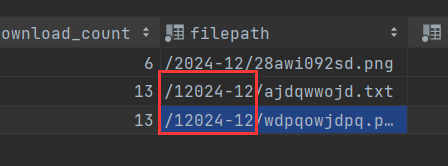

接着发起下载，下载结果如下所示：

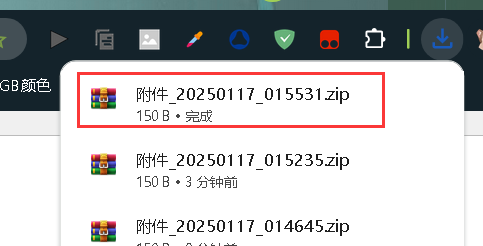

打开下载的文件，发现文件内容为空：

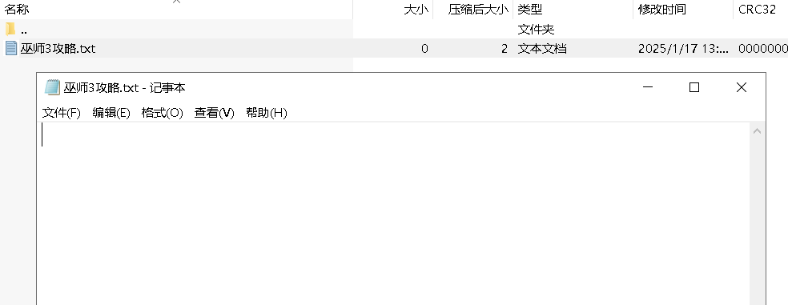

由于文件路径已被修改且路径不存在，因此在创建文件对象时会抛出异常：

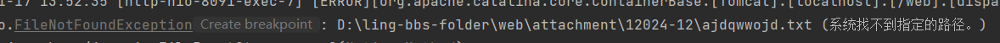

该异常最终被全局异常拦截器捕获。理想情况下，系统应返回一个带有错误信息的 JSON 响应（如`Result`对象），但由于响应头中设置了 `Content-Type` 为 `application/zip`，浏览器误认为该响应为压缩文件类型，因此会将其响应的内容作为压缩文件进行解析。同时，我们还设置了 `Content-Disposition` 为 `attachment`，使得浏览器将该响应视为附件进行下载。这样，尽管发生了错误，浏览器仍然会下载文件，且由于解析错误，下载的文件为空。

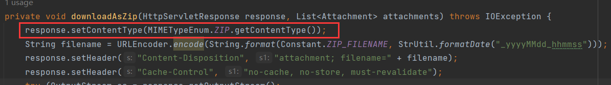

在拦截器响应日志中，可以看到：

```
Found 'Content-Type:application/zip' in response
```

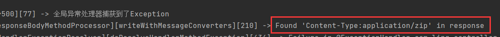

这表示响应头中的 `Content-Type` 被设置为 `application/zip`。

**尝试修复响应头**：

考虑到是响应头导致了浏览器错误的处理方式，我们尝试在发生异常时，重新设置响应头为 `application/json`。在进行此操作时，我们先将响应头清空，然后设置新的响应头，并记录日志：

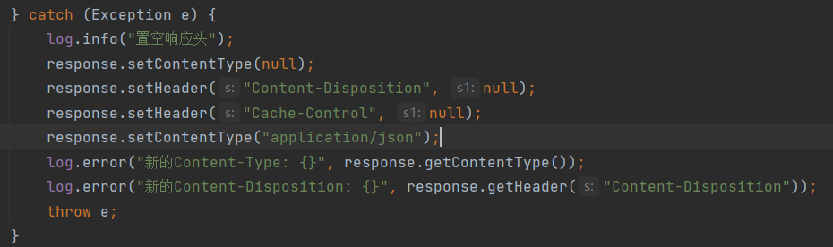

再次发起下载，并查看控制台，发现设置响应头并没有生效，响应头仍然保持旧值：

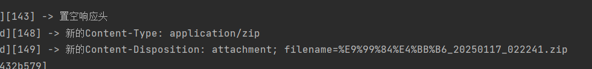

尝试将响应头先置为空字符串，再重新设：
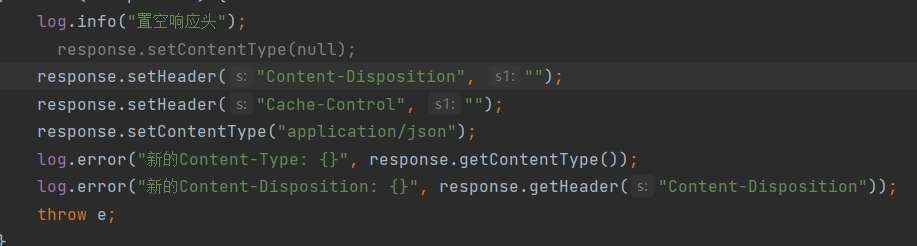

结果依然是旧值：

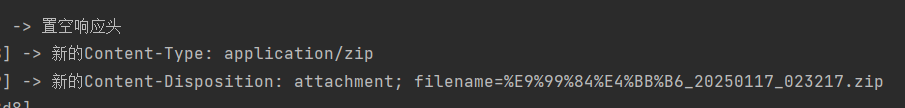

尝试直接覆盖响应头：

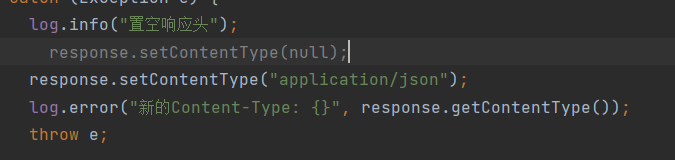

依然无效：

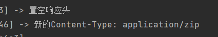

**为什么修改(覆盖)响应头？**

这是因为一旦响应内容(如输出流)开始写入，或者已经被提交(即HTTP响应头已发送到客户端)，就不能再修改响应头了。在本例中，响应头的设置发生在输出流获取之后：

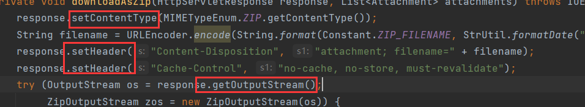

**一旦获取了输出流就表示响应体部分开始生成，此时响应头已经被提交**。

为了解决这一问题，可以将文件检查的逻辑提早到获取输出流之前进行。如果检查通过，则继续设置文件下载头；如果检查失败，则设置 JSON 响应头。虽然这可以解决问题，但在处理多文件下载时，需要两次遍历：一次用于检查文件，一次用于压缩文件。这样显得比较冗余。此外，即便能确保文件检查时响应错误的 JSON，若在写出数据时发生异常，依然无法正确响应。因此，当前的下载实现存在一定的局限性，需要进一步优化。

---

## 1.6 手动构建响应完成下载

下面将详细介绍一种手动构建HTTP响应的下载方式，该方法利用Spring框架提供的`ResponseEntity`类进行响应构建。

`ResponseEntity`是Spring提供的一个专门用于构建响应的类，它可以返回完整的HTTP响应，包括状态码、响应头和响应体。我们知道，HTTP响应通常由以下三个部分组成：

1. **状态码**：表示请求的处理结果。
2. **响应头**：包含关于响应的元信息。
3. **响应体**：响应的实际内容。

`ResponseEntity`使我们能够手动设置响应头和响应体。具体来说，`ResponseEntity`的响应体部分可以接收任意类型的数据，如下所示：

```java
<T> ResponseEntity<T> body(@Nullable T body);
```

在文件下载的场景中，我们可以通过手动构建HTTP响应，使得响应体包含文件的内容。通过设置响应头中的`Content-Disposition`为"attachment"，触发浏览器的下载行为。由于响应体中存储的是文件的字节数据，浏览器会根据这些数据进行文件下载。

我们平时控制器方法返回的`Result`对象，也不是直接返回给前端的，而是经过spring底层封装，将`Result`封装到`ResponseEntity.body`中，实际响应给前端的仍然是`ResponseEntity`，只是这里我们选择手动构建响应，可以更细致的控制`ResponseEntity`的颗粒度。

**异常处理**

传统的文件下载通常依赖于`HttpServletResponse`来进行响应写入，但这种方法存在一个问题：在出现异常时，我们无法返回正确的错误信息。原因在于`HttpServletResponse`已经与响应绑定，而我们只能对这个响应进行部分修改，如设置响应体或响应头。但如果在写入过程中发生异常，无法改变已提交的响应。

而使用`ResponseEntity`的方式则可以更灵活地控制响应构建的过程。当发生异常时，我们可以在手动构建的响应中返回错误信息，保证客户端能够正确处理异常情况。

简单来说，就是我们手动构建的响应，可以更加的灵活控制。如果发生异常，那么就返回错误的响应，如果正常那么返回文件数据的响应让浏览器下载。而`HttpServletResponse`已经是一个响应，我们只能做局部更改，但如果在写入过程中发生异常，我们无法修改这个响应变为带有错误信息的 JSON 响应。

**手动构建响应的步骤**：

1. 方法返回类型为`ResponseEntity`。
2. 读取文件内容，并将其转为字节数组。
3. 构建响应，设置适当的响应头，确保浏览器能够正确下载文件。
4. 若发生异常，返回错误响应。错误响应体可以通过`Result.error()`构建，或者直接抛出异常，交由全局异常处理器处理。

实现代码如下：

```java
/**
     * 文章附件下载
     *
     * @param session
     * @param articleId
     * @param title
     * @param authorId
     * @param needPoints
     */
    @GetMapping("/attachment")
    @AccessControl(loginRequired = true)
    @Transactional(rollbackFor = Exception.class)
    public ResponseEntity<Object> attachmentDownload(HttpSession session,
                                                     @Validation(max = 15) String articleId, @Validation String title,
                                                     @Validation(max = 15) String authorId, @Validation Integer needPoints) throws IOException {
        UserInfoSessionDto userInfo = (UserInfoSessionDto) session.getAttribute(Constant.USERINFO_SESSION_KEY);
        List<Attachment> attachments = articleService.processAttachmentDownload(userInfo, articleId, title, authorId, needPoints);
//        try {
//
//        } catch (Exception e) {
//            log.error("附件下载异常: {}", e);
//            BusinessException businessException = new BusinessException(e.getMessage());
//            return ResponseEntity.status(HttpStatus.INTERNAL_SERVER_ERROR)
//                    .body(Result.error(businessException));
//        }
        if (attachments.size() > 1) {
            return downloadAsZip(attachments);           // 压缩下载
        } else {
            return downloadAsOne(attachments.get(0));    // 单文件下载
        }
    }

/**
     * 单文件下载
     *
     * @param attachment
     * @return
     * @throws IOException
     */
    private ResponseEntity<Object> downloadAsOne(Attachment attachment) throws IOException {
        File file = new File(toServerPath(attachment.getFilepath()));
        if (!file.exists() || file.isDirectory())
            throw new BusinessException(CommonMsg.FILE_NOT_FOUND);
        InputStream is = new FileInputStream(file);
        ByteArrayOutputStream aos = new ByteArrayOutputStream();
        IOUtils.copy(is, aos);      // 输入流中的数据复制到输出流
        HttpHeaders headers = new HttpHeaders();
        headers.add("Content-Type", MIMETypeEnum.getContentType(attachment.getFiletype()));
        String filename = URLEncoder.encode(attachment.getFilename());
        headers.add("Content-Disposition", "attachment; filename=" + filename);
        headers.add("Content-Length", String.valueOf(attachment.getFileSize()));

        return ResponseEntity.ok()
                .headers(headers)
                .body(aos.toByteArray());   // 响应体填充字节数据
    }

/**
     * 多文件压缩下载
     *
     * @param attachments
     * @return
     * @throws IOException
     */
    private ResponseEntity<Object> downloadAsZip(List<Attachment> attachments) throws IOException {
        ByteArrayOutputStream aos = new ByteArrayOutputStream();
        try (ZipOutputStream zos = new ZipOutputStream(aos)) {
            for (Attachment attachment : attachments) {
                String serverPath = toServerPath(attachment.getFilepath());
                File file = new File(serverPath);
                if (!file.exists() || file.isDirectory())
                    throw new BusinessException(CommonMsg.FILE_NOT_FOUND);
                try (InputStream is = new FileInputStream(file)) {
                    ZipEntry zipEntry = new ZipEntry(attachment.getFilename());
                    zos.putNextEntry(zipEntry);
                    IOUtils.copy(is, zos);
                    zos.closeEntry();
                }
            }
        }
        // 压缩流关闭后，再写出到字节数组，否则压缩文件内容缺失
        byte[] byteArray = aos.toByteArray();
        HttpHeaders headers = new HttpHeaders();
        headers.add("Content-Type", MIMETypeEnum.ZIP.getContentType());
        String filename = URLEncoder.encode(String.format(Constant.ZIP_FILENAME, StrUtil.formatDate("_yyyyMMdd_hhmmss")));
        headers.add("Content-Disposition", "attachment; filename=" + filename);
        headers.add("Content-Length", String.valueOf(byteArray.length));

        return ResponseEntity.ok()
                .headers(headers)
                .body(byteArray);
    }
```

**细节说明**：

1、在这里选择`ByteArrayOutputStream`作为输出流，因为它可以将文件内容一次性转成字节数组，方便在构建响应体时使用。并且，由于`ByteArrayOutputStream`是基于内存的，效率较高且不需要手动关闭。

2、在输入流和输出流之间的数据转移，采用Apache的`IOUtils.copy()`方法，它能够高效地将输入流中的数据复制到输出流。

3、在进行多文件压缩下载时，需要确保压缩流（`ZipOutputStream`）关闭后再将内容写入字节数组。否则，压缩文件的内容可能会丢失：

```java
try(ZipOutputStream zos = new ZipOutputStream(aos)){
    ...
}
// 放到try(){}之后，确保zos关闭资源，再写入到数组中
byte[] byteArray = aos.toByteArray();
```

不要放到try(){}内：

```java
try(ZipOutputStream zos = new ZipOutputStream(aos)){
    ...
    // 此时写入，zos未关闭，会缺失最后一部分数据
    byte[] byteArray = aos.toByteArray();
}
```

4、我们可以选择捕获异常并返回自定义的错误响应，或者将异常抛出交由全局异常处理器进行处理。如果选择自定义响应，返回错误响应，需要确保错误信息作为响应体返回，而不是直接修改响应对象，否则浏览器可能无法正确处理。