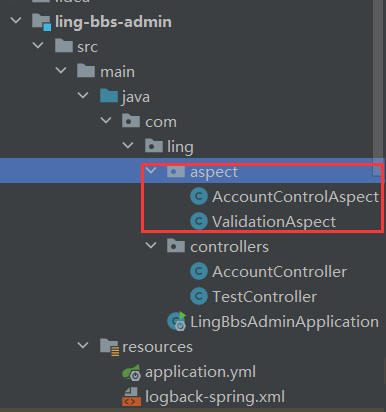
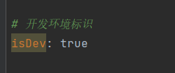
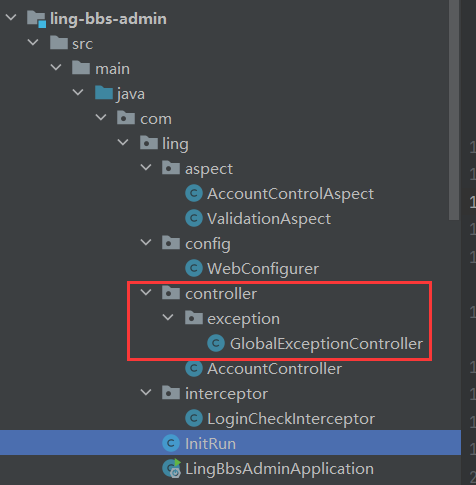

# 前言

建议先阅读 Web 端的实现，再看 Admin 端的内容。因为Admin 端依赖于 Web 端的多个服务。

以下是正式开发 Admin 端前的准备工作。


# 切面拦截方法定义

Admin 端的访问控制逻辑可以直接复用 Web 端的切面方法，但需进行一定的调整。



修改如下：

1. **保留参数校验的切面**，确保请求数据的有效性。
2. **修改访问控制逻辑**，移除接口访问频次限制。Admin 端不需要对接口调用频率进行限制，因此该功能可以去除。
3. **调整切面通知方式**，由原先的环绕通知（`@Around`）改为前置通知（`@Before`），提升执行效率。

```java
/**
 * 访问控制切面
 */
@Aspect
@Component
@Order(0)
public class AccountControlAspect {
    private Logger log = LoggerFactory.getLogger(AccountControlAspect.class);
    @Resource
    private HttpServletRequest request;

    @Pointcut("@annotation(com.ling.annotation.AccessControl)")
    public void pt() {

    }

    /**
     * 访问控制
     *
     * @param joinPoint
     */
    @Before("pt()")
    public void accountControl(JoinPoint joinPoint) {
        Method method = ((MethodSignature) joinPoint.getSignature()).getMethod();
        AccessControl accessControl = method.getAnnotation(AccessControl.class);

        HttpSession session = request.getSession();
        SessionUserinfo userinfo = (SessionUserinfo) session.getAttribute(Constant.USERINFO_SESSION_KEY);

        checkLoginRequired(accessControl, userinfo);  // 登录接口限制校验
    }

    /**
     * 登录接口限制
     *
     * @param accessControl
     */
    public void checkLoginRequired(AccessControl accessControl, SessionUserinfo userinfo) {
        if (Objects.isNull(accessControl) || !accessControl.loginRequired()) return;
        if (Objects.isNull(userinfo))
            throw new BusinessException(ResponseCodeEnum.CODE_901);
    }
}
```


# 定义拦截器

在 Admin 端，我们需要实现一个拦截器，用于管理用户登录状态。该拦截器的核心功能包括：

1. 在开发环境中，允许免登录访问接口。此时，我们需要确保当前会话中包含用户信息，因此拦截器会自动构建一个模拟的用户会话
2. Admin 端除登录和验证码相关接口外，所有接口均需登录访问。相比于 Web 端使用 `@AccessControl(loginRequired = true)` 单独声明每个受限接口，Admin 端使用统一拦截器进行登录校验更加高效。

判断是否开发环境的配置项为`isDev`：



拦截器实现如下：

```java
/**
 * 登录状态校验拦截器
 */
@Component
public class LoginCheckInterceptor implements HandlerInterceptor {
    @Resource
    private AdminConfig adminConfig;
	
    /**
     * 请求拦截预处理
     * 在控制器方法执行前
     *
     * @param request
     * @param response
     * @param handler
     * @return
     * @throws Exception
     */
    @Override
    public boolean preHandle(HttpServletRequest request, HttpServletResponse response, Object handler) throws Exception {
        HttpSession session = request.getSession();
        SessionAdminInfo adminInfo = (SessionAdminInfo) session.getAttribute(Constant.ADMIN_SESSION_KEY);

        if (Objects.isNull(adminInfo)) {
            // 若为开发环境，可以免登录，手动创建会话信息
            if (adminConfig.isDev()) {
                SessionAdminInfo admin = new SessionAdminInfo();
                admin.setAccount("admin");
                session.setAttribute(Constant.ADMIN_SESSION_KEY, admin);
                return true;
            }
            throw new BusinessException(ResponseCodeEnum.CODE_901);
        }
        return true;
    }

    @Override
    public void postHandle(HttpServletRequest request, HttpServletResponse response, Object handler, ModelAndView modelAndView) throws Exception {
        HandlerInterceptor.super.postHandle(request, response, handler, modelAndView);
    }

    @Override
    public void afterCompletion(HttpServletRequest request, HttpServletResponse response, Object handler, Exception ex) throws Exception {
        HandlerInterceptor.super.afterCompletion(request, response, handler, ex);
    }
}

```

拦截所有路径，但放行 `check-code` 和 `login` 接口：

```java
/**
 * springMVC配置类
 */
@Configuration
public class WebConfigurer implements WebMvcConfigurer {
    @Resource
    private LoginCheckInterceptor loginCheckInterceptor;

    /**
     * 注册拦截器
     *
     * @param registry
     */
    @Override
    public void addInterceptors(InterceptorRegistry registry) {
        registry.addInterceptor(loginCheckInterceptor)
                .addPathPatterns("/**")
            	//	不用加前缀/admin，会自动映射
                .excludePathPatterns("/account/check-code", "/account/login");
    }
}
```


# 定义初始化方法

定义初始化方法，在服务启动时加载系统设置到内存：

```java
@Component
public class InitRun implements ApplicationRunner {
    private static final Logger log = LoggerFactory.getLogger(InitRun.class);
    @Resource
    private SysSettingService sysSettingService;

    @Override
    public void run(ApplicationArguments args) {
        try {
            sysSettingService.refreshCache();
            log.info("系统设置加载成功");
        } catch (Exception e) {
            log.error("系统设置加载失败", e);
        }
    }
}
```


# 定义全局异常拦截器

Admin 端的全局异常处理逻辑与 Web 端保持一致，可以直接复用 Web 端的全局异常拦截器实现。



