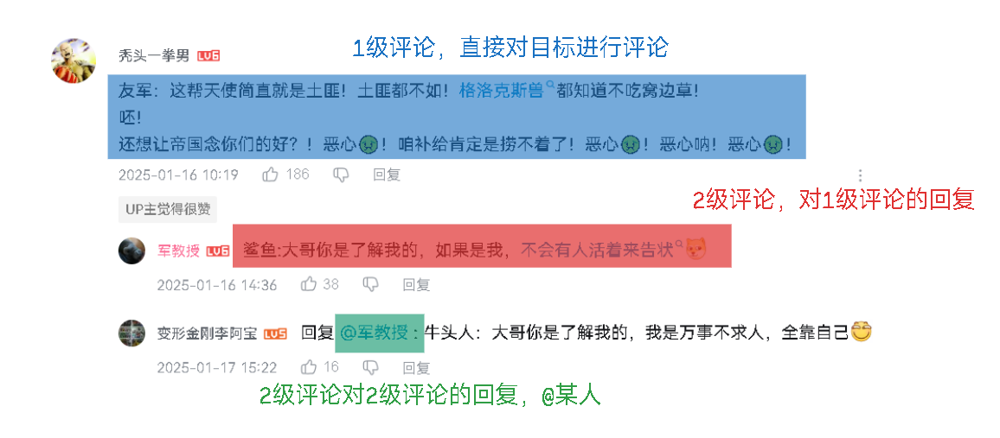
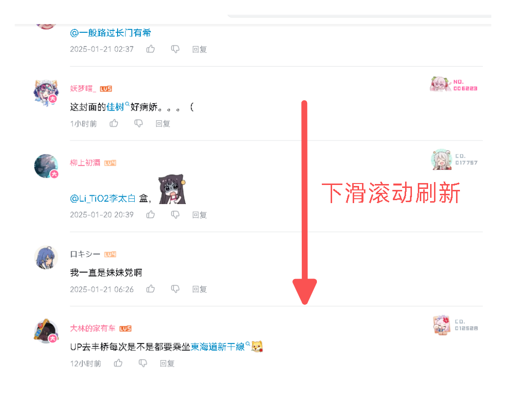
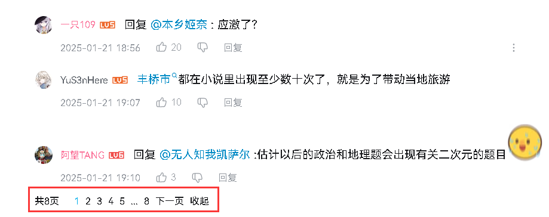

# 1 评论的组成结构

## 1.1 评论层次结构

首先看一下评论长什么样，以B站的评论为例，如下图：


整个评论列表可以划分为1级评论和2级评论，其中1级评论是对目标(视频、文章、帖子等)进行评论，而2级评论是对1级评论进行回复。整个评论层次只到两层，如果要对2级评论进行回复，那么就以@某人的方式来明确指定回复对象，如下图：



当然也可以用树形结构展示回复层次，但是随着子级回复的增多，树的深度也会增加，构建树形消耗的服务器资源会增大，还可能会导致用户体验的下降。

---

## 1.2 评论分页

评论系统通常是需要分页的，因为一篇文章的评论数量可能非常庞大，如果将所有评论一次性加载出来，势必会对数据库造成巨大压力，分页能减少一次请求的数据量。

以B站为例，B站在处理1级评论的分页时没有采用码分页方式，而是通过滚动窗口和视差计算来动态加载评论页面。具体实现如下图所示：



通常情况下，每页请求的1级评论条数是固定的(多少看需求)。

而2级评论则采用页码分页，每页显示固定10条评论，如下图：



在本项目中，1级评论和2级评论均采用页码分页，且每页条目均为10。

---

# 2 评论表

表结构如下：

```sql
create table comment
(
    comment_id        int auto_increment comment '评论id'
        primary key,
    p_comment_id      int               null comment '父级评论id',
    article_id        varchar(15)       not null comment '文章id',
    img_path          varchar(150)      null comment '图片路径',
    content           varchar(800)      not null comment '评论内容',
    sender_id         varchar(15)       not null comment '评论发送人id',
    sender_nickname   varchar(50)       not null comment '评论发送人昵称',
    sender_ip_address varchar(150)      not null comment '评论发送人IP地址',
    receiver_id       varchar(15)       null comment '被回复人id',
    receiver_nickname varchar(15)       null comment '被回复人昵称',
    top_type          tinyint default 0 not null comment '0: 未置顶, 1: 置顶',
    like_count        bigint  default 0 not null comment '点赞量',
    status            tinyint default 1 not null comment '0: 已删除, 1: 待审核, 2: 已审核',
    post_time         datetime          not null comment '发布时间'
)
    comment '评论表';

create index comments_article_id_index
    on comment (article_id);

create index comments_p_comment_id_index
    on comment (p_comment_id);

create index comments_post_time_index
    on comment (post_time);

create index comments_sender_id_index
    on comment (sender_id);

create index comments_status_index
    on comment (status);

create index comments_top_type_index
    on comment (top_type);
```

---

# 3 查询评论列表

## 3.1 需求分析

**接口**：

评论查询分为2个接口：

- 查询1级评论：同时查询1级评论下的第1页2级评论。
- 查询2级评论。

在查询1级评论时，需要同时获取该评论下的第1页2级评论数据。因为1级评论与其直接子评论存在关联，查询时需要确保1级评论及其对应的2级评论能够一并返回，以便展示完整的评论信息。

而对于2级评论的查询，则需要单独进行。2级评论是对1级评论的回应，它们是独立的评论实体，因此在查询时需要单独执行分页操作，以确保每次只返回指定页码的2级评论数据。

**数据分页**：

评论很明显是一个树形结构，但是我们不能一次性查询出1、2级评论后进行树化，而是应该分开查询1级评论和2级评论，再组合。这种设计的原因在于评论分页的特性。

假设现在评论表中有3条1级评论和9条2级评论，这9条评论全部是第一条1级评论的子评论，这些评论均来自同一篇文章，如果我们一次性查出第一页的数据，查询结果将是第一条1级评论和9条2级评论(每页10条目)，经过树化处理，最后会形成了1条树形结构的评论，但实际上这篇文章应该有3条1级评论，而不是只有1条，还有两条被分页过滤掉了。

这种分页方式在树形数据处理中可能会导致数据的丢失。因此，我们只能分别对1级评论和2级评论进行独立的分页查询，然后将查询结果组合，才能确保最终返回完整的评论列表。

---

## 3.2 🌐查询1级评论接口

地址：

```
localhost:8091/web/comments
```

方法：

`GET`

请求参数：

| 参数名    | 类型     | 必填项  | 说明                       |
| --------- | -------- | ------- | -------------------------- |
| articleId | `string` | `true`  | 文章id                     |
| orderType | `int`    | `false` | 评论排序，0: 热门, 1: 最新 |
| page      | `int`    | `false` | 页码                       |

响应：

```json
{
    "status": "success",
    "code": 200,
    "msg": "请求成功",
    "data": {
        "total": 11,
        "page": 1,
        "pageSize": 10,
        "pageTotal": 2,
        "rows": [
            {
                "commentId": 1,
                "pCommentId": 0,
                "articleId": "uukicbc29eqo",
                "imgPath": null,
                "content": "巫师3攻略开新坑，过几天上传第2章，请大家多多支持👍👍👍，大家也可以去看我的其他攻略",
                "senderId": "9619980088",
                "senderNickname": "ling",
                "senderIpAddress": "四川省",
                "receiverId": null,
                "receiverNickname": null,
                "likeCount": 12,
                "postTime": "2025-01-19 05:25:05",
                "doLike": false,
                "subComment": {
                    "total": 2,
                    "page": 1,
                    "pageSize": 10,
                    "pageTotal": 1,
                    "rows": [
                        {
                            "commentId": 6,
                            "pCommentId": 1,
                            "articleId": "uukicbc29eqo",
                            "imgPath": null,
                            "content": "作者快出第2章攻略",
                            "senderId": "9876175182",
                            "senderNickname": "user_189",
                            "senderIpAddress": "四川省",
                            "receiverId": null,
                            "receiverNickname": null,
                            "likeCount": 0,
                            "postTime": "2025-01-19 05:32:56",
                            "doLike": false,
                            "subComment": null
                        },
                        ...
                    ]
                }
            },
            ...
        ]
    }
}
```

---

## 3.3 查询1级评论接口实现

在查询1级评论时，我们需要分两步执行：首先查询1级评论，其次查询1级评论下第1页的2级评论。具体实现步骤如下：

查询1级评论：

- 文章id。
- 排序类型。
- 登录状态
- 页码。
- 每页10条目。

登录状态影响评论表的`status`字段，和文章状态一样：

- 管理员不能查看删除的评论。
- 普通登录用户，能查看审核评论或自己的待审核的评论。
- 未登录用户只能查看审核评论。

查询SQL如下：

```xml
<!-- 管理员不能看删除的评论 -->
<if test="isAdmin != null and isAdmin">
    and status != 0
</if>
<!-- 普通用户只能看审核或自己的未审核评论 -->
<if test="userId != null and userId != '' and !isAdmin">
    and (status = 2 or (status = 1 and sender_id = #{userId}))
</if>
<!-- 未登录用户只能看审核的评论 -->
<if test="userId == null or userId == ''">
    and status = 2
</if>
```

另外，在查询1级评论时，我们还需要查询用户是否已经点赞了该评论。点赞状态记录在`like_recode`表中，因此我们需要与`like_recode`表进行联查。如果记录存在，则表示用户已点赞，否则表示未点赞。为此，查询中需要添加子查询来判断用户的点赞状态，SQL如下：

```xml
<sql id="queryCondition">
    <where>
        <if test="articleId != null and articleId != ''">
            article_id = #{articleId}
        </if>
        <if test="pCommentId != null">
            and p_comment_id = #{pCommentId}
        </if>
        <if test="commentId != null">
            and comment_id = #{commentId}
        </if>
        <if test="senderId != null and senderId != ''">
            and sender_id = #{senderId}
        </if>
        <!-- 管理员不能看删除的评论 -->
        <if test="isAdmin != null and isAdmin">
            and status != 0
        </if>
        <!-- 普通用户只能看审核或自己的未审核评论 -->
        <if test="userId != null and userId != '' and !isAdmin">
            and (status = 2 or (status = 1 and sender_id = #{userId}))
        </if>
        <!-- 未登录用户只能看审核的评论 -->
        <if test="userId == null or userId == ''">
            and status = 2
        </if>
        <if test="status != null">
            and status = #{status}
        </if>
    </where>
</sql>

<select id="selectByCondition" resultType="com.ling.entity.po.Comment">
    select
    <include refid="commonField"/>
    <!-- 关联点赞记录表，如果有记录则点过赞，否则未点赞 -->
    <if test="userId != null">
        , (select count(0) from like_recode where target_id = comment_id and liker_id = #{userId}) do_like
    </if>
    from comment
    <include refid="queryCondition"/>
    <if test="orderBy != null and orderBy != ''">
        order by #{orderBy}
    </if>
    <if test="index != null and size != null">
        limit #{index}, #{size}
    </if>
</select>
```

在上面的SQL中，我使用了子查询来检查用户是否对某条评论进行了点赞。具体而言，子查询通过`targetId`(评论id，来自父查询的每行comment_id)和`likerId`(点赞人id)，在`like_recode`表中查找记录来判断当前用户是否已对该评论进行点赞。如果在`like_recode`表中有相应记录，子查询将返回1，否则返回0。

> 在MySQL中，布尔值表示为1和0，而MyBatis框架会自动将1和0映射为`true`和`false`。

那么1和0可以作为布尔值表示**已点赞**和**未点赞**的状态，映射为`true`和`false`，用于表示点赞状态。

而未登录用户查询，不需要查询点赞状态，因此用`userId`控制。

然后查询2级评论，来自于上面的1级评论，因此我们需要收集1级评论的id作为2级评论的父id，查询条件如下：

- 文章id。
- 父id列表。
- 排序类型，默认为热门。
- 登录状态。
- 页码默认第1页。
- 没有10条目。

与1级评论查询类似，评论状态和点赞状态在2级评论查询中也有相同的规则，SQL如下：

```xml
<sql id="queryCondition">
    <where>
        <if test="articleId != null and articleId != ''">
            article_id = #{articleId}
        </if>
        <if test="pCommentId != null">
            and p_comment_id = #{pCommentId}
        </if>
        <if test="commentId != null">
            and comment_id = #{commentId}
        </if>
        <if test="senderId != null and senderId != ''">
            and sender_id = #{senderId}
        </if>
        <!-- 管理员不能看删除的评论 -->
        <if test="isAdmin != null and isAdmin">
            and status != 0
        </if>
        <!-- 普通用户只能看审核或自己的未审核评论 -->
        <if test="userId != null and userId != '' and !isAdmin">
            and (status = 2 or (status = 1 and sender_id = #{userId}))
        </if>
        <!-- 未登录用户只能看审核的评论 -->
        <if test="userId == null or userId == ''">
            and status = 2
        </if>
        <if test="status != null">
            and status = #{status}
        </if>
        <if test="pIds != null">
            and p_comment_id in
            <foreach collection="pIds" item="id" separator="," open="(" close=")">
                #{id}
            </foreach>
        </if>
    </where>
</sql>

<select id="selectByCondition" resultType="com.ling.entity.po.Comment">
    select
    <include refid="commonField"/>
    <!-- 关联点赞记录表，如果有记录则点过赞，否则未点赞 -->
    <if test="userId != null">
        , (select count(0) from like_recode where target_id = comment_id and liker_id = #{userId}) do_like
    </if>
    from comment
    <include refid="queryCondition"/>
    <if test="orderBy != null and orderBy != ''">
        order by #{orderBy}
    </if>
    <if test="index != null and size != null">
        limit #{index}, #{size}
    </if>
</select>
```

就是增加了一个父id列表的查询条件。

业务层增加接口：

```java
/**
     * 查询1级评论和1级评论下2级评论, 均为前10条
     *
     * @param commentQueryDto
     * @return
     */
    PageBean<CommentVo> findLeve1andLeve2Top10(CommentQueryDto commentQueryDto);
```

实现：

```java
@Override
    public PageBean<CommentVo> findLeve1andLeve2Top10(CommentQueryDto commentQueryDto) {
        // 1级评论
        List<CommentVo> commentVos = commentMapper.selectByCondition(commentQueryDto).stream().map(e -> {
            CommentVo commentVo = new CommentVo();
            BeanUtils.copyProperties(e, commentVo);
            return commentVo;
        }).collect(Collectors.toList());
        Long total = findTotalByCondition(commentQueryDto);

        if (!commentVos.isEmpty()) {
            CommentQueryDto subCommentQuery = new CommentQueryDto();
            subCommentQuery.setArticleId(commentQueryDto.getArticleId());
            subCommentQuery.setUserId(commentQueryDto.getUserId());
            subCommentQuery.setAdmin(commentQueryDto.isAdmin());
            subCommentQuery.setOrderBy(CommentOrderEnum.HOT.getOrderBy());
            List<Integer> pCommentIds = commentVos.stream().map(CommentVo::getCommentId).collect(Collectors.toList());
            subCommentQuery.setpIds(pCommentIds);
            List<Comment> subComments = commentMapper.selectByCondition(subCommentQuery);   // 2级评论
            // 2级评论转换为vo同时按pid分组
            Map<Integer, List<CommentVo>> byPid = subComments.stream().map(e -> {
                CommentVo commentVo = new CommentVo();
                BeanUtils.copyProperties(e, commentVo);
                return commentVo;
            }).collect(Collectors.groupingBy(CommentVo::getpCommentId));
            // 组合1级和2级评论
            commentVos.forEach(e -> {
                List<CommentVo> subList = byPid.get(e.getCommentId());
                if (Objects.isNull(subList)) return;
                // 截取前10条
                List<CommentVo> limitList = subList.stream()
                        .limit(PageSizeEnum.SIZE_10.getPageSize())
                        .collect(Collectors.toList());
                Long subTotal = (long) subList.size();
                e.setSubComment(PageBean.of(subTotal, 1, PageSizeEnum.SIZE_10.getPageSize(), limitList));
            });
        }
        return PageBean.of(total, commentQueryDto.getPage(), commentQueryDto.getPageSize(), commentVos);
    }
```

因为2级评论也要分页，所以需要封装为PageBean，将2级评论按pid进行分组，然后截取出前10条数据，在与1级评论组合。

控制器：

判断系统设置中是否开启了评论，这里不要忘记：

```java
/**
     * 查询1级评论和1级评论下2级评论前10条
     *
     * @param session
     * @param articleId
     * @param orderType
     * @param page
     * @return
     */
    @GetMapping
    @AccessControl
    public Result<PageBean<CommentVo>> loadComments(HttpSession session,
                                                    @Validation(max = 15) String articleId,
                                                    @RequestParam(defaultValue = "0") @Validation(max = 1) Integer orderType,
                                                    @RequestParam(defaultValue = "1") @Validation Integer page) {
        boolean openComment = SysCacheUtil.getSysSettingContainer().getSysSetting4Comment().isOpenComment();
        if (!openComment)   // 评论开启才能访问
            throw new BusinessException(ResponseCodeEnum.CODE_404);
        UserInfoSessionDto userinfo = (UserInfoSessionDto) session.getAttribute(Constant.USERINFO_SESSION_KEY);
        CommentQueryDto commentQueryDto = new CommentQueryDto();
        commentQueryDto.setpCommentId(Constant.NUM_0);
        commentQueryDto.setArticleId(articleId);
        commentQueryDto.setPage(page == 0 ? Constant.NUM_1 : page);
        commentQueryDto.setPageSize(PageSizeEnum.SIZE_10.getPageSize());    // 固定每页10条目
        commentQueryDto.setOrderBy(CommentOrderEnum.getOrderByType(orderType));
        commentQueryDto.setUserId(userinfo == null ? null : userinfo.getUserId());
        commentQueryDto.setAdmin(userinfo != null && userinfo.getIsAdmin());
        PageBean<CommentVo> comments = commentService.findLeve1andLeve2Top10(commentQueryDto);
        return Result.success(comments);
    }
```

---

## 3.4 🌐查询2级评论接口

地址：

```
localhost:8091/web/comments/level2
```

方法：

`GET`

请求参数：

| 参数名      | 类型     | 必填项  | 说明      |
| ----------- | -------- | ------- | --------- |
| articleId   | `string` | `true`  | 文章id    |
| pCommentdId | `int`    | `false` | 1级评论id |
| page        | `int`    | `false` | 页码      |

响应：

```json
{
    "status": "success",
    "code": 200,
    "msg": "请求成功",
    "data": {
        "total": 1,
        "page": 1,
        "pageSize": 10,
        "pageTotal": 1,
        "rows": [
            {
                "commentId": 6,
                "pCommentId": 1,
                "articleId": "uukicbc29eqo",
                "imgPath": null,
                "content": "作者快出第2章攻略",
                "senderId": "9876175182",
                "senderNickname": "user_189",
                "senderIpAddress": "四川省",
                "receiverId": null,
                "receiverNickname": null,
                "likeCount": 0,
                "postTime": "2025-01-19 05:32:56",
                "doLike": false,
                "subComment": null
            }
        ]
    }
}
```

---

## 3.5 查询2级评论接口实现

就是调用条件分页查询的方法，给定1级评论的id，和其他条件，只查对应页码的2级评论即可，2级评论默认为热门排序：

控制器：

```java
/**
     * 查询2级评论
     *
     * @param session
     * @param page
     * @param pCommentId
     * @return
     */
    @GetMapping("/level2")
    @AccessControl
    public Result<PageBean<CommentVo>> loadLevel2Comments(HttpSession session,
                                                          @Validation(max = 15) String articleId,
                                                          @RequestParam(defaultValue = "1") @Validation Integer page,
                                                          @Validation Integer pCommentId) {
        boolean openComment = SysCacheUtil.getSysSettingContainer().getSysSetting4Comment().isOpenComment();
        if (!openComment)   // 评论开启才能访问
            throw new BusinessException(ResponseCodeEnum.CODE_404);
        UserInfoSessionDto userinfo = (UserInfoSessionDto) session.getAttribute(Constant.USERINFO_SESSION_KEY);
        CommentQueryDto commentQueryDto = new CommentQueryDto();
        commentQueryDto.setArticleId(articleId);
        commentQueryDto.setpCommentId(pCommentId);
        commentQueryDto.setOrderBy(CommentOrderEnum.HOT.getOrderBy());
        commentQueryDto.setPage(page == 0 ? Constant.NUM_1 : page);
        commentQueryDto.setPageSize(PageSizeEnum.SIZE_10.getPageSize());    // 固定每页10条目
        commentQueryDto.setUserId(userinfo == null ? null : userinfo.getUserId());
        commentQueryDto.setAdmin(userinfo != null && userinfo.getIsAdmin());
        PageBean<CommentVo> level2Comments = commentService.findByCondition(commentQueryDto);
        return Result.success(level2Comments);
    }
```
