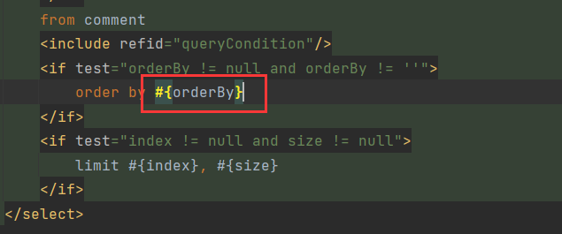

# 1 order by失效

评论查询中无论请求传递的`orderType`是什么，查询集的排序都一样：

按热门排序查询：


可以看到当前的排序语句是：`top_type desc, like_count desc, post_time desc`，是热门排序无疑。

但是这个查询集的排序并不是真正的热榜排序，反而与数据库的自然顺序相同：


这说明`order by`语句没有生效。

另外，我们按照最新排序：


`top_type desc, post_time desc`是最新排序语句。

同时可以发现，最新排序也与自然排序一致。这说明，无论是热门还是最新，`order by`语句都没有生效。

这是因为我们在动态构建排序语句时，使用了`#{}`：



MyBatis 的 `#{}` **仅支持传递参数值，不支持传递字段名或 SQL 片段**，因此直接用 `#{}` 会报错。这就是为什么`order by`会失效。

## 1.1 解决方法

我们可以使用`${}`，`${}`是字符串拼接，直接将排序语句拼接到`order by`后面，形成排序语句。但是`order by`后面不止是字段名，还可以是表达式或函数，因此存在SQL注入的风险，例如：

```sql
order by column1 desc; drop table some_table	-- 排序的同时删表
order by case when (select count(*) from some_table) > 0 then 1 else 0 end    -- 复杂子查询
```

另一种方法就是使用 `<choose>` 动态 SQL 构造安全的排序语句

```xml
<choose>
    <when test="orderBy == 'column1'">ORDER BY column1</when>
    <when test="orderBy == 'column2'">ORDER BY column2</when>
    <otherwise>ORDER BY default_column</otherwise>
</choose>
```

`${}`也不是说不能使用，只是担心SQL注入风险。但是具体请求应该具体分析，就以本项目来说，排序规则`orderType`由前端传递，如果用户通过前端发起请求，那么他只能选择系统既定的排序规则，如果他绕过前端发起请求，假设他输入的是注入的SQL，但由于`orderType`是`int`型的，后端校验会报参数错误，因此也能起到防范作用。