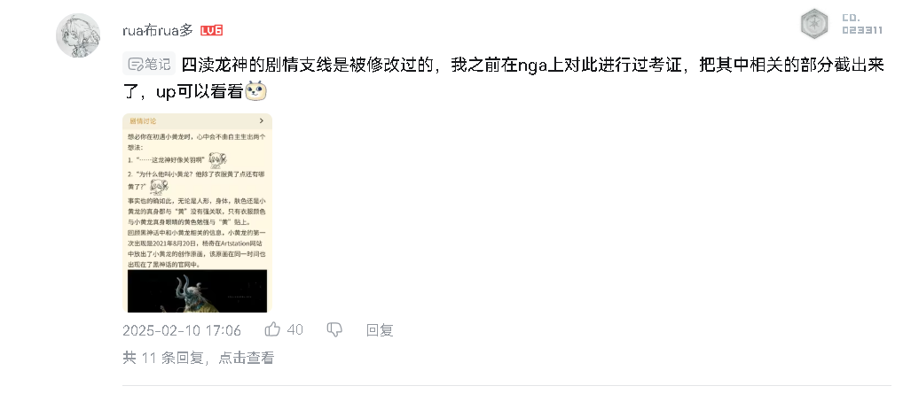
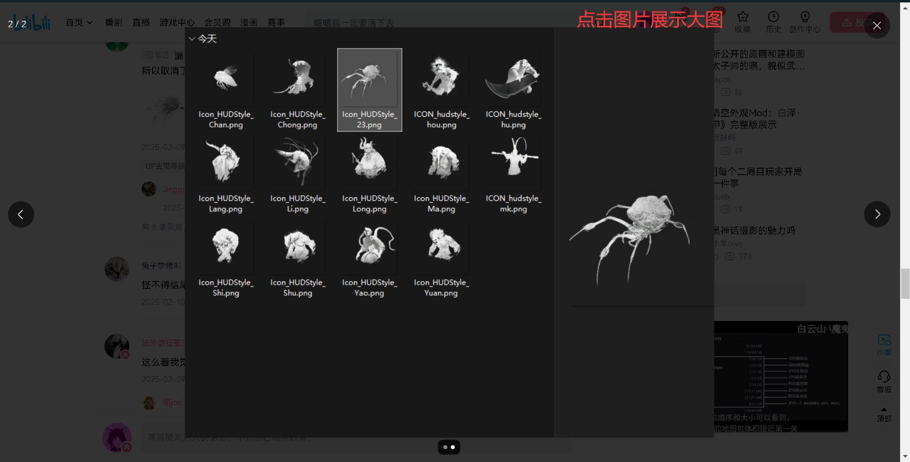

# 1 图片上传

## 1.1 图片存储路径说明

图片上传的路径在配置文件中给定：

web模块：

```yml
project:
  folder: D:/ling-bbs-folder/web   # web端项目文件路径
  folder-attachment: attachment   # 附件目录
```

admin模块：

```yml
# 项目配置
project:
  folder: D:/ling-bbs-folder/admin   # admin端项目文件路径
  folder-attachment: attachment   # 附件目录
```

其中`project.folder`指定项目的文件存储目录，作为项目文件存储的根目录所有上传文件都将基于此路径进行存储。

系统将图片资源细分为三类进行存储管理：

- 评论图片：存储在comment目录下
- 封面图片：存储在cover指定目录下
- 用户头像：存储在avatar指定目录下

最终在服务器上传生成这样的目录结构：
```
根目录（project.folder）
    ├── 图片类型目录（comment|cover|avatar）
        ├── 日期分组目录（yyyy-MM）
            └── 具体图片文件
```

每个图片子目录中会根据日期进行分组，以"yyyy-MM"格式日期为目录名创建分组目录：

```
D:/ling-bbs-folder/web
    ├── comment
        ├── 2023-08
        ├── 2023-09
    ├── cover
        ├── 2023-08
        ├── 2023-09
    ├── avatar
        ├── 2023-08
        ├── 2023-09
```

图片最终存储在日期目录下，如：

```
D:/ling-bbs-folder/web/comment/2023-09/example.jpg
```

---

## 1.2 🌐图片上传接口

地址：

```swift
Post /web/file/upload/image/{comment|cover|avatar}
```

请求参数：

| 参数名  | 类型     | 必填项 | 说明                                         |
| ------- | -------- | ------ | -------------------------------------------- |
| imgFile | `file`   | `true` | 图片                                         |
| imgDir  | `string` | `true` | 路径参数，可选值：`image`、`cover`、`avatar` |

响应：

```json
{
    "status": "success",
    "code": 200,
    "msg": "请求成功",
    "data": {
        "filepath": "avatar/2025-02/7e9845344f354ced83b47f9cf904258b.png"
    }
}
```

上传成功，返回文件路径。

---

## 1.3 上传接口实现

控制器层：

限定路径参数的取值范围，语法如下：

```java
{路径名:枚举项1|枚举项2|...}
```

例如：

限定`imgDir`可选值：`comment`、`cover`、`avatar`：

```java
@PostMapping("/upload/image/{imgDir:comment|avatar|cover}")
```

```java
/**
     * 图片上传接口
     *
     * @param imgFile
     * @return
     */
    @PostMapping("/upload/image/{imgDir:comment|avatar|cover}")
    @AccessControl(loginRequired = true)
    public Result<FileUploadVo> uploadImage(MultipartFile imgFile, @PathVariable String imgDir) {
        try {
            String filename = imgFile.getOriginalFilename();
            String suffix = StrUtil.getFilenameSuffix(filename);
            // 判断允许上传的图片格式
            if (!webConfig.getAllowImgSuffixList().contains(suffix))
                throw new BusinessException(CommonMsg.UNSUPPORTED_IMAGE_FORMAT);
            String randomFilename = StrUtil.getUUID() + suffix;
            String dateDir = StrUtil.formatDate("yyyy-MM");
            String imgDirPath = getProjectImgDirPath(imgDir, dateDir);
            File dir = new File(imgDirPath);
            if (!dir.exists()) {
                dir.mkdirs();
            }
            imgFile.transferTo(new File(dir, randomFilename));
            FileUploadVo fileUploadVo = new FileUploadVo();
            fileUploadVo.setFilepath(imgDir + "/" + dateDir + "/" + randomFilename);
            return Result.success(fileUploadVo);
        } catch (BusinessException e) {
            throw e;
        } catch (Exception e) {
            throw new BusinessException(CommonMsg.FILE_UPLOAD_FAIL);
        }
    }

    private String getProjectImgDirPath(String imgDir, String dateDir) {
                StringBuffer sb = new StringBuffer();
                return sb.append(webConfig.getProjectFolder())
                        .append(File.separator)
                        .append(imgDir)
                        .append(File.separator)
                        .append(dateDir)
                        .toString();
            }
```

---

## 1.4 生成缩略图

上传到服务器上的图片，一般需要生成缩略图。按一定比例或宽高进行缩略。

缩略的目的是：

- **减少图片大小**：提高网页或应用的加载速度。
- **优化带宽消耗**：缩略图可以减少网络传输的数据量，降低服务器流量压力。
- **快速预览**：在列表、相册、商品展示等场景，缩略图可用于快速预览，无需加载大图。

以B站评论区为例，评论中的图片都是缩略图，主要用于快速浏览：



在评论区，用户可以上传多张图片。如果直接加载原图，不仅会增加评论列表的加载时间，还会大幅占用网络带宽，影响用户体验。然而，评论区的图片主要用于快速浏览，并不需要一开始就加载高清原图。因此，我们可以先展示经过压缩的缩略图，确保页面加载更流畅。

当用户需要查看图片的详细内容时，可以点击缩略图进行大图展示，此时服务器才返回原图。这样一来，只会请求用户真正需要查看的图片，极大地减少了不必要的带宽消耗，同时也提升了整体的访问效率和流畅度，如下图：



不同类型图片资源缩略宽高如下：

| 图片资源类型 | 缩略后宽 | 缩略后高 |
| ------------ | -------- | -------- |
| 评论区图片   | 200      | 200      |
| 头像         | 120      | 120      |
| 封面         | 412      | 232      |

根据这些宽高定义一个缩略图尺寸的枚举：

```java
/**
 * 缩略图尺寸
 */
public enum ThumbnailSizeEnum {
    COMMENT_SIZE("comment", 200, 200, "评论缩略图默认尺寸"),
    AVATAR_SIZE("avatar", 120, 120, "头像缩略图默认尺寸"),
    COVER_SIZE("cover", 412, 232, "封面缩略图默认尺寸");

    private String type;
    private Integer width;
    private Integer height;
    private String desc;

    ThumbnailSizeEnum(String type, Integer width, Integer height, String desc) {
        this.type = type;
        this.width = width;
        this.height = height;
        this.desc = desc;
    }

    public static ThumbnailSizeEnum getByType(String type) {
        ThumbnailSizeEnum[] values = ThumbnailSizeEnum.values();
        for (ThumbnailSizeEnum value : values) {
            if (Objects.equals(type, value.getType()))
                return value;
        }
        return null;
    }

    public String getType() {
        return type;
    }

    public Integer getWidth() {
        return width;
    }

    public Integer getHeight() {
        return height;
    }

    public String getDesc() {
        return desc;
    }
}
```

java生成缩略图的工具类：

```java
package com.ling.utils;

import javax.imageio.ImageIO;
import java.awt.Graphics2D;
import java.awt.RenderingHints;
import java.awt.image.BufferedImage;
import java.io.File;
import java.io.IOException;

/**
 * 缩略图工具类
 */
public class ThumbnailUtil {

    /**
     * 根据指定的宽高生成缩略图（源图片为 String 路径）
     *
     * @param srcPath  源图片路径
     * @param destPath 缩略图保存路径（文件后缀决定图片格式，如 jpg、png 等）
     * @param width    缩略图宽度
     * @param height   缩略图高度
     * @throws IOException 如果读取或写入图片出错，则抛出异常
     */
    public static void createThumbnail(String srcPath, String destPath, int width, int height) throws IOException {
        createThumbnail(new File(srcPath), destPath, width, height);
    }

    /**
     * 根据指定的宽高生成缩略图（源图片为 File 对象）
     *
     * @param srcFile  源图片文件
     * @param destPath 缩略图保存路径（文件后缀决定图片格式，如 jpg、png 等）
     * @param width    缩略图宽度
     * @param height   缩略图高度
     * @throws IOException 如果读取或写入图片出错，则抛出异常
     */
    public static void createThumbnail(File srcFile, String destPath, int width, int height) throws IOException {
        BufferedImage srcImg = ImageIO.read(srcFile);
        if (srcImg == null) {
            throw new IOException("无法读取源图片，请检查文件路径或文件格式是否正确");
        }
        int originalWidth = srcImg.getWidth();
        int originalHeight = srcImg.getHeight();

        if (originalWidth <= width && originalHeight <= height) {
            ImageIO.write(srcImg, getFormatName(destPath), new File(destPath));
            return;
        }
        double scaleWidth = (double) width / originalWidth;
        double scaleHeight = (double) height / originalHeight;
        double scale = Math.min(scaleWidth, scaleHeight);
        int newWidth = (int) Math.round(originalWidth * scale);
        int newHeight = (int) Math.round(originalHeight * scale);
        createThumbnail(srcImg, destPath, newWidth, newHeight);
    }

    /**
     * 根据缩放比例生成缩略图（保持原图比例，源图片为 String 路径）
     *
     * @param srcPath  源图片路径
     * @param destPath 缩略图保存路径
     * @param scale    缩放比例（例如 0.5 表示缩小 50%）
     * @throws IOException 如果读取或写入图片出错，则抛出异常
     */
    public static void createThumbnail(String srcPath, String destPath, double scale) throws IOException {
        createThumbnail(new File(srcPath), destPath, scale);
    }

    /**
     * 根据缩放比例生成缩略图（保持原图比例，源图片为 File 对象）
     *
     * @param srcFile  源图片文件
     * @param destPath 缩略图保存路径
     * @param scale    缩放比例（例如 0.5 表示缩小 50%）
     * @throws IOException 如果读取或写入图片出错，则抛出异常
     */
    public static void createThumbnail(File srcFile, String destPath, double scale) throws IOException {
        BufferedImage srcImg = ImageIO.read(srcFile);
        if (srcImg == null) {
            throw new IOException("无法读取源图片，请检查文件路径或文件格式是否正确");
        }
        int width = (int) (srcImg.getWidth() * scale);
        int height = (int) (srcImg.getHeight() * scale);
        createThumbnail(srcImg, destPath, width, height);
    }

    /**
     * 根据最大宽度生成缩略图（保持原图比例，源图片为 String 路径）
     * 如果原图宽度小于等于 maxWidth，则直接保存原图
     *
     * @param srcPath  源图片路径
     * @param destPath 缩略图保存路径
     * @param maxWidth 最大宽度
     * @throws IOException 如果读取或写入图片出错，则抛出异常
     */
    public static void createThumbnail(String srcPath, String destPath, int maxWidth) throws IOException {
        createThumbnail(new File(srcPath), destPath, maxWidth);
    }

    /**
     * 根据最大宽度生成缩略图（保持原图比例，源图片为 File 对象）
     * 如果原图宽度小于等于 maxWidth，则直接保存原图
     *
     * @param srcFile  源图片文件
     * @param destPath 缩略图保存路径
     * @param maxWidth 最大宽度
     * @throws IOException 如果读取或写入图片出错，则抛出异常
     */
    public static void createThumbnail(File srcFile, String destPath, int maxWidth) throws IOException {
        BufferedImage srcImg = ImageIO.read(srcFile);
        if (srcImg == null) {
            throw new IOException("无法读取源图片，请检查文件路径或文件格式是否正确");
        }
        int originalWidth = srcImg.getWidth();
        int originalHeight = srcImg.getHeight();

        if (originalWidth <= maxWidth) {
            // 如果原图宽度不大于 maxWidth，则直接写入原图
            ImageIO.write(srcImg, getFormatName(destPath), new File(destPath));
            return;
        }
        double scale = (double) maxWidth / originalWidth;
        int newWidth = maxWidth;
        int newHeight = (int) (originalHeight * scale);
        createThumbnail(srcImg, destPath, newWidth, newHeight);
    }

    /**
     * 私有方法，根据 BufferedImage 生成缩略图
     *
     * @param srcImg   源图片对象
     * @param destPath 缩略图保存路径
     * @param width    缩略图宽度
     * @param height   缩略图高度
     * @throws IOException 如果写入图片出错，则抛出异常
     */
    private static void createThumbnail(BufferedImage srcImg, String destPath, int width, int height) throws IOException {
        BufferedImage destImg = new BufferedImage(width, height, BufferedImage.TYPE_INT_RGB);
        Graphics2D g2d = destImg.createGraphics();
        // 设置高质量渲染参数
        g2d.setRenderingHint(RenderingHints.KEY_INTERPOLATION, RenderingHints.VALUE_INTERPOLATION_BILINEAR);
        g2d.setRenderingHint(RenderingHints.KEY_RENDERING, RenderingHints.VALUE_RENDER_QUALITY);
        g2d.setRenderingHint(RenderingHints.KEY_ANTIALIASING, RenderingHints.VALUE_ANTIALIAS_ON);
        // 绘制缩放后的图像
        g2d.drawImage(srcImg, 0, 0, width, height, null);
        g2d.dispose();
        String formatName = getFormatName(destPath);
        ImageIO.write(destImg, formatName, new File(destPath));
    }

    /**
     * 从文件名中获取图片格式
     *
     * @param filename 文件名
     * @return 图片格式（不含点号），如 "jpg" 或 "png"
     */
    private static String getFormatName(String filename) {
        int dotIndex = filename.lastIndexOf('.');
        if (dotIndex >= 0 && dotIndex < filename.length() - 1) {
            return filename.substring(dotIndex + 1);
        }
        return "jpg"; // 默认格式
    }
}
```

为了和原图进行区分，也为了方便访问，生成的缩略图采用原图名(无后缀)+`_t_n`的格式命名，例如：

```swift
// 原图
example.jpg
// 缩略图
example_t_n.jpg
```

t、n为缩略图Thumbnail的缩写。只要知道原图路径，那么只需加上`_t_n`就能访问到缩略图。

在上传图片的接口中增加两个请求参数【w】、【h】来表示缩略之后的宽高，这两个参数不是必填项，当宽高为空时，设置默认宽高。

增加生成缩略图的步骤：

```java
/**
     * 图片上传接口
     *
     * @param imgFile
     * @return
     */
    @PostMapping("/upload/image/{imgDir:comment|avatar|cover}")
    @AccessControl(loginRequired = true)
    public Result<FileUploadVo> uploadImage(MultipartFile imgFile, @PathVariable String imgDir) {
        try {
            String filename = imgFile.getOriginalFilename();
            String suffix = StrUtil.getFilenameSuffix(filename);
            // 判断允许上传的图片格式
            if (!webConfig.getAllowImgSuffixList().contains(suffix))
                throw new BusinessException(CommonMsg.UNSUPPORTED_IMAGE_FORMAT);
            String randomFilename = StrUtil.getUUID() + suffix;
            String dateDir = StrUtil.formatDate("yyyy-MM");
            String imgDirPath = getProjectImgDirPath(imgDir, dateDir);
            File dir = new File(imgDirPath);
            if (!dir.exists()) {
                dir.mkdirs();
            }
            File resourceImg = new File(dir, randomFilename);
            // 存储图片
            imgFile.transferTo(resourceImg);

            // 缩略图宽高
            ThumbnailSizeEnum tSize = ThumbnailSizeEnum.getByType(imgDir);
            w = w == null ? tSize.getWidth() : w;
            h = h == null ? tSize.getHeight() : h;
            
            // 生成缩略图
            String destPath = imgDirPath + File.separatorChar + randomFilename.replace(".", "_t_n.");
            ThumbnailUtil.createThumbnail(resourceImg, destPath, w, h);

            FileUploadVo fileUploadVo = new FileUploadVo();
            fileUploadVo.setFileUrl(imgDir + "/" + dateDir + "/" + randomFilename);
            return Result.success(fileUploadVo);
        } catch (BusinessException e) {
            throw e;
        } catch (Exception e) {
            throw new BusinessException(CommonMsg.FILE_UPLOAD_FAIL);
        }
    }
```

---

## 1.5 🌐图片读取接口

地址：

```swift
localhost:8091/web/file/read/{imgDir}/{dateDir}/{filename}
```

方式：

`GET`

请求参数：

| 参数名   | 类型     | 必填项 | 说明       |
| -------- | -------- | ------ | ---------- |
| imgDir   | `string` | `true` | 图片目录   |
| dateDir  | `string` | `true` | 日期目录   |
| filename | `string` | `true` | 图片文件名 |

响应：

```
以流形式返回
```

基于URL路径参数读取并返回指定图片，确保访问路径与存储路径一致。

---

## 1.6 读取接口实现

控制器：

读取的图片缓存3天。

```java
/**
     * 读取图片接口
     *
     * @param response
     * @param imgDir
     * @param dateDir
     * @param filename
     * @throws Exception
     */
    @GetMapping("/read/{imgDir}/{dateDir}/{filename}")
    public void readImg(HttpServletResponse response,
                        @PathVariable String imgDir, @PathVariable String dateDir, @PathVariable String filename) throws Exception {
        String imgDirPath = getProjectImgDirPath(imgDir, dateDir);
        File file = new File(imgDirPath, filename);
        if (!file.exists())
            throw new BusinessException(CommonMsg.FILE_NOT_FOUND);
        response.setContentType("image/" + StrUtil.getFilenameSuffixWithoutDot(filename));
        response.setHeader("Cache-Control", "max-age=259200");  // 缓存3天
        ByteArrayOutputStream aos = new ByteArrayOutputStream();
        try (OutputStream os = response.getOutputStream();
             InputStream is = new FileInputStream(file)) {
            IOUtils.copy(is, aos);
            response.setHeader("Content-Length", String.valueOf(aos.size()));
            os.write(aos.toByteArray());
        }
    }
```

