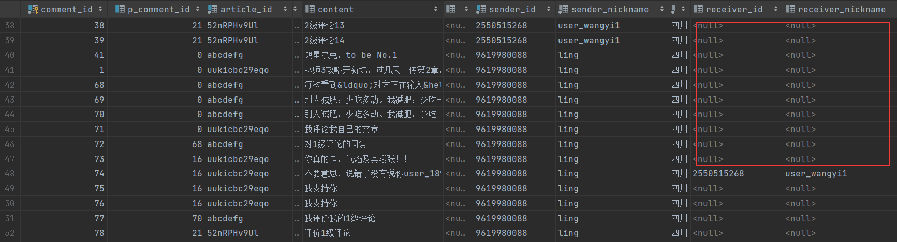
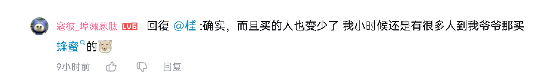
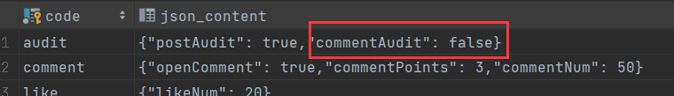
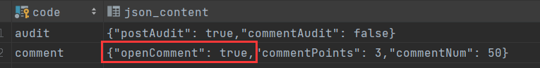

# 1 发布评论分析

在[21.评论模块-查询评论列表](21.评论模块-查询评论列表)中，我们已经分析过了评论的层次结构，接下来，我们将探讨影响评论层级关系的三个关键字段：

- article_id
- p_comment_id
- receiver_id

从评论表的结构来看，我们可以发现部分评论记录包含 `receiver_id` 字段，而另一些则没有。`receiver_id` 的作用在于明确评论的回复关系：



具体表现在 UI 展示上，即在评论内容前以"@用户名" 形式标注被回复对象，如下图所示：



然而，并非所有评论的回复关系都依赖于receiver_id字段。具体来说：

- **1级评论**：即直接对文章进行评论的评论，其回复对象默认为文章的作者。用户能直接识别出回复关系，由于1级评论的回复对象固定为文章作者，因此无需依赖receiver_id字段即可明确回复关系。

- **2级评论**：即对1级评论的回复，其回复对象为1级评论的作者。在页面展示中，这种回复关系通常较为直观，用户可以通过上下文直接识别出回复对象。

- **2级评论之间的回复**：当2级评论回复另一个2级评论时，情况变得复杂。由于1级评论下可能存在多个2级评论，若不借助receiver_id字段，将无法准确判断某个2级评论具体是回复哪个2级评论。

---

## 1.1 评论审核

评论的状态分为 **"待审核"** 和 **"已审核"**。评论的默认状态由系统设置中的 `commentAudit` 选项决定，该选项用于控制评论审核机制：



- **`commentAudit = true`**：表示评论需经过审核，初始状态为 **"待审核"**，管理员需手动审核后才会公开显示。

- **`commentAudit = false`**：表示评论无需审核，提交后即直接发布，状态为 **"已审核"**。

此外，用户在发布评论后可获得积分奖励，但积分的实际发放仅在评论审核通过后进行。审核通过后，系统将执行以下操作：

1. **增加用户积分**
2. **更新文章的评论数**
3. **记录用户消息通知**

为了更清晰地管理评论发布逻辑，我们将评论发布接口拆分为 **1级评论接口** 和 **2级评论接口**，分别处理不同层级的评论。

---


# 2 🌐发送1级评论接口

接口地址：

```swift
Post /web/comments/post/l1
```

请求参数：

| 参数名     | 类型     | 必填项  | 说明     |
| ---------- | -------- | ------- | -------- |
| articleId  | `string` | `true`  | 文章id   |
| content    | `string` | `false` | 评论内容 |
| imgContent | `string` | `false` | 图片内容 |

返回示例：

```java
{
    "status": "success",
    "code": 200,
    "msg": "请求成功",
    "data": {
        "commentId": 83,
        "pCommentId": 0,
        "articleId": "ababa",
        "imgPath": null,
        "content": "感觉配色不如上一代好看",
        "senderAvatar": null,
        "senderId": "9876175182",
        "senderNickname": "user_189",
        "senderIpAddress": "四川省",
        "receiverId": null,
        "receiverNickname": null,
        "likeCount": 0,
        "topType": 0,
        "status": 2,
        "postTime": "2025-02-20 05:59:02",
        "doLike": false,
        "subComment": null
    }
}
```

返回用户的评论，前端可以立刻显示这条评论，减少请求，2级评论也是如此。

---

## 1.2 发送1级评论接口实现

在处理评论发布时，我们首先需要进行 **预检**，确保以下条件满足：

1. **系统是否开启评论功能**（由 `openComment` 选项控制）
2. **评论内容是否有效**（`content` 和 `imgContent` 至少有一个不为空）



在 `Controller` 层，我们定义一个私有方法 `preCheck()` 来执行上述检查，以便在 **1级评论** 和 **2级评论** 接口中复用：

```java
// 预检
    private void preCheck(String content, String imgContent) {
        boolean isOpenComment = SysCacheUtil.getSysSettingContainer().getSysSetting4Comment().isOpenComment();
        // 判断评论是否开启
        if (!isOpenComment)
            throw new BusinessException(CommonMsg.UNOPENED_COMMENT);
        // 评论内容或图片至少要有一个
        if (Objects.isNull(content) && Objects.isNull(imgContent))
            throw new BusinessException(ResponseCodeEnum.CODE_600);
    }
```

在 `Controller` 层，我们还需要构建 `Comment` 对象，确保数据完整性，同时防止 **XSS 攻击**：

```java
// 构建comment
    private Comment createComment(UserInfoSessionDto userinfo, String articleId, Integer pCommentId, String content,
                                  String receiverId, String imgContent) {
        Comment comment = new Comment();
        comment.setpCommentId(pCommentId);
        comment.setArticleId(articleId);
        comment.setImgPath(imgContent);
        comment.setContent(StringEscapeUtils.escapeHtml4(content)); // 转义html，防止xss攻击
        comment.setSenderAvatar(userinfo.getAvatar());
        comment.setSenderId(userinfo.getUserId());
        comment.setSenderNickname(userinfo.getNickName());
        comment.setSenderIpAddress(userinfo.getProvince());
        comment.setReceiverId(receiverId);
        // 评论默认未审核，因此只当设置不需要审核评论时，将状态设为已审核
        Integer status = isAuditComment() ? TargetStatusEnum.PENDING.getStatus() : TargetStatusEnum.AUDITED.getStatus();
        comment.setStatus(status);
        comment.setLikeCount(Constant.NUM_0);
        comment.setTopType(Constant.NUM_0);
        comment.setPostTime(new Date());
        return comment;
    }
```

此处的 **`escapeHtml4()`** 处理 HTML 转义，防止 XSS 攻击。例如，用户提交 `<script>alert("你好")</script>` 时，系统会将 `<`、`>` 等标签转义，避免恶意脚本执行。

在 `Controller` 层实现 **一级评论提交接口**：

```java
/**
     * 发送1级评论接口
     *
     * @param session
     * @param articleId
     * @param content
     * @param imgContent
     * @return
     */
    @PostMapping("/post/l1")
    @AccessControl(loginRequired = true)
    public Result<CommentVo> postL1CommentHandle(HttpSession session,
                                                 @Validation(max = 15) String articleId,
                                                 @Validation(required = false, max = 200) String content,
                                                 @Validation(required = false, max = 150) String imgContent) {
        preCheck(content, imgContent);
        UserInfoSessionDto userinfo = (UserInfoSessionDto) session.getAttribute(Constant.USERINFO_SESSION_KEY);
        Comment comment = createComment(userinfo, articleId, Constant.NUM_0, null, content, imgContent);
        CommentVo commentVo = commentService.processPostL1Comment(comment, isAuditComment());
        return Result.success(commentVo);
    }
```

**关键点解析**：

- **`pCommentId` 设为 0**，表示该评论为 **一级评论**
- **`receiverId` 设为 `null`**，表示默认回复对象为 **文章作者**
- **评论是否审核** 由 `isAuditComment()` 方法动态决定

```java
// 是否审核评论
    private boolean isAuditComment() {
        return SysCacheUtil.getSysSettingContainer().getSysSetting4Audit().isCommentAudit();
    }
```

在 `Service` 层，实现 `processPostL1Comment` 方法，处理评论存储与审核：

```java
/**
     * 处理1级评论发布
     *
     * @param comment
     * @param needAudit
     * @return
     */
    CommentVo processPostL1Comment(Comment comment, boolean needAudit);
```

第二个参数【needAudit】表示是否审核评论，需要通过此参数来决定是否进行审核后的处理。

对于1级评论而言，只需要判断文章是否存在即可。

```java
@Override
    @Transactional(rollbackFor = Exception.class)
    public CommentVo processPostL1Comment(Comment comment, boolean needAudit) {
        Article article = articleMapper.selectById(comment.getArticleId());
        // 判断文章 是否存在 | 是否已审核
        if (Objects.isNull(article))
            throw new BusinessException(CommonMsg.ARTICLE_NOT_EXISTS);
        // 记录评论
        add(comment);
        CommentVo commentVo = new CommentVo();
        BeanUtils.copyProperties(comment, commentVo);
        // 若设置评论不需要审核，直接让评论通过审核
        if (!needAudit)
            processPassCommentReview(true, comment.getSenderAvatar(), comment.getSenderId(),
                    comment.getSenderNickname(), article, comment, article.getUserId());
        return commentVo;
    }

/**
     * 处理评论审核通过的逻辑
     *
     * @param isLevel1
     * @param senderAvatar
     * @param senderId
     * @param senderNickName
     * @param article
     * @param comment
     * @param msgReceiver
     */
    private void processPassCommentReview(boolean isLevel1, String senderAvatar, String senderId, String senderNickName,
                                          Article article, Comment comment, String msgReceiver) {
        // 更新用户积分
        Integer points = SysCacheUtil.getSysSettingContainer().getSysSetting4Comment().getCommentPoints();
        userPointsRecodeService.processUserPoints(senderId, OperationTypeEnum.POST_COMMENT.getType(), points);
        // 更新文章评论数量
        articleMapper.updateCommentCount(comment.getArticleId(), Constant.NUM_1);
        // 接收人为当前用户，不发消息
        if (!Objects.equals(msgReceiver, senderId)) {
            UserMessage userMessage = new UserMessage();
            userMessage.setReceivedUserId(msgReceiver);
            userMessage.setArticleId(article.getArticleId());
            userMessage.setArticleTitle(article.getTitle());
            userMessage.setCommentId(comment.getCommentId());
            userMessage.setSenderAvatar(senderAvatar);
            userMessage.setSendUserId(senderId);
            userMessage.setSendNickName(senderNickName);
            userMessage.setMessageType(MessageTypeEnum.COMMENT.getType());
            String msgContent = isLevel1 ? Constant.ARTICLE_COMMENT_MESSAGE_CONTENT : Constant.BACK_COMMENT_MESSAGE_CONTENT;
            userMessage.setMessageContent(msgContent);
            userMessage.setStatus(MessageStatusEnum.NO_READ.getStatus());
            Date date = new Date();
            userMessage.setCreateTime(date);
            userMessage.setUpdateTime(date);
            userMessageMapper.insert(userMessage);
        }
    }
```

为什么单独定义了一个方法【processPassCommentReview()】？

原因是，除了在1、2级评论中复用外，还可以在管理端复用，管理员去审核的时候调用审核接口，接口再来调用这个方法。

---


# 3 🌐发送2级评论接口

接口地址：

```swift
Post /web/comments/post/l2
```

请求参数：

| 参数名     | 类型     | 必填项  | 说明             |
| ---------- | -------- | ------- | ---------------- |
| articleId  | `string` | `true`  | 文章id           |
| pCommentId | `string` | `true`  | 父评论id         |
| receiverId | `string` | `false` | 接收人(回复人)id |
| content    | `string` | `false` | 评论内容         |
| imgContent | `string` | `false` | 图片内容         |

返回示例：

```java
{
    "status": "success",
    "code": 200,
    "msg": "请求成功",
    "data": {
        "commentId": 86,
        "pCommentId": 83,
        "articleId": "ababa",
        "imgPath": null,
        "content": "配色都是其次，关键是要性能",
        "senderAvatar": null,
        "senderId": "9876175182",
        "senderNickname": "user_189",
        "senderIpAddress": "四川省",
        "receiverId": "9619980088",
        "receiverNickname": "ling",
        "likeCount": 0,
        "topType": 0,
        "status": 2,
        "postTime": "2025-02-20 06:17:40",
        "doLike": false,
        "subComment": null
    }
}
```

---

## 3.1 发送2级评论接口实现

在 `Controller` 层实现 **2级评论提交接口**，该接口用于用户在已有的一级评论下发表回复：

```java
/**
     * 发送2级评论接口
     *
     * @param session
     * @param articleId
     * @param pCommentId
     * @param content
     * @param receiverId
     * @param imgContent
     * @return
     */
    @PostMapping("/post/l2")
    @AccessControl(loginRequired = true)
    public Result<CommentVo> postL2CommentHandle(HttpSession session,
                                                 @Validation(max = 15) String articleId,
                                                 @Validation(min = 1) Integer pCommentId,
                                                 @Validation(required = false, max = 200) String content,
                                                 String receiverId,
                                                 @Validation(required = false, max = 150) String imgContent) {
        preCheck(content, imgContent);
        UserInfoSessionDto userinfo = (UserInfoSessionDto) session.getAttribute(Constant.USERINFO_SESSION_KEY);
        Comment comment = createComment(userinfo, articleId, pCommentId, receiverId, content, imgContent);
        CommentVo commentVo = commentService.processPostL2Comment(comment, isAuditComment());
        return Result.success(commentVo);
    }

	// 是否审核评论
    private boolean isAuditComment() {
        return SysCacheUtil.getSysSettingContainer().getSysSetting4Audit().isCommentAudit();
    }

    // 预检
    private void preCheck(String content, String imgContent) {
        boolean isOpenComment = SysCacheUtil.getSysSettingContainer().getSysSetting4Comment().isOpenComment();
        // 判断评论是否开启
        if (!isOpenComment)
            throw new BusinessException(CommonMsg.UNOPENED_COMMENT);
        // 评论内容或图片至少要有一个
        if (Objects.isNull(content) && Objects.isNull(imgContent))
            throw new BusinessException(ResponseCodeEnum.CODE_600);
    }

    // 构建comment
    private Comment createComment(UserInfoSessionDto userinfo, String articleId, Integer pCommentId, String receiverId,
                                  String content, String imgContent) {
        Comment comment = new Comment();
        comment.setpCommentId(pCommentId);
        comment.setArticleId(articleId);
        comment.setImgPath(imgContent);
        comment.setContent(StringEscapeUtils.escapeHtml4(content)); // 转义html，防止xss攻击
        comment.setSenderAvatar(userinfo.getAvatar());
        comment.setSenderId(userinfo.getUserId());
        comment.setSenderNickname(userinfo.getNickName());
        comment.setSenderIpAddress(userinfo.getProvince());
        comment.setReceiverId(receiverId);
        // 评论默认未审核，因此只当设置不需要审核评论时，将状态设为已审核
        Integer status = isAuditComment() ? TargetStatusEnum.PENDING.getStatus() : TargetStatusEnum.AUDITED.getStatus();
        comment.setStatus(status);
        comment.setLikeCount(Constant.NUM_0);
        comment.setTopType(Constant.NUM_0);
        comment.setPostTime(new Date());
        return comment;
    }
```

在 `Service` 层，实现 `processPostL2Comment()` ，处理评论存储与审核：

```java
/**
     * 处理2级评论发布
     *
     * @param comment
     * @param needAudit
     * @return
     */
    CommentVo processPostL2Comment(Comment comment, boolean needAudit);
```

```java
@Override
    @Transactional(rollbackFor = Exception.class)
    public CommentVo processPostL2Comment(Comment comment, boolean needAudit) {
        Article article = articleMapper.selectById(comment.getArticleId());
        // 判断文章 是否存在 | 是否已审核
        if (Objects.isNull(article))
            throw new BusinessException(CommonMsg.ARTICLE_NOT_EXISTS);
        boolean noReceiver = Objects.isNull(comment.getReceiverId());   // 是否没有接收人
        CommentQueryDto commentQueryDto = new CommentQueryDto();
        commentQueryDto.setArticleId(comment.getArticleId());
        if (noReceiver) {
            commentQueryDto.setCommentId(comment.getpCommentId());
        } else {
            commentQueryDto.setpCommentId(comment.getpCommentId());
            commentQueryDto.setSenderId(comment.getReceiverId());
        }
        List<Comment> comments = commentMapper.selectByCondition(commentQueryDto);
        // 判断回复的评论是否存在
        if (Objects.isNull(comments) || comments.isEmpty()) {
            throw new BusinessException(CommonMsg.REPLY_COMMENT_NOT_EXISTS);
        }
        // 无接收人表示对1级评论回复，但可能查出2级评论，故判断
        if (noReceiver && !Objects.equals(comments.get(0).getpCommentId(), Constant.NUM_0)) {
            throw new BusinessException(CommonMsg.REPLY_COMMENT_NOT_EXISTS);
        }
        String msgReceiver = comments.get(0).getSenderId();
        if (!noReceiver) comment.setReceiverNickname(comments.get(0).getSenderNickname());
        // 记录评论
        add(comment);
        CommentVo commentVo = new CommentVo();
        BeanUtils.copyProperties(comment, commentVo);
        // 若设置评论不需要审核，直接让评论通过审核
        if (!needAudit)
            processPassCommentReview(false, comment.getSenderAvatar(), comment.getSenderId(),
                    comment.getSenderNickname(), article, comment, msgReceiver);
        return commentVo;
    }
```

在二级评论的提交逻辑中，除了基本的评论存储，还需要进行一系列合法性校验，防止用户绕过前端限制，手动调用 API 造成数据污染。主要逻辑如下：

除了判断文章是否存在外，还要判断被回复的评论是否存在，分为两种情况：

- 回复1级评论，需要检查该一级评论是否真实存在
- 回复2级评论，需要检查该二级评论是否真实存在，且属于目标一级评论的子评论

根据【receiverId == null】来判断回复的是1级还是2级，并动态构建查询条件，查询评论表以确认被回复的评论是否存在。

根据查询结果，进行以下判断：

```java
// 判断回复的评论是否存在
if (Objects.isNull(comments) || comments.isEmpty()) {
    throw new BusinessException(CommonMsg.REPLY_COMMENT_NOT_EXISTS);
}
```

若回复1级评论，则需要判断该一级评论是否存在，因此需构建如下查询条件：

```java
CommentQueryDto commentQueryDto = new CommentQueryDto();
commentQueryDto.setArticleId(comment.getArticleId());
commentQueryDto.setCommentId(comment.getpCommentId());	// 找评论id为pid
```

参数 **`pCommentId`** 即该一级评论的 id，因为当你回复一级评论时，该评论就是你的父级。因此，查询时需要通过 **文章 ID** 和 **评论 ID** 来确保该评论属于当前文章。

若回复2级评论，则需要判断该2级评论是否，因此需构建如下查询条件：

```java
CommentQueryDto commentQueryDto = new CommentQueryDto();
commentQueryDto.setArticleId(comment.getArticleId());
commentQueryDto.setpCommentId(comment.getpCommentId());  // 找pid为pCommentId的
commentQueryDto.setSenderId(comment.getReceiverId());    // 根据接收人来查找
```

也就是要查找某个文章（`articleId`）下的某条一级评论（`pCommentId`）下是否存在该二级评论。具体判断依据是通过这条评论的 **发送人（`senderId`）** 和 **接收人（`receiverId`）** 来进行匹配。

在经过存在性判断后，我又做了如下额外的判断：

```java
// 无接收人表示对1级评论回复，但可能查出2级评论，故判断
if (noReceiver && !Objects.equals(comments.get(0).getpCommentId(), Constant.NUM_0)) {
    throw new BusinessException(CommonMsg.REPLY_COMMENT_NOT_EXISTS);
}
```

这个判断的核心是在没有接收人的情况下，判断查询结果是否属于一级评论。为什么需要这样判断？

因为有可能查询出2级评论，在绕过前端直接访问接口的情况下，比如对文章a下的1级评论b进行回复，而a下还有一条2级评论c，此时通过文章id和父id查询，若父id恰好是c的id，那么就会把c查询出来，结果集不为空进而插入这条回复。但是c是2级评论，回复的对象都改变了，我们的消息接收人也变为c的发送人，而不是a的了：

因为在绕过前端直接访问接口情况下，查询可能会返回二级评论，而不是我们预期的一级评论。举个例子，如果我们在文章 `a` 下对一级评论 `b` 进行回复，而文章 `a` 下还存在一条二级评论 `c`，当我们通过文章ID和父评论ID来查询时，假如父评论ID恰好是二级评论 `c` 的 ID，就可能错误地查询到二级评论 `c`。查询结果不为空时，系统就会误以为该二级评论是回复的目标，进而错误地插入回复。

从错误的回复目标中拿到的值自然也是错误的

```java
String msgReceiver = comments.get(0).getSenderId();	// 比如拿到错误的回复人
```

此时，`msgReceiver` 会是 `c` 的发送人，而不是原本一级评论 `a` 的接收人。这样就导致了回复对象发生了变化，消息接收人也错误地指向了二级评论的发送人。

因此，我们通过这个判断，确保只有在没有接收人的情况下，且查询到的评论确实是一级评论时，才继续进行回复。这样做的目的是为了防止在绕过前端直接访问接口的情况下，因查询到二级评论而导致回复对象和接收人错误。

总的来说，二级评论的核心提交逻辑与一级评论相似，唯一的区别在于如何判断回复的评论是否存在，且是一级评论还是二级评论。
