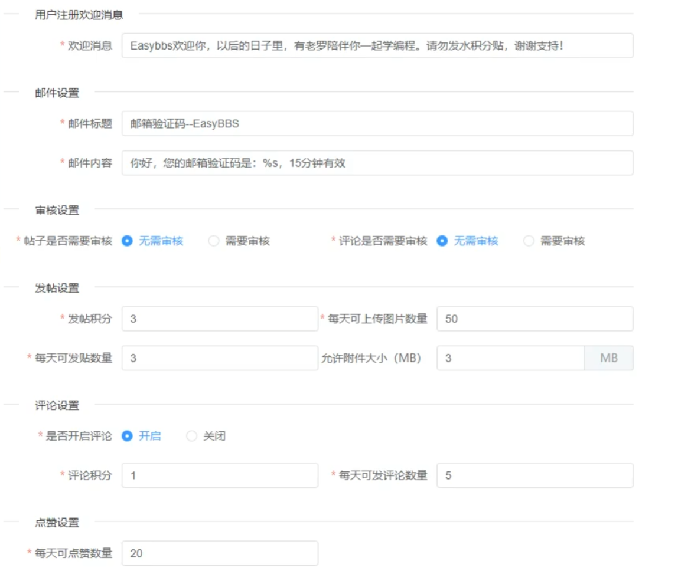

# 1 系统设置

可以通过提前设定一系列参数值，并在需要时从设置项中获取并使用这些参数。例如，设置一个积分规则，其中包括用户注册时默认获得的积分数和发布帖时获得的积分数。类似地，用户发送文件的大小限制等设置也可以预设。这样，设置的参数可以根据需求灵活调整，确保系统灵活性和可配置性。

效果图如下：



这些预设的参数需要存储在数据库中，并且在系统启动时从数据库加载并将其存入内存，在整个系统的生命周期中使用这些启动时加载的配置项。

由于设置项需要存储在数据库中，我们需要设计合适的表结构。上诉的6个设置项，是否为需要每个设置项单独创建一张表呢？这显然不是一个高效的方案。如果以后需要新增设置项，难道每次都需要创建一张新表吗？仔细分析后发现，实际上每个设置项都可以视作一个对象，设置项中的各字段对应对象的属性。因此，我们可以设计一张表来统一存储所有设置项，每一行数据代表一个设置项。表中至少需要两个字段：【code】和【json_content】。

- 【code】：存储设置项的标识或名称；
- 【json_content】：存储设置项的具体内容，以JSON字符串形式表示，方便扩展和修改。

采用JSON格式存储配置项的具体字段，可以让我们灵活地表达和管理这些设置项。启动时，我们只需要从数据库中读取这些数据，然后将【json_content】字段反序列化为对象，并将其存入相应的实体类中，便于后续的操作和维护。这样既能避免为每个设置项单独建表，又能提高系统的灵活性和可扩展性。

## 1.1 sys_setting表

系统设置表，表结构如下：

```sql
create table sys_setting
(
    code         varchar(10)  not null comment '编码'
        primary key,
    json_content varchar(500) null comment '设置信息的json字符串',
    create_time  datetime     not null comment '创建时间',
    update_time  datetime     not null comment '修改时间'
)
    comment '系统设置信息表';
```

根据效果图中的6种设置信息，我们设计如下的json消息：

1、注册欢迎消息，它的【code】为：

```
register
```

【json_content】为：

```json
{
    "welcomeInfo": "恭喜您成功注册！在这里，每一位成员都是我们宝贵的一部分。希望您能在社区中找到灵感，分享智慧，一起成长！"
}
```

2、邮件设置，它的【code】为：

```
mail
```

【json_content】为：

```json
// %s占位符，到时候替换为具体的验证码
{
    "mailTitle": "邮箱验证码",
    "mailContent": "您好！您的邮箱验证码为：%s。验证码有效时间为5分钟，请尽快完成注册。感谢您的支持！"
}
```

3、审核设置，它的【code】为：

```
audit
```

【json_content】为：

```json
{
    "postAudit": true,		// 帖子是否需要审核
    "commentAudit": true	// 评论是否需要审核
}
```

4、发帖设置，它的【code】为：

```
post
```

【json_content】为：

```json
{
    "postPoints": 3,		// 发帖积分
    "postNum": 3,			// 每天可发帖数量
    "uploadImgNum": 50,		// 每天可上传图片数量
    "attachmentSize": 3		// 附件大小
}
```

5、评论设置，它的【code】为：

```
comment
```

【json_content】为：

```json
{
    "openComment": true,		// 是否开启评论
    "commentPoints": 3,			// 评论积分
    "commentNum": 50			// 每天可发评论数量
}
```

6、点赞设置，它的【code】为：

```
like
```

【json_content】为：

```json
{
    "likeNum": 20		// 每天可点赞数量
}
```

综上，完整的插入sql为：

```sql
INSERT INTO ling_bbs.sys_setting (code, json_content, create_time, update_time) VALUES ('audit', '{"postAudit": true,"commentAudit": true}', '2024-11-18 22:41:36', '2024-11-18 22:41:51');
INSERT INTO ling_bbs.sys_setting (code, json_content, create_time, update_time) VALUES ('comment', '{"openComment": true,"commentPoints": 3,"commentNum": 50}', '2024-11-18 22:41:44', '2024-11-18 22:41:52');
INSERT INTO ling_bbs.sys_setting (code, json_content, create_time, update_time) VALUES ('like', '{"likeNum": 20}', '2024-11-18 22:41:47', '2024-11-18 22:41:53');
INSERT INTO ling_bbs.sys_setting (code, json_content, create_time, update_time) VALUES ('mail', '{"mailTitle": "邮箱验证码","mailContent": "您好！您的邮箱验证码为：%s。验证码有效时间为5分钟，请尽快完成注册。感谢您的支持！"}', '2024-11-18 22:41:48', '2024-11-18 22:41:54');
INSERT INTO ling_bbs.sys_setting (code, json_content, create_time, update_time) VALUES ('post', '{"postPoints": 3,"postNum": 3,"uploadImgNum": 50,"attachmentSize": 3}', '2024-11-18 22:41:49', '2024-11-18 22:41:55');
INSERT INTO ling_bbs.sys_setting (code, json_content, create_time, update_time) VALUES ('register', '{"welcomeInfo": "恭喜您成功注册！在这里，每一位成员都是我们宝贵的一部分。希望您能在社区中找到灵感，分享智慧，一起成长！"}', '2024-11-18 22:41:50', '2024-11-18 22:41:56');
```

## 1.2 创建对应实体

首先是【SysSetting】，作为表实体需要创建对应的CRUD，这里不展示，参考[springboot-vue-note](https://github.com/lingzed/springboot-vue-note/tree/main)第26章。

然后创建6中设置对应的实体，命名规则统一以SysSetting4为前缀，4通for：

比如审核设置：

```java
package com.ling.entity.po;

/**
 * 系统设置-审核设置
 */
public class SysSetting4Audit {
    private boolean postAudit;          // 发布帖是否需要审核
    private boolean commentAudit;       // 评论是否需要审核


    public SysSetting4Audit() {
    }

    public SysSetting4Audit(boolean postAudit, boolean commentAudit) {
        this.postAudit = postAudit;
        this.commentAudit = commentAudit;
    }

    /**
     * 获取
     * @return postAudit
     */
    public boolean isPostAudit() {
        return postAudit;
    }

    /**
     * 设置
     * @param postAudit
     */
    public void setPostAudit(boolean postAudit) {
        this.postAudit = postAudit;
    }

    /**
     * 获取
     * @return commentAudit
     */
    public boolean isCommentAudit() {
        return commentAudit;
    }

    /**
     * 设置
     * @param commentAudit
     */
    public void setCommentAudit(boolean commentAudit) {
        this.commentAudit = commentAudit;
    }

    public String toString() {
        return "SysSetting4Audit{postAudit = " + postAudit + ", commentAudit = " + commentAudit + "}";
    }
}
```

其他按照此实体完成，这里不展示。

然后我们再创建一个大的设置类【SettingContainer】，用于管理这6项设置，它的属性就是这些设置项对象。

```java
package com.ling.entity.dto;

/**
 * 系统设置容器
 */
public class SysSettingContainer {
    private SysSetting4Audit sysSetting4Audit;          // 审核设置
    private SysSetting4Comment sysSetting4Comment;      // 评论设置
    private SysSetting4Like sysSetting4Like;            // 点赞设置
    private SysSetting4Mail sysSetting4Mail;            // 邮件设置 
    private SysSetting4Post sysSetting4Post;            // 发帖设置
    private SysSetting4Register sysSetting4Register;    // 注册设置


    public SysSettingContainer() {
    }

    public SysSettingContainer(SysSetting4Audit sysSetting4Audit, SysSetting4Comment sysSetting4Comment, SysSetting4Like sysSetting4Like, SysSetting4Mail sysSetting4Mail, SysSetting4Post sysSetting4Post, SysSetting4Register sysSetting4Register) {
        this.sysSetting4Audit = sysSetting4Audit;
        this.sysSetting4Comment = sysSetting4Comment;
        this.sysSetting4Like = sysSetting4Like;
        this.sysSetting4Mail = sysSetting4Mail;
        this.sysSetting4Post = sysSetting4Post;
        this.sysSetting4Register = sysSetting4Register;
    }

    /**
     * 获取
     * @return sysSetting4Audit
     */
    public SysSetting4Audit getSysSetting4Audit() {
        return sysSetting4Audit;
    }

    /**
     * 设置
     * @param sysSetting4Audit
     */
    public void setSysSetting4Audit(SysSetting4Audit sysSetting4Audit) {
        this.sysSetting4Audit = sysSetting4Audit;
    }

    /**
     * 获取
     * @return sysSetting4Comment
     */
    public SysSetting4Comment getSysSetting4Comment() {
        return sysSetting4Comment;
    }

    /**
     * 设置
     * @param sysSetting4Comment
     */
    public void setSysSetting4Comment(SysSetting4Comment sysSetting4Comment) {
        this.sysSetting4Comment = sysSetting4Comment;
    }

    /**
     * 获取
     * @return sysSetting4Like
     */
    public SysSetting4Like getSysSetting4Like() {
        return sysSetting4Like;
    }

    /**
     * 设置
     * @param sysSetting4Like
     */
    public void setSysSetting4Like(SysSetting4Like sysSetting4Like) {
        this.sysSetting4Like = sysSetting4Like;
    }

    /**
     * 获取
     * @return sysSetting4Mail
     */
    public SysSetting4Mail getSysSetting4Mail() {
        return sysSetting4Mail;
    }

    /**
     * 设置
     * @param sysSetting4Mail
     */
    public void setSysSetting4Mail(SysSetting4Mail sysSetting4Mail) {
        this.sysSetting4Mail = sysSetting4Mail;
    }

    /**
     * 获取
     * @return sysSetting4Post
     */
    public SysSetting4Post getSysSetting4Post() {
        return sysSetting4Post;
    }

    /**
     * 设置
     * @param sysSetting4Post
     */
    public void setSysSetting4Post(SysSetting4Post sysSetting4Post) {
        this.sysSetting4Post = sysSetting4Post;
    }

    /**
     * 获取
     * @return sysSetting4Register
     */
    public SysSetting4Register getSysSetting4Register() {
        return sysSetting4Register;
    }

    /**
     * 设置
     * @param sysSetting4Register
     */
    public void setSysSetting4Register(SysSetting4Register sysSetting4Register) {
        this.sysSetting4Register = sysSetting4Register;
    }

    public String toString() {
        return "SysSettingContainer{sysSetting4Audit = " + sysSetting4Audit + ", sysSetting4Comment = " + sysSetting4Comment + ", sysSetting4Like = " + sysSetting4Like + ", sysSetting4Mail = " + sysSetting4Mail + ", sysSetting4Post = " + sysSetting4Post + ", sysSetting4Register = " + sysSetting4Register + "}";
    }
}
```

## 1.3 存入内存

我们已创建设置项的实体，接下来需要从【sys_setting】表中读取数据，将其封装到【SettingContainer】中，并存储至内存。

由于【sys_setting】表中的每一项数据对应一个设置项对象，而这些对象类型各异，因此需要根据【code】字段动态生成对应的对象。然而，直接使用【if-else】分支来判断会导致代码不够灵活且难以维护。目前虽只有6个设置项，但未来可能新增更多类，导致【if-else】分支进一步膨胀。为解决这一问题，推荐使用反射机制，具体实现步骤如下：

1、定义一个设置项的枚举，将所有设置项集中维护在枚举中。枚举需要包含以下字段：

- **code**：与【sys_setting】表的【code】字段一致，用于获取对应的枚举对象。
- **className**：设置项类的全限定名，用于通过反射生成对象实例。
- **field**：系统设置容器类的字段。

```java
package com.ling.enums;

/**
 * 设置项枚举
 */
public enum SysSettingItemEnum {
    AUDIT("audit", "com.ling.entity.dto.SysSetting4Audit.java", "sysSetting4Audit"),
    COMMENT("comment", "com.ling.entity.dto.SysSetting4Comment.java", "sysSetting4Comment"),
    LIKE("like", "com.ling.entity.dto.SysSetting4Like.java", "sysSetting4Like"),
    MAIL("mail", "com.ling.entity.dto.SysSetting4Mail.java", "sysSetting4Mail"),
    POST("post", "com.ling.entity.dto.SysSetting4Post.java", "sysSetting4Post"),
    REGISTER("register", "com.ling.entity.dto.SysSetting4Register.java", "sysSetting4Register");

    private String code;        // 设置项编码
    private String classname;   // 设置项类全类名
    private String field;       // 系统设置容器类的字段

    SysSettingItemEnum() {
    }

    SysSettingItemEnum(String code, String classname, String field) {
        this.code = code;
        this.classname = classname;
        this.field = field;
    }

    /**
     * 通过code获取枚举项
     *
     * @param code
     * @return
     */
    public static SysSettingItemEnum getItemByCode(String code) {
        for (SysSettingItemEnum item : SysSettingItemEnum.values()) {
            if (code.equals(item.getCode())) return item;
        }
        return null;
    }

    /**
     * 获取
     *
     * @return code
     */
    public String getCode() {
        return code;
    }

    /**
     * 获取
     *
     * @return classname
     */
    public String getClassname() {
        return classname;
    }

    /**
     * 获取
     *
     * @return desc
     */
    public String getField() {
        return field;
    }
}
```

在枚举中，定义了一个静态方法 `getItemByCode()`，根据传入的【code】值获取对应的枚举。

2、在 `SysSettingService` 接口中新增一个 `refreshCache()` 方法，其主要功能是重新加载【sys_setting】表中的数据，将其封装到 `SettingContainer` 中，并存储至缓存，实现设置数据的动态更新。该方法的核心作用是确保内存中的配置数据与数据库保持一致。

方法执行时机：

- **项目启动**：确保在应用启动时加载最新的配置数据。

- **更新设置参数后**：当设置项被修改后，及时刷新缓存以反映最新的配置。

​                                                                                                                                                                        