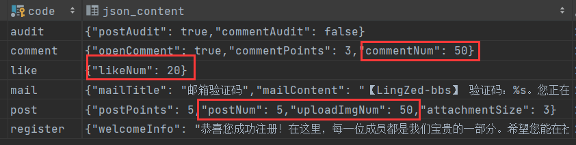

# 分析&&实现思路

在之前的设计中，我们定义了一个注解 `@AccessControl`，用于实现访问控制。该注解目前的功能主要包括控制接口是否为登录接口，以及是否启用参数校验。现在，我们需要扩展该注解，新增一个控制访问次数的功能。

在系统设置中，我们对某些功能进行了访问次数的限制。具体来说，每个用户每日在以下操作中的访问次数都有所限制：



具体包括以下限制

- 评论限制
- 点赞限制
- 发文限制
- 上传图片限制

基于此，我们可以创建一个枚举【FrequencyLimitTypeEnum】来表示这些限制：

```java
package com.ling.enums;

/**
 * 频次限制类型枚举
 */
public enum FrequencyLimitTypeEnum {
    UNLIMITED("unlimited", "无限制", null),
    COMMENT_LIMIT("comment_num_limit", "评论限制", "评论次数已达上限（每日%d次），请明日再试"),
    LIKE_LIMIT("like_num_limit", "点赞限制", "点赞次数已达上限（每日%d次），请明日再试"),
    POST_LIMIT("post_num_limit", "发文限制", "发文次数已达上限（每日%d次），请明日再试"),
    UPLOAD_IMG_LIMIT("upload_img_num_limit", "上传图片限制", "图片上传次数已达上限（每日%d次），请明日再试");

    private String type;	// 限制类型
    private String desc;	// 描述
    private String errMsg; 	// 超过限制时抛出的错误消息

    FrequencyLimitTypeEnum(String type, String desc, String errMsg) {
        this.type = type;
        this.desc = desc;
        this.errMsg = errMsg;
    }

    public String getType() {
        return type;
    }

    public String getDesc() {
        return desc;
    }

    public String getErrMsg() {
        return errMsg;
    }
}
```

接下来，我们在 `@AccessControl` 注解中新增一个属性 `frequency`，用于设置访问次数限制：

```java
/**
 * 访问控制
 */
@Target(ElementType.METHOD)
@Retention(RetentionPolicy.RUNTIME)
public @interface AccessControl {
    boolean enableValidation() default true;           // 是否开启参数校验

    boolean loginRequired() default false;       // 是否登录后才能访问

    FrequencyLimitTypeEnum frequency() default FrequencyLimitTypeEnum.UNLIMITED;  // 访问频次限制
}
```

该属性的默认值为 `UNLIMITED`，表示没有次数限制。通过这个属性，我们可以对接口访问频次进行控制。具体实现思路如下：

1. **使用 AOP 拦截方法调用**：通过 AOP 拦截带有 `@AccessControl` 注解的方法。
2. **判断 `frequency` 属性的值**：如果该值为 `UNLIMITED`，则跳过频次限制的判断；如果是其他限制类型，则继续进行次数判断。
3. **从会话中获取访问次数**：首先检查会话中是否已经存储了该操作的访问次数。
4. **查询数据库并更新会话**：如果会话中没有次数信息，则需要查询数据库统计当前用户当天的访问次数，并将其更新到会话中。
5. **从系统设置中获取限制次数**：获取系统设置中的访问次数限制，并与当前访问次数进行比较。
6. **执行判断逻辑**：如果访问次数小于限制次数，则继续执行后续操作；否则，抛出异常提示用户已达访问上限。
7. **更新会话中的访问次数**：操作成功后，更新会话中的访问次数。

核心思想是将每个操作的访问次数与当前会话绑定。当会话失效时，需要从数据库中重新统计并更新访问次数。

需要特别注意的是，会话中存储的访问次数应该与当前日期相关联。如果没有按照日期进行关联，而是使用固定的key存储，可能会导致访问次数错误。例如，如果用户在当天 23:50 进行了多次访问，还剩余一次次数，当午夜过后再进行访问，这次访问会将次数耗尽，当再次访问时系统会认为用户已用尽当天的所有访问次数，而实际情况应从第二天开始重新计算次数。这正是因为两天共用一个key，所以第二天读取时是已经耗尽次数的，因此，访问次数的存储键必须与日期相关联，确保每天的访问次数是独立计算的。


# 实现

改造原来的切面方法，将登录限制和频次限制单独定义定义方法【checkLoginRequired()】和【frequencyLimitation()】，然后定义新的切面方法【accountControl()】，通知类型改为环绕通知(我们需要通过方法的返回值来更新访问次数)。

```java
@Aspect
@Component
@Order(0)
public class AccountControlAspect {
    private Logger log = LoggerFactory.getLogger(AccountControlAspect.class);
    @Resource
    private HttpServletRequest request;
    @Resource
    private CommentService commentService;
    @Resource
    private LikeRecordService likeRecordService;
    @Resource
    private ArticleService articleService;
    private static final Map<FrequencyLimitTypeEnum, Function<String, Integer>> countFormDB = new HashMap<>();
    private static final Map<FrequencyLimitTypeEnum, Supplier<Integer>> countFormSys = new HashMap<>();

    static {
        countFormSys.put(FrequencyLimitTypeEnum.COMMENT_LIMIT,
                () -> SysCacheUtil.getSysSettingManager().getSysSetting4Comment().getCommentNum());
        countFormSys.put(FrequencyLimitTypeEnum.LIKE_LIMIT,
                () -> SysCacheUtil.getSysSettingManager().getSysSetting4Like().getLikeNum());
        countFormSys.put(FrequencyLimitTypeEnum.POST_LIMIT,
                () -> SysCacheUtil.getSysSettingManager().getSysSetting4Post().getPostNum());
        countFormSys.put(FrequencyLimitTypeEnum.UPLOAD_IMG_LIMIT,
                () -> SysCacheUtil.getSysSettingManager().getSysSetting4Post().getUploadImgNum());
    }

    {
        countFormDB.put(FrequencyLimitTypeEnum.COMMENT_LIMIT, userId -> {
            CommentQuery query = new CommentQuery();
            LocalDate now = LocalDate.now();
            query.setSenderId(userId);
            query.setStartPostTime(now);
            query.setEndPostTime(now);
            Long totalByCondition = commentService.findTotalByCondition(query);
            return totalByCondition.intValue();
        });
        countFormDB.put(FrequencyLimitTypeEnum.LIKE_LIMIT, userId -> {
            LikeRecordQuery query = new LikeRecordQuery();
            LocalDate now = LocalDate.now();
            query.setLikerId(userId);
            query.setStartLikeTime(now);
            query.setEndLikeTime(now.plusDays(1));
            Long totalByCondition = likeRecordService.findTotalByCondition(query);
            return totalByCondition.intValue();
        });
        countFormDB.put(FrequencyLimitTypeEnum.POST_LIMIT, userId -> {
            ArticleQuery query = new ArticleQuery();
            LocalDate now = LocalDate.now();
            query.setUserId(userId);
            query.setStartCreateTime(now);
            query.setEndCreateTime(now.plusDays(1));
            Long totalByCondition = articleService.findTotalByCondition(query);
            return totalByCondition.intValue();
        });
        countFormDB.put(FrequencyLimitTypeEnum.UPLOAD_IMG_LIMIT, userId -> 0);
    }

    @Pointcut("@annotation(com.ling.annotation.AccessControl)")
    public void pt() {

    }

    /**
     * 访问控制
     *
     * @param joinPoint
     */
    @Around("pt()")
    public Object accountControl(ProceedingJoinPoint joinPoint) throws Throwable {
        Method method = ((MethodSignature) joinPoint.getSignature()).getMethod();
        AccessControl accessControl = method.getAnnotation(AccessControl.class);

        HttpSession session = request.getSession();
        SessionUserinfo userinfo = (SessionUserinfo) session.getAttribute(Constant.USERINFO_SESSION_KEY);

        checkLoginRequired(accessControl, userinfo);  // 登录接口限制校验

        String ymd = StrUtil.formatDate("yyy-MM-dd_");
        boolean recordFrequency = frequencyLimitation(accessControl, ymd);// 接口频次访问限制

        Object proceed = joinPoint.proceed();	// 目标方法执行

        // 若Result状态码为200，则更新会话中的限制次数
        if (recordFrequency && Objects.equals(((Result) proceed).getCode(), 200)) {
            FrequencyLimitTypeEnum frequency = accessControl.frequency();
            String frequencyKey = ymd + frequency.getType();
            Integer count = (Integer) session.getAttribute(frequencyKey);
            session.setAttribute(frequencyKey, count + 1);
        }
        return proceed;
    }

    /**
     * 登录接口限制
     *
     * @param accessControl
     */
    public void checkLoginRequired(AccessControl accessControl, SessionUserinfo userinfo) {
        if (Objects.isNull(accessControl) || !accessControl.loginRequired()) return;
        if (Objects.isNull(userinfo))
            throw new BusinessException(ResponseCodeEnum.CODE_901);
    }

    /**
     * 接口频次限制
     *
     * @param accessControl
     * @param formatDate
     */
    public boolean frequencyLimitation(AccessControl accessControl, String formatDate) {
        if (Objects.isNull(accessControl) ||
                Objects.equals(FrequencyLimitTypeEnum.UNLIMITED, accessControl.frequency()))
            return false;
        FrequencyLimitTypeEnum frequency = accessControl.frequency();
        HttpSession session = request.getSession();
        SessionUserinfo userinfo = (SessionUserinfo) session.getAttribute(Constant.USERINFO_SESSION_KEY);

        // 从session中获取已完成的次数
        String frequencyKey = formatDate + frequency.getType();
        Integer count = (Integer) session.getAttribute(frequencyKey);

        // 若为null，则从数据库中查询次数并存入session
        if (Objects.isNull(count)) {
            count = countFormDB.get(frequency).apply(userinfo.getUserId());
            session.setAttribute(frequencyKey, count);
        }

        // 判断是否超出次数限制
        Integer sysCount = countFormSys.get(frequency).get();
        if (count >= sysCount)
            throw new BusinessException(String.format(frequency.getErrMsg(), sysCount));
        return true;
    }
}
```

因为不同的操作类型有各自的访问次数限制，也有各自查库的操作，不免要进行条件分支判断，因此我选择将这些分支操作与类型建立映射，避免掉分支操作：

【countFormDB】存储从数据库中统计访问次数的操作：

```java
private static final Map<FrequencyLimitTypeEnum, Function<String, Integer>> countFormDB = new HashMap<>();

{
    countFormDB.put(FrequencyLimitTypeEnum.COMMENT_LIMIT, userId -> {
        CommentQuery query = new CommentQuery();
        LocalDate now = LocalDate.now();
        query.setSenderId(userId);
        query.setStartPostTime(now);
        query.setEndPostTime(now);
        Long totalByCondition = commentService.findTotalByCondition(query);
        return totalByCondition.intValue();
    });
    countFormDB.put(FrequencyLimitTypeEnum.LIKE_LIMIT, userId -> {
        LikeRecordQuery query = new LikeRecordQuery();
        LocalDate now = LocalDate.now();
        query.setLikerId(userId);
        query.setStartLikeTime(now);
        query.setEndLikeTime(now.plusDays(1));
        Long totalByCondition = likeRecordService.findTotalByCondition(query);
        return totalByCondition.intValue();
    });
    countFormDB.put(FrequencyLimitTypeEnum.POST_LIMIT, userId -> {
        ArticleQuery query = new ArticleQuery();
        LocalDate now = LocalDate.now();
        query.setUserId(userId);
        query.setStartCreateTime(now);
        query.setEndCreateTime(now.plusDays(1));
        Long totalByCondition = articleService.findTotalByCondition(query);
        return totalByCondition.intValue();
    });
    countFormDB.put(FrequencyLimitTypeEnum.UPLOAD_IMG_LIMIT, userId -> 0);
}
```

【countFormSys】存储从系统设置中获取限制次数的操作：

```java
private static final Map<FrequencyLimitTypeEnum, Supplier<Integer>> countFormSys = new HashMap<>();

static {
    countFormSys.put(FrequencyLimitTypeEnum.COMMENT_LIMIT,
                     () -> SysCacheUtil.getSysSettingManager().getSysSetting4Comment().getCommentNum());
    countFormSys.put(FrequencyLimitTypeEnum.LIKE_LIMIT,
                     () -> SysCacheUtil.getSysSettingManager().getSysSetting4Like().getLikeNum());
    countFormSys.put(FrequencyLimitTypeEnum.POST_LIMIT,
                     () -> SysCacheUtil.getSysSettingManager().getSysSetting4Post().getPostNum());
    countFormSys.put(FrequencyLimitTypeEnum.UPLOAD_IMG_LIMIT,
                     () -> SysCacheUtil.getSysSettingManager().getSysSetting4Post().getUploadImgNum());
}
```

在会话中存储次数时，key一定要与日期关联：

```java
String frequencyKey = formatDate + frequency.getType();
```

最后，判断方法的返回值状态码是否为200，若是则表示执行成功，将次数更新：

```java
// 若Result状态码为200，则更新会话中的限制次数
if (recordFrequency && Objects.equals(((Result) proceed).getCode(), 200)) {
    FrequencyLimitTypeEnum frequency = accessControl.frequency();
    String frequencyKey = ymd + frequency.getType();
    Integer count = (Integer) session.getAttribute(frequencyKey);
    session.setAttribute(frequencyKey, count + 1);
}
```

**注意**：访问次数 只会在操作成功并返回状态码为 `200` 时进行 **加**，不会在失败时进行 **减少**。避免因错误请求导致访问次数的错误减少。